

  _ dentro, sobre um quadrado escuro">

<h1 align="center">Pipa</h1>

<b>Seus terminais, de longe. Presos por uma linha segura.</b>

  <code>fase: planejamento</code>&nbsp;
  <code>VS Code + Android</code>&nbsp;
  <code>PT-BR · EN</code>&nbsp;
  <code>ponte própria, cifrada ponta a ponta</code>&nbsp;
  <code>licença: a definir</code>

  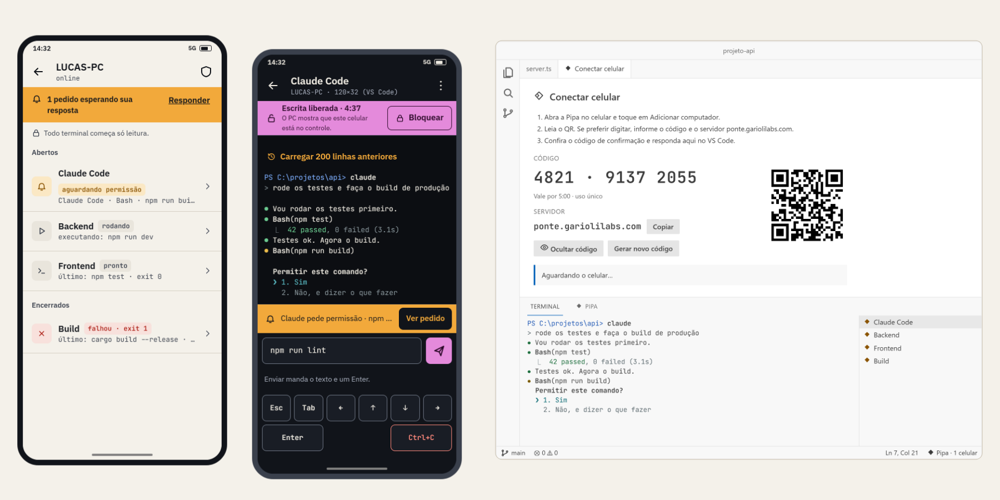

## O que é

A Pipa controla, pelo celular, os terminais abertos no VS Code: de qualquer
lugar, com segurança, praticidade e leveza. Você acompanha builds, testes,
servidores e agentes de IA como o Claude Code, e responde quando algo pede
atenção.

> [!IMPORTANT]
> **Estado: planejamento.** Ainda não existe código. Tudo o que aparece aqui
> é o desenho aprovado e o [protótipo navegável](docs/interfaces/prototipo/index.html),
> com dados fictícios. O desenvolvimento começa só após a aprovação final do
> planejamento.

## Como funciona em 4 passos

<table>
  <tr>
    <td width="38%" valign="top">
      <h3>1. Instale a extensão</h3>
      
No VS Code. Ela traz o agente que cuida dos terminais e oferece, uma
      vez, usar o perfil <b>Terminal remoto</b> como padrão (só grava com o
      seu sim). Assim, todo terminal novo já nasce acessível pelo celular, em
      modo só leitura.

      
Na primeira vez que você rodar <b>Conectar celular</b>, ela pede o
      endereço do seu <a href="#servidor-não-há-servidor-público">servidor</a>
      e a chave de inscrição dele.

      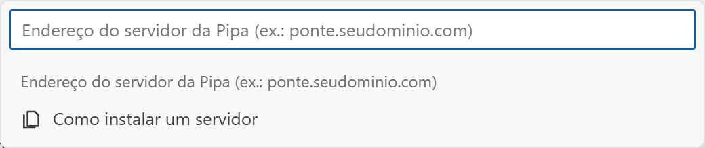
    </td>
    <td valign="top">
      <h3>2. Gere o código</h3>
      
No VS Code, <b>Pipa: Conectar celular</b> mostra 12 dígitos, o
      servidor e um QR. O código vale 5 minutos e serve uma vez só.

      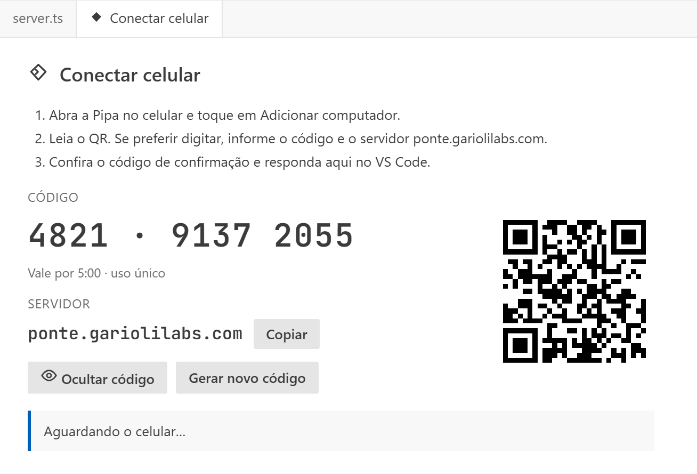
    </td>
  </tr>
  <tr>
    <td valign="top">
      <h3>3. Digite no app</h3>
      
No Android, <b>Adicionar computador</b>: leia o QR, que já traz o
      servidor, ou digite o servidor e os 12 dígitos.

      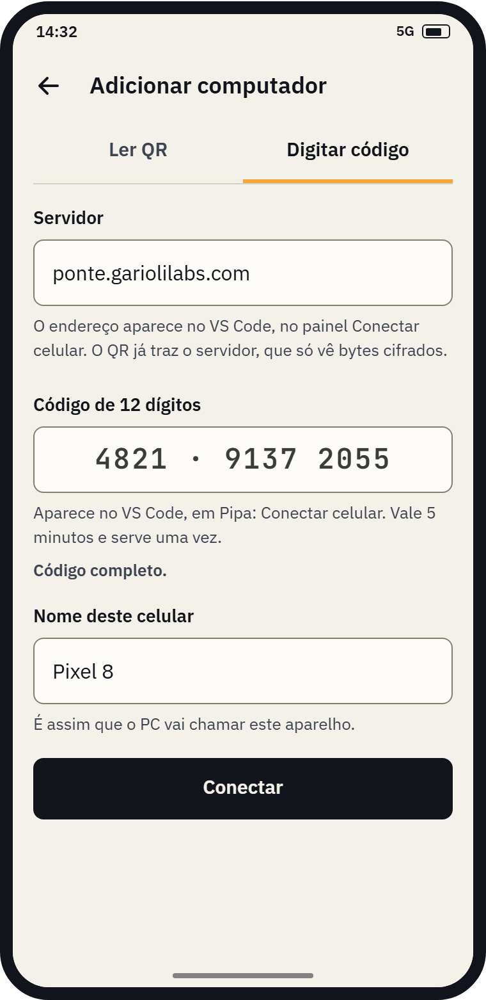
    </td>
    <td valign="top">
      <h3>4. Confirme no PC</h3>
      
O celular e o VS Code mostram o mesmo código de confirmação de
      6 dígitos. Confira e clique em <b>Permitir</b>. Pronto: nas próximas
      vezes, basta abrir o app.

      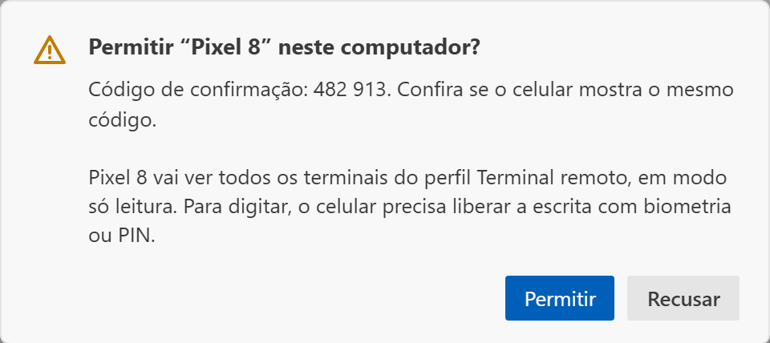 
      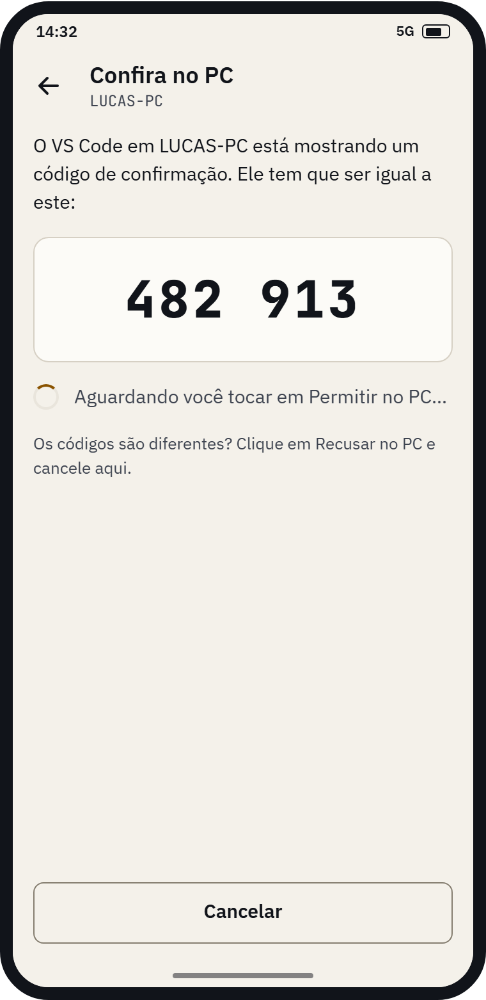
    </td>
  </tr>
</table>

## Servidor: não há servidor público

O PC e o celular nunca se conectam direto. Os dois fazem conexões de
**saída** até um servidor de retransmissão, a ponte `trc-bridge`, que junta
as duas pontas e só repassa bytes cifrados. Por isso funciona atrás de
CGNAT e sem porta aberta no PC.

- **Não existe servidor público.** `ponte.gariolilabs.com` é **privada**:
  serve só Sr. Garioli e quem ele autorizar, com uma chave de inscrição
  emitida por ele.
- **Cada pessoa hospeda a sua.** Quem não foi autorizado roda o mesmo
  binário `trc-bridge` num servidor ou VPS mínimo (~US$ 4–6/mês) ou num
  Raspberry Pi em casa.
- **Raspberry atrás de CGNAT precisa de IP público.** Sem IP público
  liberado pela operadora, o Raspberry em casa não é alcançável; nesse caso,
  use um VPS.
- **Só PCs com a chave de inscrição se registram no servidor.** A chave
  fica no cofre do sistema, nunca nas configurações. O celular não precisa
  dela.
- **O QR traz o endereço do servidor;** quem digita os 12 dígitos informa o
  servidor à parte. Se o QR trouxer um servidor diferente do dos seus outros
  computadores, o app pergunta antes de usar.
- **O servidor não lê nada:** vê só bytes cifrados, IPs, horários e
  tamanhos.

As instruções de instalação do `trc-bridge` são escritas junto com a
especificação da ponte (P4) e a fase M6. Detalhes em
[ADR-0004](docs/adr/0004-ponte-propria-e-codigo-de-12-digitos.md) e
[ADR-0006](docs/adr/0006-hospedagem-da-ponte-adiada-para-m6.md).

## Telas

Capturas do protótipo aprovado, revisão 2 das interfaces (2026-09-26)
([abra localmente](docs/interfaces/prototipo/index.html) para navegar pelos
70 estados). Os nomes de PC, aparelhos e comandos são fictícios.

### Android

<table>
  <tr>
    <td align="center" valign="top" width="33%">
      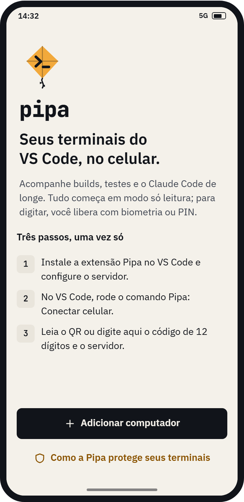 
      <b>Boas-vindas.</b> Três passos, uma vez só.
    </td>
    <td align="center" valign="top" width="33%">
      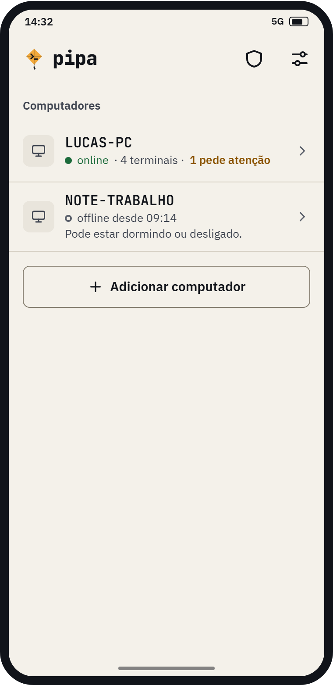 
      <b>Computadores.</b> Online, ou offline desde quando.
    </td>
    <td align="center" valign="top" width="33%">
      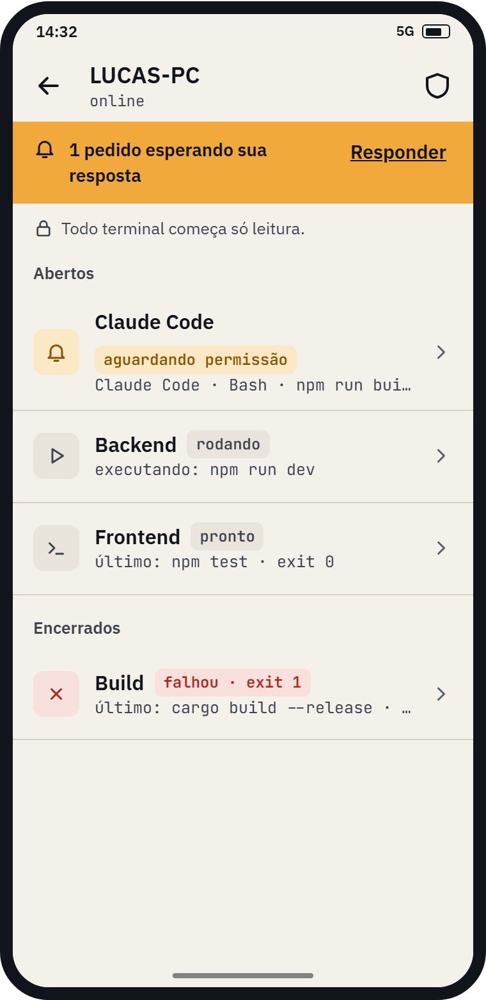 
      <b>Terminais.</b> Estado e contexto mínimo de cada um.
    </td>
  </tr>
  <tr>
    <td align="center" valign="top">
      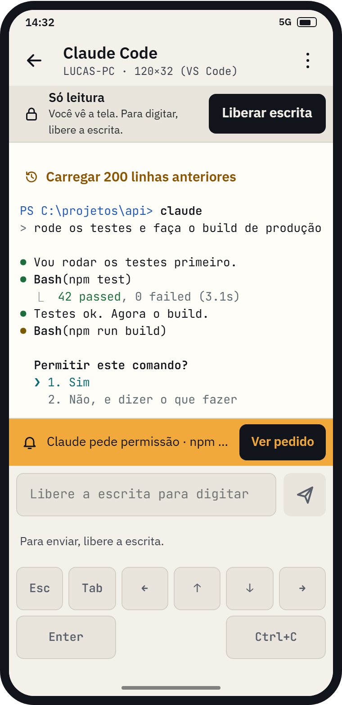 
      <b>Terminal, só leitura.</b> Tela sob demanda e teclas especiais.
    </td>
    <td align="center" valign="top">
      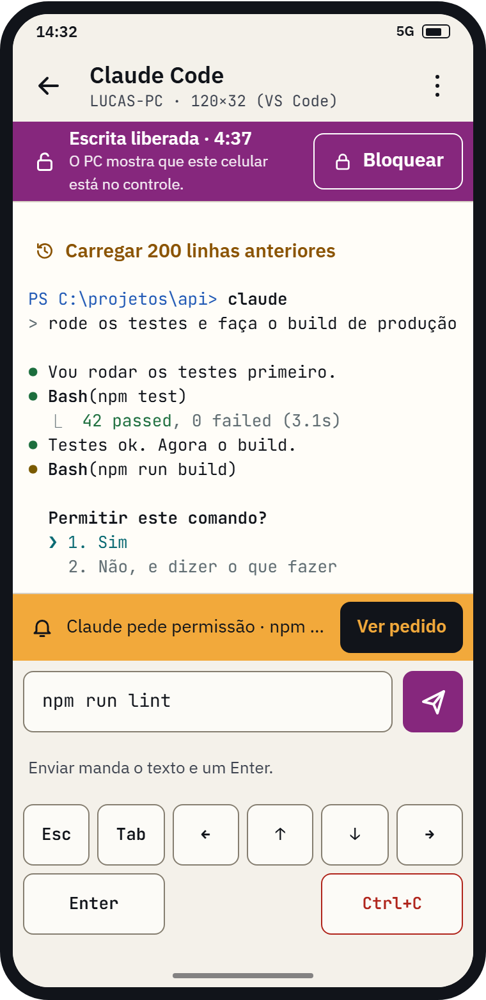 
      <b>Escrita liberada.</b> Faixa magenta com contagem regressiva.
    </td>
    <td align="center" valign="top">
      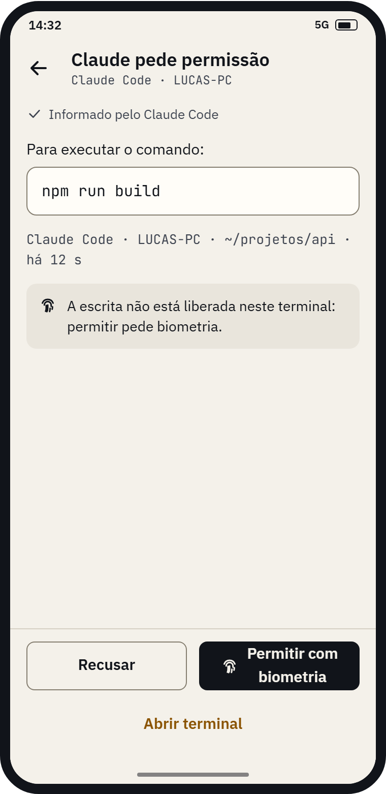 
      <b>Pedido do Claude.</b> Permitir ou recusar, sem teclar às cegas.
    </td>
  </tr>
  <tr>
    <td align="center" valign="top">
      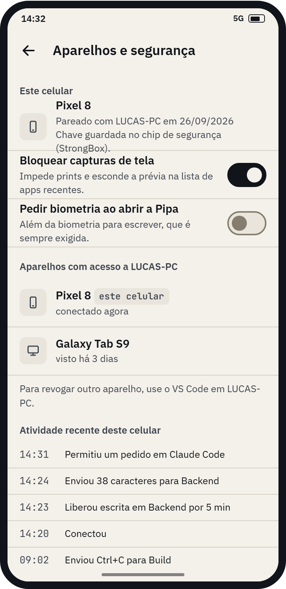 
      <b>Aparelhos e segurança.</b> Quem tem acesso, por qual servidor, e o que fez.
    </td>
    <td align="center" valign="top">
       
      <b>Adicionar computador.</b> QR, ou servidor e 12 dígitos.
    </td>
    <td align="center" valign="top">
       
      <b>Confira no PC.</b> O mesmo código nos dois lados.
    </td>
  </tr>
</table>

**Avisos de outros programas** ([EX1](docs/exigencias-externas.md)):

<table>
  <tr>
    <td align="center" valign="top" width="50%">
      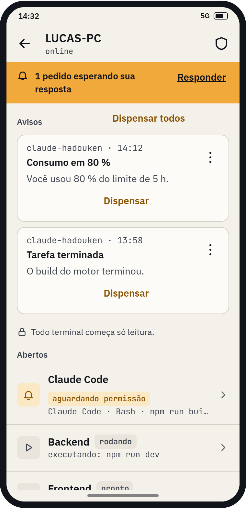 
      <b>Avisos.</b> Um cartão por aviso, acima dos terminais.
    </td>
    <td align="center" valign="top" width="50%">
      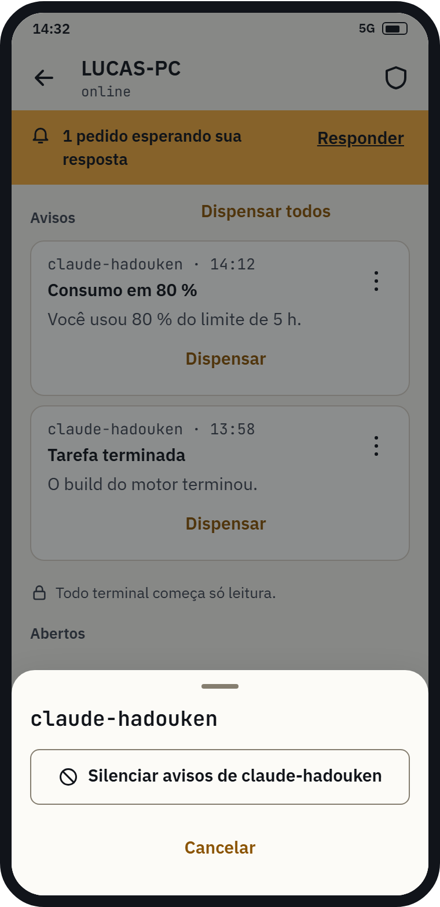 
      <b>Silenciar.</b> Por origem, neste celular; reativa em Aparelhos e segurança.
    </td>
  </tr>
</table>

**Claro e escuro**, seguindo o sistema:

<table>
  <tr>
    <td align="center" valign="top" width="33%">
      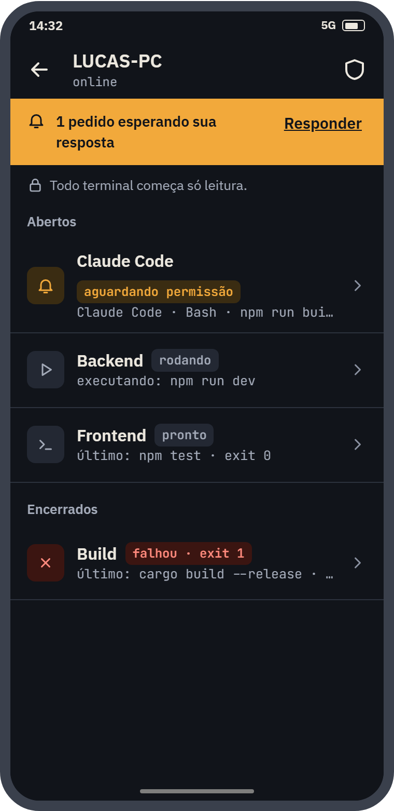 
      Terminais
    </td>
    <td align="center" valign="top" width="33%">
      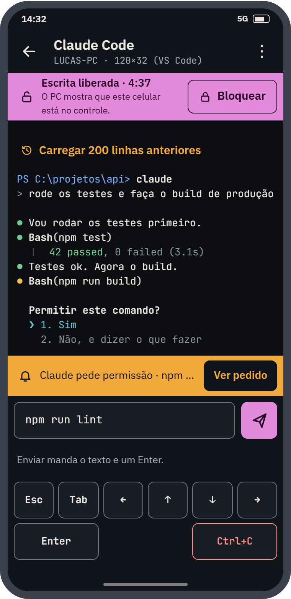 
      Escrita liberada
    </td>
    <td align="center" valign="top" width="33%">
      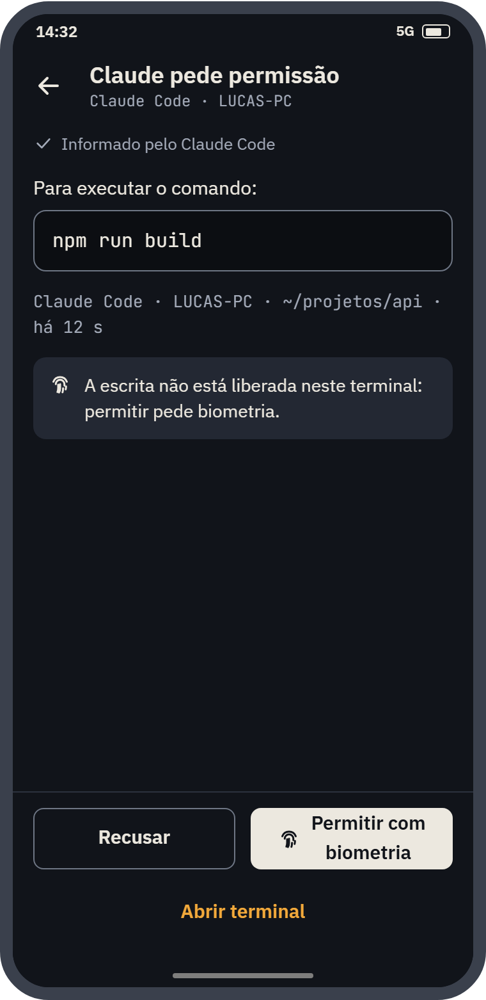 
      Pedido do Claude
    </td>
  </tr>
</table>

### VS Code

Só API estável e UI nativa. A única webview é o painel de pareamento.

<table>
  <tr>
    <td align="center" valign="top" width="50%">
       
      <b>Conectar celular.</b> Código de 12 dígitos, servidor, QR e validade de 5 min.
    </td>
    <td align="center" valign="top" width="50%">
      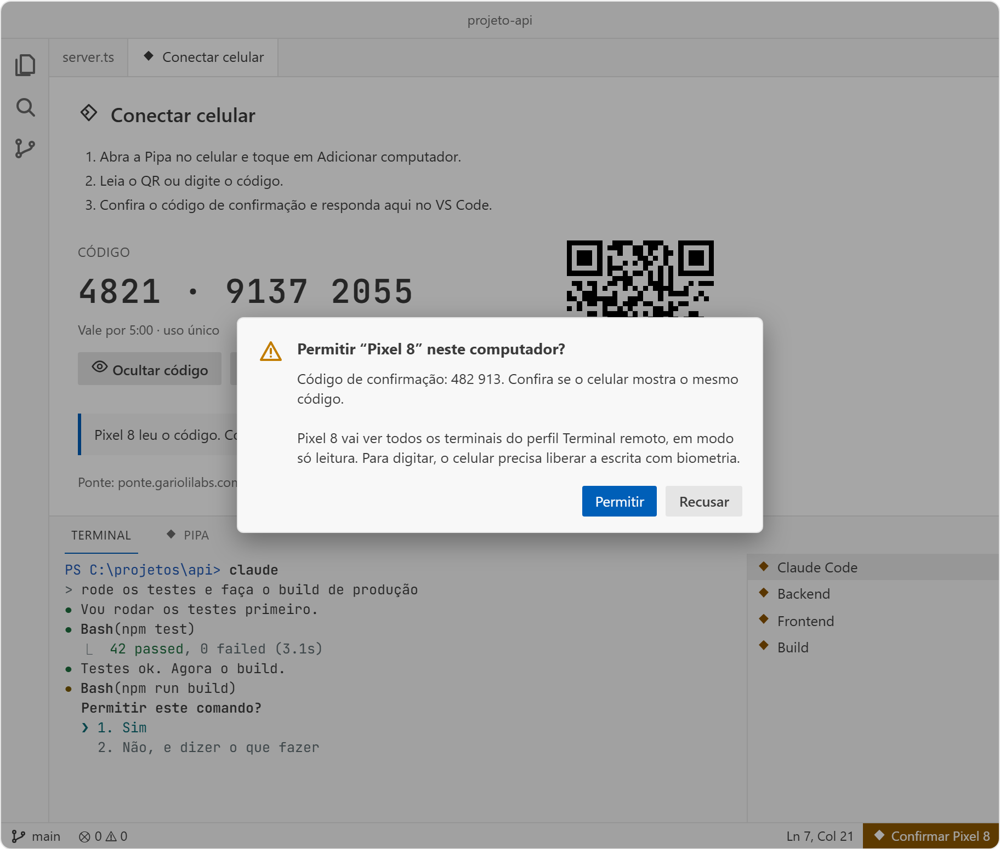 
      <b>Permitir aparelho.</b> O modal nomeia o celular e mostra o código de confirmação.
    </td>
  </tr>
  <tr>
    <td align="center" valign="top">
      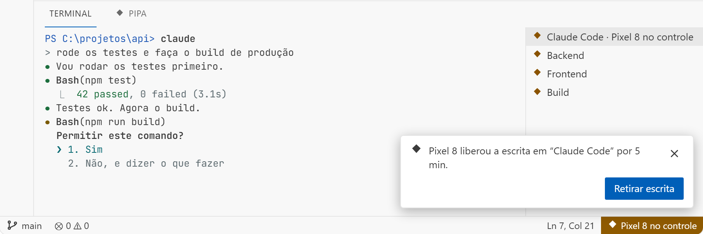 
      <b>Controle remoto visível.</b> A aba muda de nome e a barra de status muda de cor.
    </td>
    <td align="center" valign="top">
      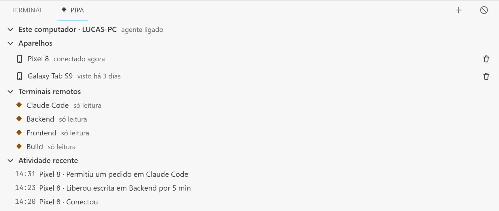 
      <b>Painel Pipa.</b> Aparelhos, terminais remotos e atividade recente.
    </td>
  </tr>
  <tr>
    <td align="center" valign="top" colspan="2">
       
      <b>Configurar servidor.</b> Pedido na primeira vez que você conecta um celular; depois vem a chave de inscrição.
    </td>
  </tr>
</table>

## Por que a Pipa

- **Nenhum terceiro no caminho.** Sem Tailscale, sem Microsoft Dev Tunnels,
  sem contas. O PC e o celular se conectam, por saída, a um **servidor
  próprio** (ponte `trc-bridge` num VPS ou num Raspberry), e ele só repassa
  bytes cifrados de ponta a ponta. Nenhuma porta fica aberta no PC. Não há
  servidor público: veja [Servidor](#servidor-não-há-servidor-público).
- **Contexto mínimo no celular, nada guardado nele.** O celular recebe o
  estado de cada terminal e um resumo curto. A tela vem sob demanda e fica só
  na memória, com captura de tela bloqueada por padrão. O celular guarda
  apenas a lista de PCs pareados e a própria chave.
- **Só leitura por padrão.** Para digitar, você libera **um** terminal por
  1, 5 ou 15 minutos com **biometria ou PIN** (o padrão ou a senha do
  aparelho também valem). A faixa de modo fica sempre visível, e o PC mostra
  quem está no controle.
- **Aprovações destrutivas e encerrar terminal pedem biometria ou PIN de
  novo**, mesmo com a escrita liberada. Recusar nunca pede.
- **Corte de acesso no PC.** Um comando derruba todas as conexões na hora,
  sem confirmação, e oferece **Reativar**. O corte continua valendo depois de
  reiniciar o PC.
- **Feita para agentes de IA.** Pedidos de permissão do Claude Code chegam
  pelos hooks dele como aprovações estruturadas ("executar `npm run build`?"),
  e não como teclas digitadas às cegas. Pedido já respondido no PC não aceita
  resposta.
- **Avisos de outros programas.** O agente vai oferecer uma entrada local de
  avisos: programas do próprio PC mandam um aviso curto ao celular pelo canal
  cifrado da Pipa. O primeiro cliente é o
  [claude-hadouken](https://github.com/Garioli-Labs/claude-hadouken), com
  alertas de consumo e avisos de tarefa terminada. No app, os avisos
  aparecem na seção **Avisos** do computador, e cada origem pode ser
  silenciada no celular. A notificação é opaca ("Novo aviso em LUCAS-PC"),
  num canal próprio. Transporte, autenticação de quem chama e formato da
  mensagem ainda estão em desenho
  ([EX1](docs/exigencias-externas.md)).
- **Terminais que sobrevivem ao VS Code.** Um agente próprio é dono dos
  terminais; a extensão só os exibe. Fechar o VS Code não mata as sessões.
- **Leve de rodar.** As metas abaixo são **metas, ainda não medições**: a
  fase M0 mede e a M2 as transforma em teste de regressão.

  | Componente | Meta |
  |---|---|
  | Agente parado, sem terminais | ≤ 20 MB de RAM, ~0 % de CPU (só eventos, sem polling) |
  | Agente, por terminal | ≤ 5 MB (histórico limitado a ~2 000 linhas) |
  | 4 terminais ativos + 1 celular assistindo | ≤ 2 % de um núcleo |
  | Extensão | sem módulo nativo |
  | Celular em segundo plano | nenhuma conexão aberta |
  | Envio → tela atualizada | ≤ 150 ms p95 com a ponte no Brasil; ≤ 400 ms p95 com a ponte nos EUA |

## Arquitetura

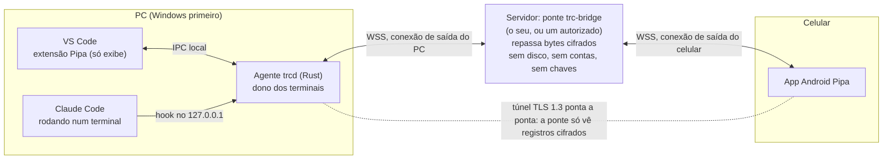
```mermaid
flowchart LR
  subgraph PC["PC (Windows primeiro)"]
    direction TB
    VS["VS Code<br/>extensão Pipa (só exibe)"]
    AG["Agente trcd (Rust)<br/>dono dos terminais"]
    CC["Claude Code<br/>rodando num terminal"]
    VS <-->|IPC local| AG
    CC -->|hook no 127.0.0.1| AG
  end
  BR["Servidor: ponte trc-bridge<br/>(o seu, ou um autorizado)<br/>repassa bytes cifrados<br/>sem disco, sem contas, sem chaves"]
  subgraph CEL["Celular"]
    APP["App Android Pipa"]
  end
  AG <-->|"WSS, conexão de saída do PC"| BR
  BR <-->|"WSS, conexão de saída do celular"| APP
  AG -.-|"túnel TLS 1.3 ponta a ponta: a ponte só vê registros cifrados"| APP
```

- **Agente dono dos terminais.** Os terminais do perfil "Terminal remoto"
  rodam num agente leve em Rust, iniciado no logon como processo do usuário
  (nunca como administrador nem como serviço). A extensão é uma view fina
  desses terminais, e as sessões sobrevivem ao fechamento do VS Code.
- **Tela, não fluxo de bytes.** O agente interpreta o terminal e envia ao
  celular o estado da tela (texto e estilo já interpretados), nunca a saída
  bruta com sequências de escape.
- **Ponte burra por construção.** Ela junta as duas pontas pelo número de
  encontro e copia bytes. Não guarda nada em disco, não tem banco e não
  conhece nenhuma chave. É um binário único que roda num Raspberry Pi, num
  VPS mínimo ou num contêiner. Onde `ponte.gariolilabs.com` vai morar é
  decidido na fase M6.

Detalhes em [auditoria](docs/auditoria-arquitetura-2026-09-26.md),
[conexão por código](docs/proposta-conexao-por-codigo-2026-09-26.md),
[ADRs](docs/adr/README.md) e [protocolo TRCP/1](docs/spec/trcp-1.md).

## Segurança e privacidade

| Fica no PC, sempre | Pode chegar ao celular | Nunca é guardado, em lugar nenhum |
|---|---|---|
| Saída bruta do terminal, histórico completo, variáveis de ambiente, arquivos, transcript do Claude Code, chaves privadas | Lista de terminais, estado, contexto curto, pedidos de atenção, tela visível e histórico paginado **só do terminal que você abriu, sob demanda** | Saída bruta, texto digitado, conteúdo de tela no celular (só memória, descartado ao sair) |

A notificação push leva só um identificador opaco ("Algo pede sua atenção em
LUCAS-PC"). O conteúdo é buscado pelo túnel quando você abre o app.

**Pareamento pelo código de 12 dígitos:**

- Os **4 primeiros** são o número de encontro: a ponte usa só para juntar as
  duas pontas.
- Os **8 restantes** são o segredo e **nunca saem dos aparelhos**. Eles
  alimentam uma troca de chaves SPAKE2 (o mesmo desenho do magic-wormhole).
- Quem tenta adivinhar tem **uma** tentativa por código (1 chance em
  100 milhões). Um erro invalida o código de forma visível, e não existe
  ataque offline, nem para quem controla a ponte.
- O QR leva o código e o endereço do servidor; o código digitado não leva o
  servidor, por isso o app tem o campo **Servidor**.
- O PC ainda pede confirmação: o modal nomeia o aparelho e mostra o código
  de confirmação de 6 dígitos, que precisa ser igual ao do celular.
- Depois disso, as chaves ficam fixadas (Android Keystore no celular, cofre
  do Windows no PC), e cada sessão usa TLS 1.3 mútuo dentro do fluxo
  repassado pela ponte.
- A ponte vê apenas IPs, horários e tamanhos. Esse metadado é aceito e
  declarado. Em `ponte.gariolilabs.com`, quem o vê é a Garioli Labs, e só
  de usuários autorizados.

A parte criptográfica passa por revisão de segurança dedicada antes de
qualquer código. Política de dados completa em
[privacidade](docs/privacy.md).

## Andamento

| Etapa | Estado |
|---|---|
| Auditoria da arquitetura | ✅ [feita](docs/auditoria-arquitetura-2026-09-26.md) |
| Conexão por código, sem terceiros | ✅ [aprovada](docs/proposta-conexao-por-codigo-2026-09-26.md) |
| Visão, nome e marca | ✅ [aprovados](docs/visao.md) |
| Interfaces (VS Code + Android) e protótipo | ✅ [aprovadas](docs/interfaces/README.md); revisão 2 aplicada |
| ADRs das decisões | ✅ [feitos](docs/adr/README.md), aguardam revisão |
| Protocolo TRCP/1 | ✅ [feito](docs/spec/trcp-1.md), aguarda revisão |
| Privacidade e requisitos não funcionais | ✅ [feitos](docs/privacy.md) ([requisitos](docs/requisitos-nao-funcionais.md)), aguardam revisão |
| Ponte e segurança (revisão Fable max) | ⏳ |
| Planos por fase (M0–M8) | ⏳ |
| Desenvolvimento | 🔒 aguardando aprovação do planejamento |

Mapa completo do planejamento:
[`docs/plans/00-mapa-do-planejamento.md`](docs/plans/00-mapa-do-planejamento.md).

## Documentos

- [Visão do produto](docs/visao.md)
- [Auditoria técnica e arquitetural](docs/auditoria-arquitetura-2026-09-26.md)
- [Conexão por código (ponte própria)](docs/proposta-conexao-por-codigo-2026-09-26.md)
- [Decisões de arquitetura (ADRs 0001–0014)](docs/adr/README.md)
- [Protocolo TRCP/1](docs/spec/trcp-1.md)
- [Privacidade](docs/privacy.md)
- [Requisitos não funcionais](docs/requisitos-nao-funcionais.md)
- [Exigências externas](docs/exigencias-externas.md) (EX1: avisos de outros
  programas)
- [Mapa do planejamento](docs/plans/00-mapa-do-planejamento.md)
- [Interfaces](docs/interfaces/README.md):
  - [fluxos](docs/interfaces/fluxos.md)
  - [VS Code](docs/interfaces/vscode.md)
  - [Android](docs/interfaces/android.md)
  - [identidade visual](docs/interfaces/identidade-visual.md)
  - [textos PT-BR/EN](docs/interfaces/textos.md)
  - [exigências para o protocolo](docs/interfaces/exigencias-para-o-protocolo.md)
  - [ajustes da revisão 2](docs/interfaces/ajustes-pendentes-2026-09-26.md)
  - [protótipo navegável](docs/interfaces/prototipo/index.html): abra o
    arquivo localmente no navegador.
- [Conceitos de logo](docs/marca/pipa-conceitos-de-logo.html)

## Identidade visual

Estilo terminal: base sóbria de papel e tinta, uma única cor de marca e
monoespaçada onde o dado é de terminal. Cada cor tem um significado só.

| | Cor | Hex | Uso |
|---|---|---|---|
|  | Âmbar de fósforo | `#F2A93B` | marca e atenção (pedido pendente) |
|  | Âmbar para texto | `#8A5300` | texto "âmbar" sobre fundo claro |
|  | Tinta | `#11141A` | texto, botão principal, fundo escuro |
|  | Papel | `#F4F1EA` | fundo claro |
|  | Magenta | `#86277D` | escrita liberada |
|  | Vermelho | `#B0251C` | destrutivo ou erro |

- **Tipografia:** JetBrains Mono (marca e terminal) + IBM Plex Sans (UI).
- **Acessibilidade medida:** contraste WCAG 2.2 AA sem reprovações em 96
  pares de tokens e em 4.474 textos renderizados, nos dois temas; alvos de
  toque de 48 dp.

## Perguntas frequentes

**Preciso de Tailscale ou de uma VPN?**
Não. A Pipa não depende de Tailscale, Microsoft Dev Tunnels nem de contas de
terceiros. O PC e o celular fazem conexões de saída até o servidor (a
ponte), por isso funcionam atrás de CGNAT e sem porta aberta no PC.

**Posso usar o servidor `ponte.gariolilabs.com`?**
Só com autorização de Sr. Garioli: ele é privado. Sem autorização, você
hospeda o seu, com o mesmo `trc-bridge`, num VPS ou num Raspberry. Raspberry
em casa atrás de CGNAT só funciona com IP público da operadora; sem ele, use
um VPS.

**Não tenho biometria cadastrada. Consigo usar?**
Sim. O PIN, o padrão ou a senha do aparelho também liberam a escrita. Sem
biometria nem bloqueio de tela no celular, o app só lê.

**Funciona no iPhone?**
Ainda não. O iOS fica fora do escopo inicial; o app é Android.

**O celular guarda o que aparece nos meus terminais?**
Não. A tela fica só na memória e é descartada ao sair. O celular não guarda
nem a lista de terminais: só a lista de PCs pareados e a chave dele.

**A ponte consegue ler meus terminais?**
Não. Ela só vê bytes cifrados, além de IPs, horários e tamanhos.

**E se o PC dormir?**
O agente não impede o sleep. O app mostra "LUCAS-PC está offline desde
14:02" e nenhuma ação remota fica disponível até o PC acordar.

**Todo terminal do VS Code fica acessível pelo celular?**
Só os do perfil "Terminal remoto", que a extensão oferece como padrão. Os
terminais que já existiam antes da instalação, ou abertos por outro perfil,
continuam só locais.

## Plataformas

- Extensão VS Code (Windows primeiro; Linux e macOS depois).
- App Android. iOS fica fora do escopo inicial.
- Idiomas: português (Brasil) e inglês.

## Licença

A definir.
