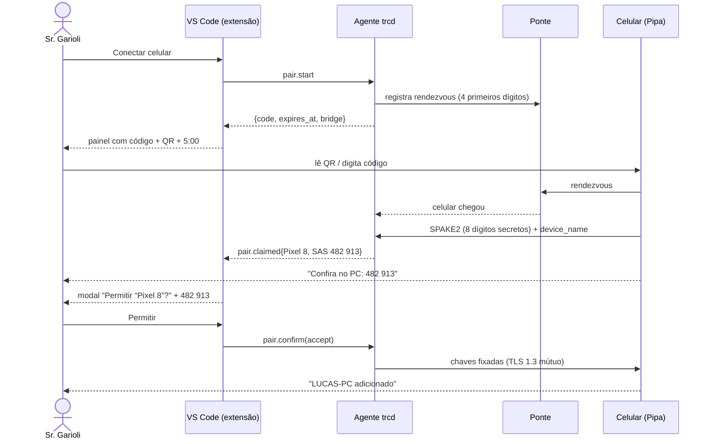
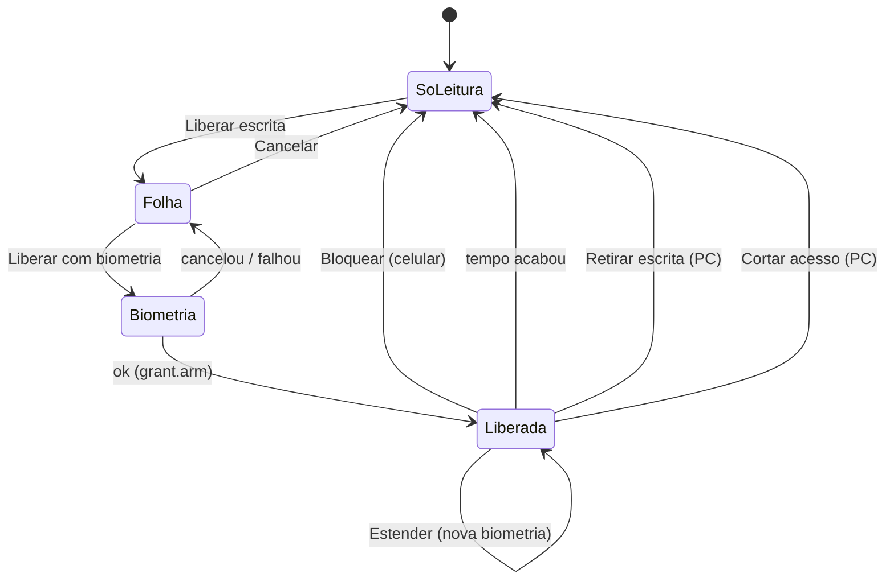
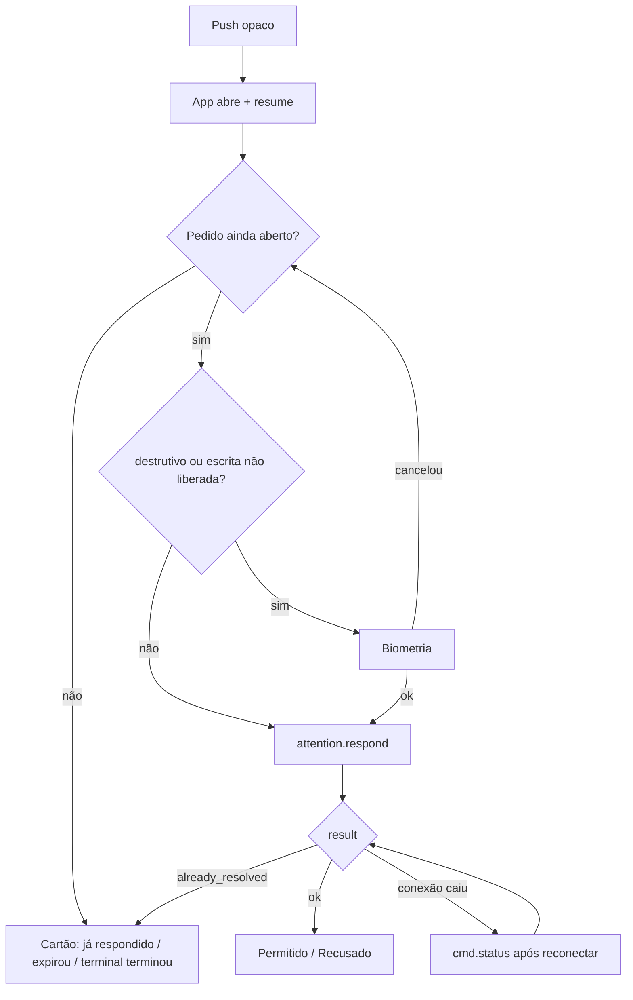
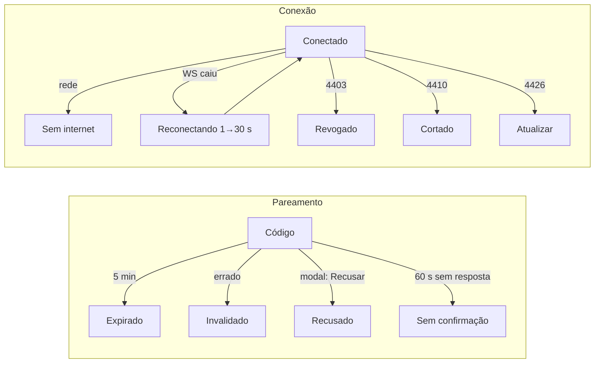

# Fluxos de uso (P7)

Status: rascunho de planejamento, 2026-09-26.

- Nomes de tela: `android.md` (A§n) e `vscode.md` (V§n).
- Textos: `textos.md`.
- No protótipo, cada passo tem um atalho `#<estado>`.

Personagem: Sr. Garioli, com o PC "LUCAS-PC" (VS Code com terminais
"Claude Code", "Backend", "Frontend", "Build") e um Pixel 8.

## F1. Instalar e parear (caminho feliz)

1. No PC, instala a extensão Pipa.
   - O agente `trcd` sobe.
   - A barra de status mostra `$(pipa) Pipa` (V§2).
   - Uma notificação oferece "Usar Terminal remoto como padrão?"; só grava
     com o sim (V§6).
2. No celular, instala a Pipa e abre: **Boas-vindas** (A§1) → **Adicionar
   computador** (A§2).
3. No VS Code: barra de status → **Conectar celular**. Abre o painel com o
   código `4821 · 9137 2055`, o QR e "Vale por 5:00" (V§4, `#vs_pair`).
4. No celular: lê o QR (ou digita os 12 dígitos) e confere o nome "Pixel 8"
   → **Conectar** (`#add_code_full`).
5. O celular mostra **Conectando** (`#pair_connecting`) e depois **Confira no
   PC** com `482 913` (`#pair_verify`).
6. Ao mesmo tempo, o VS Code mostra o modal **"Permitir “Pixel 8” neste
   computador?"**, com o mesmo `482 913` (V§5, `#vs_modal`).
7. Sr. Garioli compara os códigos → **Permitir**.
8. O celular mostra **LUCAS-PC adicionado** (`#pair_success`) → Ver
   terminais.
9. O app pede a permissão de notificação, com explicação.

## F2. Uso diário: acompanhar

1. Abre a Pipa: **Computadores** (A§5) mostra "LUCAS-PC · online ·
   4 terminais".
2. Toca em LUCAS-PC: **Terminais** (A§6). Cada terminal mostra estado e
   contexto em uma linha.
3. Toca em "Backend": **Terminal** em só leitura (A§7). A tela é ao vivo e
   quebra linha.
4. Rola para cima → "Carregar 200 linhas anteriores" → … → "Início do
   histórico guardado no PC" (`#session_history`).
5. Sai do app. A conexão fecha; nada da tela fica no celular.

## F3. Uso diário: digitar

1. No terminal "Claude Code", toca **Liberar escrita**. A folha (A§8)
   oferece 1 / 5 / 15 min, padrão 5 (`#arm`).
2. **Liberar com biometria** → `BiometricPrompt` (`#arm_bio`) → a faixa fica
   magenta, "Escrita liberada · 5:00" (`#session_armed`).
3. **No PC, ao mesmo tempo:**
   - a aba vira "Claude Code · Pixel 8 no controle";
   - a barra de status fica em warning "Pixel 8 no controle";
   - aparece a notificação com "Retirar escrita" (`#vs_armed`).
4. Digita `npm run lint` → Enviar. Aparece "Enviando…" e depois "Enviado.".
   Esc, Tab, setas, Enter e Ctrl+C ficam na grade de teclas.
5. Aos 30 s do fim: "A escrita termina em 30 s." + Estender
   (`#session_expiring`).
6. No fim, a escrita volta a só leitura. O texto não enviado fica no campo.

## F4. Aprovar um pedido do Claude Code

1. O Claude Code pede permissão para `npm run build`. O agente abre
   `attention` (fonte: adapter).
2. O push chega: **"Algo pede sua atenção em LUCAS-PC"** (A§11, `#notif`).
   Nada do comando aparece.
3. Toque → app → `resume` → **Pedido** (A§10, `#attn`):
   - "Claude pede permissão";
   - caixa com `npm run build`;
   - "Claude Code · LUCAS-PC · ~/projetos/api · há 12 s".
4. **Permitir:**
   - se a escrita estiver liberada, envia direto;
   - senão, pede biometria (a nota avisa antes);
   - aparece "Enviando resposta…" e depois "Permitido. O Claude continuou."
     (`#attn_done`).
5. **Recusar:** envia sem biometria → "Recusado. O Claude foi avisado."

**Variações:**

- **Destrutivo** (`rm -rf dist`, `#attn_destructive`): nota vermelha,
  "Permitir com biometria" **sempre**, mesmo com escrita liberada.
- **Detectado pela tela** (`#attn_heuristic`): aviso âmbar "Confira o
  terminal antes de responder".
- **Já respondido no PC** (`#attn_stale`): sem botões, só o cartão
  "Já respondido no PC às 14:33" e Abrir terminal.
- **Claude parou de esperar** (`#attn_expired`).

## F5. Revogar e cortar (lado do PC)

**Revogar um aparelho:**

1. Painel Pipa → Aparelhos → "Galaxy Tab S9" → ícone de lixeira
   (`#vs_revoke`).
2. Modal "Revogar “Galaxy Tab S9”?" nomeia o aparelho → Revogar.
3. Aparece a notificação "Galaxy Tab S9 não tem mais acesso." O aparelho, se
   estiver conectado, cai com 4403 e mostra **"Este celular foi removido de
   LUCAS-PC"** (`#revoked`).

**Kill switch:**

1. Barra de status → **Cortar acesso remoto**. Não há confirmação
   (`#vs_cut`).
2. Todas as conexões caem com 4410. As escritas liberadas terminam. O
   celular mostra **"Acesso remoto cortado em LUCAS-PC"** (`#cut`).
3. A notificação no PC oferece **Reativar** (desfazer). O corte persiste
   até alguém reativar no PC (pergunta Q5).

**Retirar a escrita:** na barra de status ou na árvore, **Retirar escrita de
Pixel 8**. O celular volta a só leitura e mostra "A escrita foi retirada no
PC".

## F6. Remover o PC pelo celular

Aparelhos e segurança → **Remover LUCAS-PC deste celular** → o diálogo nomeia
o PC → Remover LUCAS-PC (`#remove_pc`).

- `device.forget` faz o agente registrar a remoção.
- O celular apaga a chave e volta à Boas-vindas.

## F7. Caminhos de falha

| # | Situação | O que a pessoa vê | Como sai |
|---|---|---|---|
| X1 | Código expirou (5 min) | celular: `pair.err_expired_*`; PC: "O código expirou" | Gerar novo código |
| X2 | Código digitado errado | celular: `pair.err_wrong_*`; PC: "Alguém digitou um código errado. Este código foi invalidado" | Gerar novo código; tentativa única (anti-força-bruta) |
| X3 | Recusado no PC | celular: `pair.err_rejected_*` | Conferir se é o PC certo |
| X4 | Ninguém respondeu o modal em 60 s | celular: `pair.err_timeout_*` | Tentar de novo perto do PC |
| X5 | Códigos de confirmação diferentes | a dica na tela manda recusar no PC e cancelar | Recusar; gerar novo código |
| X6 | Ponte fora | faixa / cartão com o endereço da ponte | Tentar de novo; conferir a ponte |
| X7 | Sem internet no celular | faixa "Sem internet"; a tela antiga é descartada, não gravada | volta sozinho |
| X8 | PC dormindo / desligado | "LUCAS-PC está offline desde 14:02" | nenhuma ação remota; acordar o PC |
| X9 | Conexão caiu no meio de um envio | "Conferindo no PC se chegou…" → "Chegou" / "Não chegou; seu texto continua aqui" | `cmd.status`, nunca reenvio automático |
| X10 | A tela mudou antes do envio | "A tela mudou antes do envio. Nada foi enviado." | Conferir e enviar de novo |
| X11 | A escrita expirou com texto no campo | "A escrita expirou… Seu texto continua aqui." | Liberar de novo |
| X12 | Aparelho revogado | tela cheia de revogado | Adicionar de novo |
| X13 | Acesso cortado | tela "cortado" | Só o PC reativa |
| X14 | Agente parado no PC | PC: "Pipa parada" (warning); celular: PC offline | Iniciar agente |
| X15 | Versões diferentes | "Atualize a Pipa…" | Loja |
| X16 | Sem biometria nem bloqueio no Android | a folha explica e leva às configurações | Configurar bloqueio |
| X17 | Câmera negada | aba QR explica; aba Digitar funciona | Digitar código |

