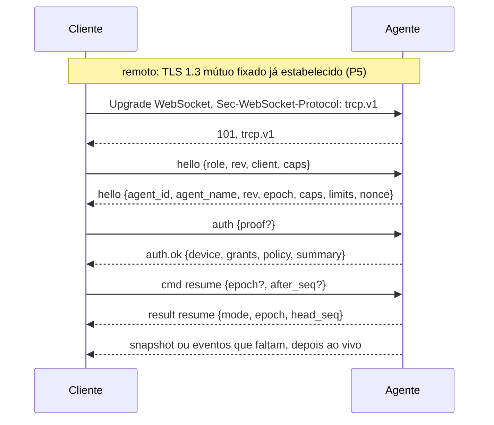
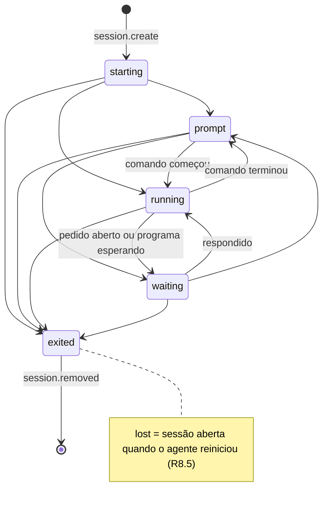
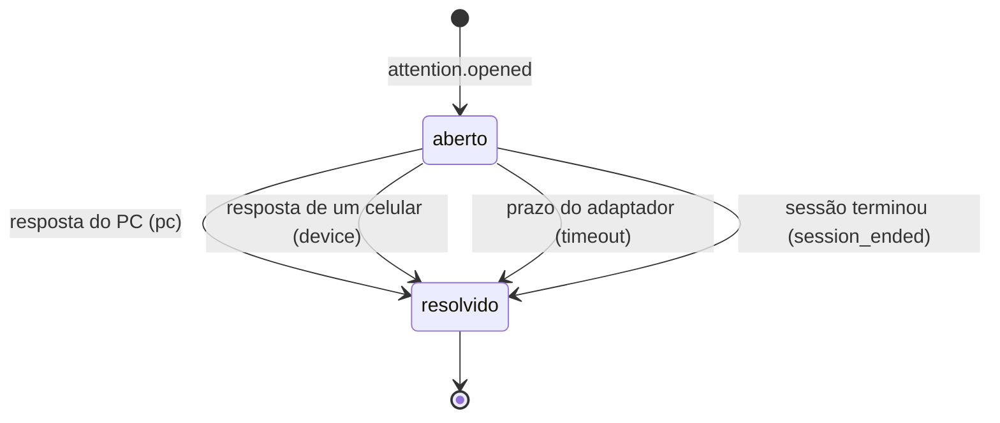
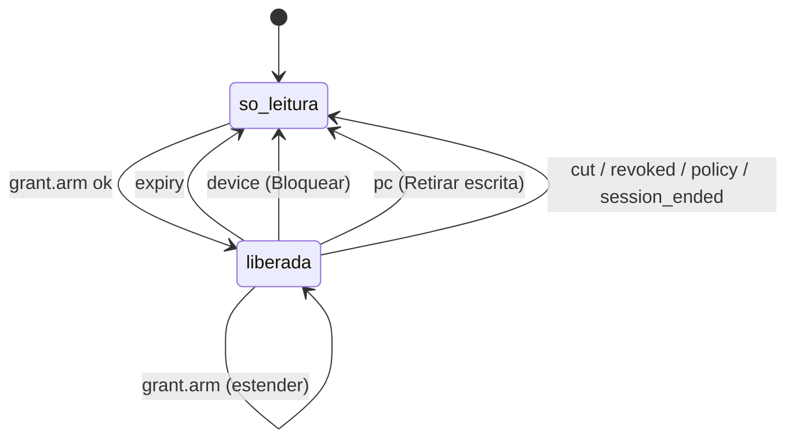
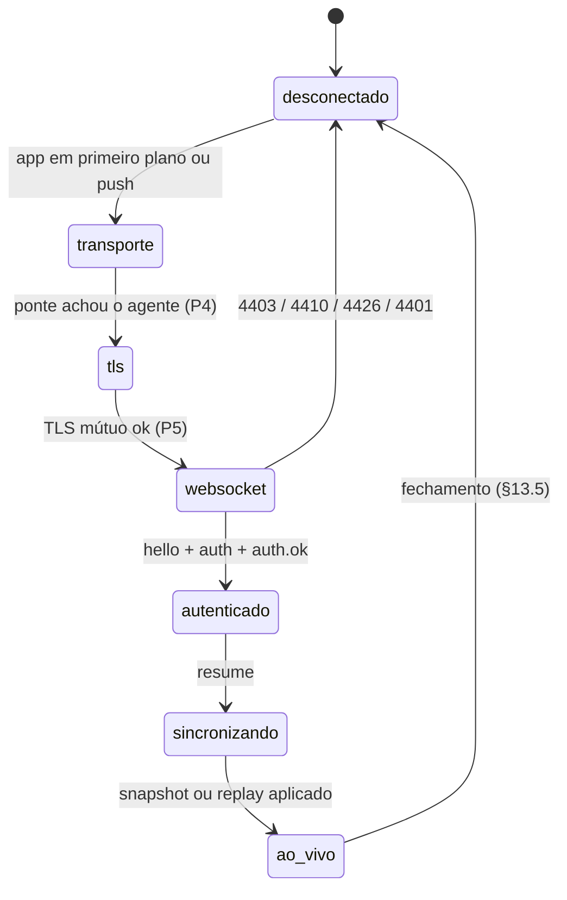
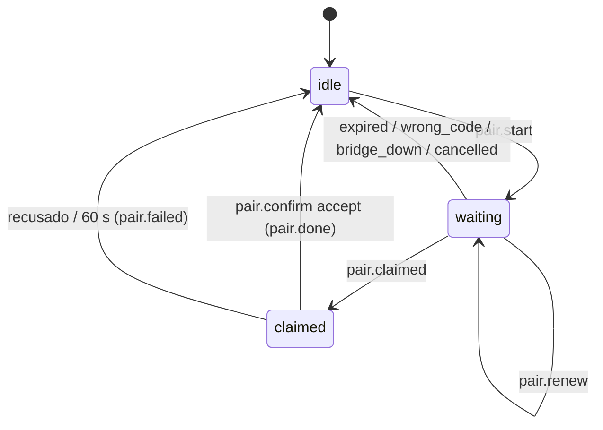

# TRCP/1 — Especificação do protocolo

Status: **rascunho para revisão**, 2026-09-26. Entrega P3 de
`docs/plans/00-mapa-do-planejamento.md`. Planejamento: nada aqui é código
de produto.

- Subprotocolo WebSocket: `trcp.v1`.
- Revisão menor descrita aqui: `rev` 0.
- Dono: Agente de protocolo (P3). Revisões: segurança (P5, Fable max) e
  requisitos não funcionais (P8) antes de qualquer código.

## Sumário

0. Sobre este documento
1. Convenções
2. Papéis e perfis
3. Transporte e framing
4. Envelope
5. Handshake, versão e capacidades
6. Autenticação e autorização
7. Tempo e identificadores
8. Event Log
9. Screen Sync
10. Comandos: regras gerais e semântica
11. Catálogo de mensagens
12. Estados
13. Erros e códigos de fechamento
14. Limites e rate limits
15. Versionamento e evolução
16. Privacidade: o que o protocolo impõe
17. Interfaces com as outras entregas
18. Fixtures de conformidade descritas
19. Decisões desta spec e pontos em aberto
20. Rastreabilidade das exigências das interfaces
21. Referências

## 0. Sobre este documento

### 0.1 Fontes e precedência

Base, já decidida e não reaberta aqui:

- `docs/auditoria-arquitetura-2026-09-26.md`: §5 (esboço do TRCP/1), §6
  (ameaças), §7 (dados) e §13 (leveza);
- `docs/proposta-conexao-por-codigo-2026-09-26.md`: ponte própria, código
  de 12 dígitos, TLS 1.3 mútuo fixado dentro do fluxo repassado;
- interfaces aprovadas em 2026-09-26 (`docs/interfaces/`): `android.md`,
  `vscode.md`, `fluxos.md`, `textos.md` e
  `exigencias-para-o-protocolo.md`;
- ADR-0001 a ADR-0014 (`docs/adr/`);
- decisões de Sr. Garioli de 2026-09-26, recebidas durante esta entrega:
  1. se a pessoa recusa o perfil padrão, a extensão não pergunta de novo;
     para o celular só existem as sessões do perfil "Terminal remoto";
  2. push = FCM com payload opaco, sem conteúdo; o app acorda e busca pelo
     túnel; UnifiedPush fica fora do MVP;
  3. liberar escrita aceita biometria forte **ou** credencial do aparelho
     (PIN/padrão);
  4. ponte `ponte.gariolilabs.com` **privada** (só Sr. Garioli e quem
     ele autorizar, com chave de inscrição emitida por ele); não há ponte
     pública, e os demais usam a própria ponte, com o mesmo binário
     (revista em 2026-09-26; `docs/adr/README.md` item 5).
- requisito derivado do ADR-0002, pedido por P2 durante esta entrega: o
  agente informa se o perfil "Terminal remoto" é o padrão no PC, para o
  celular mostrar o estado vazio certo depois de um "não" (§11.7,
  requisito AD1 em §20);
- ADR-0014: push pelo FCM, payload opaco `{agent_id, attention_id}`.

Precedência, quando dois documentos discordam:

1. telas e textos aprovados (`docs/interfaces/`). Esta spec **não muda
   tela nem texto**; quando precisa de algo que mudaria uma tela, registra
   em §19.2;
2. ADRs aceitas;
3. esta spec;
4. auditoria e proposta, que são esboços.

### 0.2 Rótulos de evidência

- **[FATO]**: conferido em 2026-09-26 em documentação oficial; o link está
  ao lado ou em §21.
- **[INFERÊNCIA]**: conclusão a partir de fatos. "Validar em M0" quando
  precisa de prova antes do código.
- **[P8]**: número proposto, a validar e medir em P8
  (`docs/requisitos-nao-funcionais.md`). Todo número rotulado assim é
  **proposta**, não medição.
- **A definir em P4 / P5 / P6 / M5 / M8**: fica para outro documento; esta
  spec só deixa o gancho.

### 0.3 Escopo

**Define:** as mensagens trocadas entre o agente `trcd` e seus clientes
(extensão VS Code, CLI `trc` e app Android): transporte do WebSocket,
envelope, handshake, autorização na camada do protocolo, Event Log, Screen
Sync, comandos, erros, limites, versionamento e as exigências de
privacidade que o protocolo impõe.

**Não define:**

- o protocolo da ponte `trc-bridge`: encontro por código, presença, modos
  permanente e sob demanda, formato do túnel (**P4**, `docs/spec/bridge.md`);
- a criptografia: SPAKE2, código de confirmação (SAS), chaves, TLS
  fixado, formato exato do step-up, rotação e revogação de chaves (**P5**,
  `docs/security.md`);
- a política de dados, redação e retenção (**P6**, `docs/privacy.md`);
- as metas e o método de medição (**P8**);
- o adaptador do Claude Code (**M5**): o HTTP hook fala com o agente em
  loopback, fora do TRCP (§2);
- o envio do push (**M8**, com P4). Aqui ficam só o registro do token e a
  regra de conteúdo.

## 1. Convenções

### 1.1 Palavras normativas

As palavras abaixo seguem o sentido da RFC 2119, com o esclarecimento da
RFC 8174: só têm valor normativo quando escritas em MAIÚSCULAS.

| Termo nesta spec | Equivalente na RFC 2119 | Sentido |
|---|---|---|
| DEVE, DEVEM | MUST, REQUIRED, SHALL | obrigatório |
| NÃO DEVE, NÃO DEVEM | MUST NOT, SHALL NOT | proibido |
| DEVERIA, DEVERIAM | SHOULD, RECOMMENDED | recomendado; quem desviar registra o motivo |
| NÃO DEVERIA | SHOULD NOT, NOT RECOMMENDED | desaconselhado; idem |
| PODE, PODEM | MAY, OPTIONAL | opcional |

Fontes: https://www.rfc-editor.org/rfc/rfc2119 e
https://www.rfc-editor.org/rfc/rfc8174.

### 1.2 Notação

- As mensagens são objetos JSON. Nos exemplos do catálogo (§11), os
  campos `v`, `id` e `ts` do envelope são omitidos por brevidade; numa
  mensagem real eles são obrigatórios (§4).
- Tipos: `str` (texto UTF-8), `int` (inteiro JSON dentro da faixa I-JSON,
  §4), `bool`, `obj`, `arr<T>`, `ulid` (§7.1), `ts` (inteiro, ms desde a
  época Unix, §7.2).
- Sufixo `?`: campo opcional, que pode estar **ausente**. `null` só é
  aceito onde o tipo diz `|null`.
- Tamanhos em **bytes** são bytes UTF-8. Tamanhos em **caracteres** são
  valores escalares Unicode.
- Regras numeradas (`R8.3`) servem para citação nas fixtures (§18) e na
  rastreabilidade (§20).
- IDs usados nos exemplos:

| Nome | Valor | O que é |
|---|---|---|
| AGENTE | `01J8ZK3M4N5P6Q7R8S9T0VWXYZ` | agente de LUCAS-PC |
| ÉPOCA1 | `01J8ZM0A1B2C3D4E5F6G7H8J9K` | época atual do log |
| ÉPOCA0 | `01J8ZMA0B1C2D3E4F5G6H7J8K9` | época anterior |
| S1 | `01J8ZNA1B1C1D1E1F1G1H1J1K1` | sessão "Claude Code" |
| S2 | `01J8ZNA2B2C2D2E2F2G2H2J2K2` | sessão "Backend" |
| AT1 | `01J8ZQ5R6S7T8V9W0X1Y2Z3A4B` | pedido de permissão |
| D1 | `01J8ZD9E8F7G6H5J4K3M2N1P0Q` | aparelho "Pixel 8" |
| D2 | `01J8ZDA9B8C7D6E5F4G3H2J1K0` | aparelho "Galaxy Tab S9" |
| C1, C2, … | `01J8ZRCMD000000000000000C1`, … | IDs de comando; o fim do id é o número |

- Horários dos exemplos: `1790443920000` = 2026-09-26 17:32:00 UTC
  (14:32 em Brasília).

## 2. Papéis e perfis

```text
 PC do usuário (conta comum, nunca admin)
┌────────────────────────────────────────────────────────────────┐
│ VS Code: extensão Pipa ──┐                                     │
│ CLI trc ─────────────────┤ perfil local: WebSocket trcp.v1     │
│                          │ sobre named pipe com ACL do usuário │
│                          ▼                                     │
│ trcd (agente): dono dos PTYs, emulador VT por sessão,          │
│   Event Log, Screen Sync, grants, audit                        │
│      ▲                                                         │
│      └── HTTP hook em 127.0.0.1 ── Claude Code (adaptador; M5) │
└──────┬─────────────────────────────────────────────────────────┘
       │ conexão de saída; túnel repassado pela ponte (P4)
┌──────▼──────┐                           ┌────────────────────┐
│ trc-bridge  │ ◄──── conexão de saída ── │ app Pipa (Android) │
│ só repassa  │                           │ perfil remoto      │
│ bytes       │                           └────────────────────┘
└─────────────┘
 TLS 1.3 mútuo fixado ponta a ponta, agente ⇄ celular (P5),
 e o WebSocket trcp.v1 dentro dele.
```

| Papel | Componente | Fala TRCP? | Perfil |
|---|---|---|---|
| Agente | `trcd`, processo do usuário | sim, é o único servidor | — |
| Extensão VS Code | view fina dos PTYs do agente (`Pseudoterminal`) | sim, cliente | `local` |
| CLI | `trc`, cliente de teste e de conformidade | sim, cliente | `local` |
| Celular | app Pipa (Android) | sim, cliente | `remote` |
| Ponte | `trc-bridge` | **não**: repassa bytes cifrados e não vê mensagens TRCP | — |
| Adaptador Claude Code | HTTP hook do Claude Code para o agente | **não**: é entrada do agente, em loopback | — |

Regras:

- **R2.1** O agente DEVE ser a única fonte de verdade de sessões, telas,
  pedidos de atenção, grants, política e estado de corte. Os clientes só
  mostram e pedem.
- **R2.2** Só existem para o protocolo as sessões que o agente criou (o
  perfil "Terminal remoto"). Terminais do VS Code abertos em outro perfil
  NÃO DEVEM aparecer no TRCP (ADR-0002; decisão 1 de 2026-09-26).
- **R2.3** O perfil de uma conexão é fixado no `hello` (§5) e NÃO DEVE
  mudar durante a conexão.
- **R2.4** O perfil `remote` NUNCA recebe bytes VT crus (ADR-0007). O
  canal bruto `pty.*` (§9.10) só existe no perfil `local`.
- **R2.5** Nenhuma garantia do TRCP depende da ponte além de ela repassar
  bytes. A ponte é tratada como rede hostil (proposta §7).
- **R2.6** O agente DEVE informar a todos os clientes se o perfil
  "Terminal remoto" é o padrão dos novos terminais no PC
  (`agent.remote_profile_default`, §11.7). O celular escolhe o estado
  vazio da lista de terminais por esse valor (ADR-0002; requisito AD1).

O que cada perfil pode fazer:

| Capacidade | `local` (extensão, CLI) | `remote` (celular) |
|---|---|---|
| Lista, estados, contexto, pedidos (Event Log) | sim | sim, com projeção (§8.2) |
| Conteúdo da tela | canal bruto `pty.*`, para o xterm do VS Code | Screen Sync `screen.*` |
| Digitar no terminal | `pty.input`, sem liberar escrita: a pessoa está no PC | `input.send`, só com escrita liberada |
| Responder pedido | PODE (`resolved_by = pc`) | com as regras de §10.6.3 |
| Criar terminal | sim (`session.create` com `profile_id` e `cwd`) | não no MVP (§10.6.7) |
| Encerrar terminal | sim, sem step-up | com step-up |
| Pareamento, aparelhos, corte, política, nome do PC | sim | não; só remover o próprio pareamento e ler os próprios dados |

## 3. Transporte e framing

### 3.1 Pilha do perfil remoto

De fora para dentro:

1. conexão de saída do celular e do agente até a ponte (WSS; formato e
   modos em **P4**; a ponte configurada na extensão: a própria do
   usuário ou, para Sr. Garioli e quem ele autorizar, a privada
   `ponte.gariolilabs.com`, com o mesmo binário, decisão 4 e ADR-0004);
2. fluxo de bytes repassado pela ponte, que não o interpreta;
3. **TLS 1.3 mútuo com chaves fixadas** no pareamento, ponta a ponta entre
   agente e celular (**P5**);
4. dentro do TLS, **HTTP/1.1 Upgrade para WebSocket** (RFC 6455) com o
   subprotocolo `trcp.v1`;
5. mensagens TRCP em frames de texto.

- **R3.1** O cliente remoto DEVE oferecer `trcp.v1` em
  `Sec-WebSocket-Protocol`. O agente DEVE selecionar `trcp.v1` quando
  oferecido.
- **R3.2** O agente NÃO DEVE aceitar o Upgrade do perfil remoto fora do
  TLS mútuo fixado. O TLS é o que autentica o aparelho (§6.1).
- **R3.3** O caminho do Upgrade é `/trcp`. O agente PODE ignorar `Host`
  (o túnel já é ponta a ponta), mas DEVE rejeitar com HTTP 400 um pedido
  que não seja Upgrade para WebSocket.
- **R3.4** Um pedido de Upgrade com o cabeçalho `Origin` DEVE ser
  rejeitado com HTTP 403. **[FATO]** Navegadores DEVEM enviar `Origin`
  (RFC 6455 §4.1, §10.2); nenhum cliente TRCP legítimo é navegador.

### 3.2 Pilha do perfil local

- Transporte: **named pipe do Windows** criado pelo agente, com DACL que
  só dá acesso à conta do usuário, e o mesmo WebSocket `trcp.v1` por cima
  (auditoria §5.1; exigências §3).
- **[FATO]** `CreateNamedPipe` aceita `PIPE_REJECT_REMOTE_CLIENTS`, que
  rejeita clientes de outra máquina, e a DACL vem do
  `lpSecurityAttributes`
  (https://learn.microsoft.com/windows/win32/api/namedpipeapi/nf-namedpipeapi-createnamedpipew).
- **R3.5** O agente DEVE criar o pipe com `PIPE_REJECT_REMOTE_CLIENTS` e
  com DACL restrita ao SID do usuário.
- O nome do pipe, a proteção contra outro processo criar o pipe antes do
  agente (squatting) e a verificação, pela extensão, de que o servidor é o
  agente legítimo ficam para **P5** (auditoria §6, ameaças de processo
  local).
- **[INFERÊNCIA]** a extensão (Node) fala WebSocket sobre o pipe: o `net`
  do Node aceita caminho de pipe do Windows, e o cliente WebSocket precisa
  aceitar um socket já conectado. Validar em M0/M4. Se não der, o perfil
  local PODE usar framing próprio sobre o pipe, com as **mesmas**
  mensagens TRCP; esta spec só exige que o conteúdo das mensagens seja
  idêntico.

### 3.3 Regras de WebSocket (os dois perfis)

- **R3.6** Toda mensagem TRCP DEVE ser **um** frame de texto (opcode 0x1),
  com um objeto JSON. **[FATO]** O conteúdo de frame de texto é UTF-8
  válido (RFC 6455 §5.6); quem recebe UTF-8 inválido DEVE falhar a
  conexão (§8.1), com o código 1007 (§7.4.1).
- **R3.7** Frames binários NÃO DEVEM ser usados em v1. Quem receber frame
  binário DEVE fechar com 4400.
- **R3.8** Fragmentação é permitida pelo WebSocket; o limite de tamanho
  (§14) vale para a mensagem remontada. Mensagem acima do limite fecha com
  **1009**.
- **R3.9** Os dois lados NÃO DEVEM negociar extensões WebSocket, em
  especial compressão (`permessage-deflate`, RFC 7692). **[INFERÊNCIA]**
  compressão de texto controlado por terceiros junto com segredos da tela
  abre vazamento por tamanho no estilo CRIME/BREACH; a economia de banda
  não compensa. Revisar em P5 e P8.
- **R3.10** Keepalive: o **cliente** DEVE enviar Ping a cada 20 s sem
  tráfego enviado [P8]; o agente DEVE responder Pong (**[FATO]** o Pong
  ecoa os dados do Ping, RFC 6455 §5.5.2–5.5.3). Um lado que não recebe
  nenhum frame por 45 s [P8] DEVE considerar a conexão morta e fechá-la.
  O agente PODE enviar Ping também.
- **R3.11** O RTT de "ponte alcançável · 182 ms" (E23) é medido pelo
  cliente com o próprio Ping/Pong. O TRCP não define mensagem para isso.

### 3.4 Uma conexão por aparelho

- **R3.12** O agente DEVE manter no máximo **uma** conexão remota por
  aparelho. Quando o mesmo aparelho abre outra, o agente DEVE fechar a
  antiga com **4409** e reason `{"code":"replaced"}` antes de responder o
  `auth.ok` da nova.
- **R3.13** Conexões locais podem ser várias (cada janela do VS Code e a
  CLI têm a sua).
- O total de conexões remotas por agente tem teto (§14).

## 4. Envelope

### 4.1 Campos

Toda mensagem é um objeto JSON com estes campos:

| Campo | Tipo | Presença | Regra |
|---|---|---|---|
| `v` | int | sempre | Versão maior do protocolo. Em `trcp.v1`, DEVE ser `1`. |
| `t` | str | sempre | Tipo da mensagem (§4.2). |
| `k` | str | sempre | Nome da mensagem dentro do tipo, ex.: `input.send`. Padrão `^[a-z][a-z0-9_]*(\.[a-z0-9_]+)*$`, até 64 caracteres. |
| `id` | ulid | sempre | ULID novo a cada mensagem do remetente, nunca reaproveitado entre conexões. Em `cmd`, é a chave de idempotência (§10.2). Em `event` do log, é o id do evento. |
| `ts` | int | sempre | Hora do remetente, ms desde a época Unix. **Só informativo**: o agente nunca decide nada pelo `ts` do cliente (§7.2). |
| `epoch` | ulid | só `event` do log e `snapshot` | Época do Event Log (§8.1). Ausente nas outras mensagens. |
| `seq` | int | só `event` do log e `snapshot` | Posição no log, de 1 a 2^53−1 (§8.1). |
| `s` | ulid | quando a mensagem é sobre uma sessão | Id da sessão. NÃO DEVE ser repetido como campo de primeiro nível de `p`; objetos aninhados PODEM ter `session_id` para serem autocontidos (§11.7). |
| `p` | obj | sempre | Payload. PODE ser `{}`. |

- **R4.1** O receptor DEVE fechar com **4400** quando faltar campo
  obrigatório, quando `v` ≠ 1, ou quando um campo do envelope tiver o
  tipo errado.
- **R4.2** O receptor DEVE ignorar campos desconhecidos no envelope e em
  `p` (evolução, §15).
- **R4.3** As mensagens DEVEM seguir o I-JSON (RFC 7493): **[FATO]**
  UTF-8 (§2.1), números inteiros dentro de ±(2^53−1) (§2.2) e sem nomes
  de membro duplicados (§2.3). JSON com membro duplicado DEVE fechar com
  4400.
- **R4.4** Campos de texto NÃO DEVEM conter U+0000. Os limites em
  caracteres e bytes estão em cada campo e em §14.

### 4.2 Tipos (`t`)

| `t` | Direção | Para quê |
|---|---|---|
| `hello` | os dois | Abertura (§5). |
| `auth` | os dois | Prova do cliente e resposta `auth.ok` do agente (§5.4). |
| `cmd` | cliente → agente | Pedido com efeito ou leitura; sempre tem `result`. |
| `result` | agente → cliente | Resposta a um `cmd`. |
| `event` | agente → cliente | Evento do log (com `epoch`/`seq`) ou evento efêmero local (sem eles). |
| `screen` | agente → cliente | Frames de tela (`screen.frame`) e canal bruto local (`pty.output`). |
| `screen` | cliente → agente | Só `pty.input` (canal bruto local, sem `result`). |
| `ack` | cliente → agente | Confirmação de frame aplicado (`screen.ack`). |
| `error` | os dois | Erro que não é resposta de `cmd` e não fecha a conexão (§13.2). |

- **R4.5** Um `t` desconhecido DEVE ser ignorado pelo receptor. Um `k`
  desconhecido em `cmd` DEVE ter `result` com `code: "unsupported"`. Um
  `k` desconhecido em `event` DEVE ser ignorado, mas o `seq` dele conta
  como aplicado (§8.7).

### 4.3 `result`

```json
{"t":"result","k":"input.send","s":"01J8ZNA1B1C1D1E1F1G1H1J1K1",
 "p":{"re":"01J8ZRCMD000000000000000C3","ok":true,"data":{}}}
```

| Campo de `p` | Tipo | Regra |
|---|---|---|
| `re` | ulid | `id` do `cmd` respondido. |
| `ok` | bool | `true`: aplicado (ou lido). `false`: **não** aplicado. |
| `code` | str | Presente só quando `ok` é `false`. Valores em §13.1. |
| `msg` | str? | Texto de depuração, até 256 caracteres, em inglês. **Nunca** mostrado na tela; a tela usa `code`. |
| `data` | obj? | Dados de sucesso, ou detalhes do erro (ex.: `busy` traz quem está no controle). |

- **R4.6** `result.k` DEVE ser igual ao `k` do `cmd`, e `result.s` igual
  ao `s` do `cmd` quando existir.
- **R4.7** `ok: false` DEVE significar que o comando **não teve efeito**.
  Não existe resultado parcial em v1.
- **R4.8** O agente DEVE responder todo `cmd` que passou da validação do
  envelope com exatamente um `result`, salvo quando a conexão cai antes.
  Nesse caso vale `cmd.status` (§10.3).

### 4.4 `error`

```json
{"t":"error","k":"error",
 "p":{"code":"invalid","re":"01J8ZRCMD00000000000000C18",
      "msg":"ack ver not sent"}}
```

- `code`: um dos códigos de §13.1. `re?`: id da mensagem que causou o
  erro. `msg?`: depuração, até 256 caracteres.
- **R4.9** `error` é para falhas que não pedem fechar a conexão e que não
  são resposta de `cmd` (ex.: `ack` de versão que nunca foi enviada). Erro
  de protocolo grave fecha a conexão (§13.3).

## 5. Handshake, versão e capacidades

### 5.1 Sequência



- **R5.1** O cliente DEVE enviar `hello` em até 10 s [P8] depois do
  Upgrade; senão o agente fecha com **4400**.
- **R5.2** O cliente DEVE enviar `auth` em até 10 s [P8] depois do
  `hello` do agente; senão o agente fecha com **4401**.
- **R5.3** Antes do `auth.ok`, qualquer mensagem que não seja `hello` ou
  `auth` fecha a conexão com **4400**.
- **R5.4** Depois do `auth.ok`, o agente não envia eventos até receber o
  `cmd resume` (§8.3). Comandos de leitura que não dependem do log (ex.:
  `devices.list`) PODEM vir antes do `resume`.

### 5.2 `hello` do cliente

```json
{"v":1,"t":"hello","k":"hello","id":"01J8ZRCMD000000000000000C1",
 "ts":1790443920000,
 "p":{"role":"remote","rev":0,
      "client":{"app":"pipa-android","version":"1.0.0",
                "platform":"android-15"},
      "caps":[]}}
```

| Campo | Tipo | Regra |
|---|---|---|
| `role` | str | `remote` ou `local`. |
| `rev` | int | Revisão menor que o cliente implementa (§15). |
| `client.app` | str | `pipa-android`, `pipa-vscode` ou `trc-cli`; até 32 caracteres. |
| `client.version` | str | Versão do app, `MAJOR.MINOR.PATCH`; até 32 caracteres. |
| `client.platform` | str | Livre, até 32 caracteres. Só para audit e depuração. |
| `caps` | arr<str> | Capacidades opcionais que o cliente entende (§5.6); até 32. |

- **R5.5** O agente DEVE fechar com **4401** um cliente que declara
  `role: "local"` numa conexão remota, e com **4400** um que declara
  `role: "remote"` no pipe local.

### 5.3 `hello` do agente

```json
{"t":"hello","k":"hello",
 "p":{"agent_id":"01J8ZK3M4N5P6Q7R8S9T0VWXYZ",
      "agent_name":"LUCAS-PC","agent_version":"1.0.0","rev":0,
      "epoch":"01J8ZM0A1B2C3D4E5F6G7H8J9K",
      "caps":[],
      "limits":{"max_msg":262144,"max_input":4096,"max_keys":16,
                "cmd_per_s":30,"input_per_s":10,"fps":20,"window":4,
                "history_max":200,"subs_max":2},
      "nonce":"q0l3w6mS1jJ2N0p8z2nq7m8yYk4W0v3yH7dXxG2o5aE"}}
```

| Campo | Tipo | Regra |
|---|---|---|
| `agent_id` | ulid | Id estável do agente, criado na instalação (E1). |
| `agent_name` | str | Nome do PC, até 63 caracteres. Padrão = hostname do Windows, editável no PC (E1, Q11). |
| `agent_version` | str | Versão do `trcd`. |
| `rev` | int | Revisão menor que o agente implementa. |
| `epoch` | ulid | Época atual do log (§8.1). |
| `caps` | arr<str> | Capacidades opcionais que o agente oferece e que o cliente anunciou (interseção). |
| `limits` | obj | Limites efetivos desta conexão (§14). O cliente DEVE respeitá-los. |
| `nonce` | str | 32 bytes aleatórios em base64url sem padding. Uso em `auth.proof` definido em **P5**. |

- **R5.6** O celular DEVE guardar `agent_name` junto dos dados de
  pareamento `{agent_id, agent_name, bridge, fingerprint}` e atualizá-lo a
  cada `hello` e a cada `agent.changed` (E1). Não é conteúdo de tela.

### 5.4 `auth` e `auth.ok`

Cliente:

```json
{"t":"auth","k":"auth","p":{"proof":"<definido em P5>"}}
```

- **R5.7** No perfil remoto, `proof` é **opcional em v1 rev 0** e existe
  para a ligação com o canal TLS (channel binding). **[FATO]** O
  exportador `tls-exporter` do TLS 1.3 existe e é sempre válido no
  TLS 1.3 (RFC 9266: rótulo `EXPORTER-Channel-Binding`, contexto vazio,
  32 bytes). Se `proof` passa a ser obrigatório, e o formato exato,
  ficam **a definir em P5**. Se P5 exigir e o `proof` faltar ou falhar, o
  agente fecha com **4401**.
- **R5.8** No perfil local, `auth.p` DEVE ser `{}`. A autenticação é o
  ACL do pipe (§3.2).

Agente, perfil remoto:

```json
{"t":"auth","k":"auth.ok",
 "p":{"device":{"id":"01J8ZD9E8F7G6H5J4K3M2N1P0Q","name":"Pixel 8",
                "paired_at":1790442120000},
      "grants":[{"scope":"*","perms":["read","write","terminate"]}],
      "policy":{"write_enabled":true,"arm_max_min":15,
                "arm_choices_min":[1,5,15]},
      "summary":{"sessions":4,"open_attentions":1}}}
```

Agente, perfil local:

```json
{"t":"auth","k":"auth.ok",
 "p":{"principal":"local",
      "policy":{"write_enabled":true,"arm_max_min":15,
                "arm_choices_min":[1,5,15],"audit_input":false},
      "remote":{"state":"on"},
      "summary":{"sessions":4,"open_attentions":1}}}
```

| Campo | Perfil | Regra |
|---|---|---|
| `device` | remoto | O próprio aparelho: `id` (o do próprio celular pode ir), `name`, `paired_at`. |
| `principal` | local | Sempre `"local"`. |
| `grants` | remoto | Permissões do aparelho (§6.4). |
| `policy` | os dois | Política do PC (§6.7, E4). `audit_input` só no local. |
| `summary` | os dois | `sessions` = sessões abertas; `open_attentions` = pedidos abertos (E3). |
| `remote` | local | `{state: "on"\|"cut", since?}` (§6.8, I1, I7). |

- **R5.9** `summary` DEVE contar só o que o destinatário pode ver; no
  MVP, todas as sessões do perfil "Terminal remoto" (§2, R2.2).
- **R5.10** O celular PODE fechar a conexão logo depois do `auth.ok`
  quando só quer montar a lista de computadores (E3): `summary` basta.

### 5.5 Versão

- **Versão maior** = subprotocolo WebSocket. `trcp.v1` é a versão 1; uma
  versão 2 incompatível será `trcp.v2` (auditoria §5.2). O cliente PODE
  oferecer várias em ordem de preferência.
- **Revisão menor** = `rev`, compatível para trás dentro da mesma maior.
- **Capacidades** = recursos opcionais (§5.6).

Sem versão comum:

- **[FATO]** Quando o servidor não aceita nenhum subprotocolo oferecido,
  ele não devolve `Sec-WebSocket-Protocol` (RFC 6455 §4.2.2), e o cliente
  que ofereceu subprotocolos DEVE falhar a conexão se o servidor escolher
  um que não foi oferecido (RFC 6455 §4.1).
- **R5.11** Sem subprotocolo comum, o agente DEVE completar o Upgrade
  **sem** `Sec-WebSocket-Protocol` e fechar logo em seguida com **4426**,
  reason `{"code":"version","min_client":"1.2","agent_max":1}` (E21).
  - `min_client`: menor versão **do app** (`MAJOR.MINOR`) que fala uma
    versão do protocolo que este agente aceita.
  - `agent_max`: maior versão do protocolo que o agente fala.
- **R5.12** O cliente que recebe 4426 com `agent_max` maior que as versões
  que ele fala DEVE mostrar "atualize o app" (`global.outdated`). Se
  `agent_max` for **menor** (o celular é mais novo que o PC), o texto
  aprovado não cobre o caso: ponto em aberto §19.2.
- **R5.13** O formato JSON do reason de fechamento (§13.4) DEVE ser
  estável em **todas** as versões maiores futuras, para que um cliente
  velho sempre entenda o 4426.
- **R5.14** Diferença de `rev`: cada lado usa o menor `rev` entre os dois
  para decidir o que enviar. Nenhum lado envia campo, valor de enum ou
  mensagem de `rev` maior que o do outro.

### 5.6 Capacidades

- **R5.15** Os dois lados DEVEM ignorar capacidades desconhecidas. O
  agente DEVE devolver em `hello.caps` só a interseção.
- **R5.16** Recurso atrás de capacidade só é usado quando ela está na
  interseção. `cmd` de capacidade não negociada tem `result` com
  `unsupported`.
- **R5.17** Valor novo de enum (ex.: um `kind` novo de pedido) só vai a
  quem anunciou a capacidade correspondente.

Capacidades definidas em `rev` 0:

| Capacidade | O que habilita | Fase |
|---|---|---|
| `push` | `push.register` (§10.6.11) | M8 |
| `create` | `session.create` pelo perfil remoto (§10.6.7) | fora do MVP |

Todo o resto desta spec é obrigatório em `rev` 0.

## 6. Autenticação e autorização

### 6.1 O que vem do TLS (P5)

No perfil remoto, antes de qualquer byte TRCP, o TLS 1.3 mútuo com chaves
fixadas no pareamento já garantiu (proposta §3; ADR-0004; detalhes em
**P5**):

- que o aparelho do outro lado tem a chave privada pareada;
- que o agente do outro lado tem a chave privada pareada;
- confidencialidade e integridade ponta a ponta: a ponte não lê nem altera
  mensagens TRCP.

O agente identifica o aparelho pela chave pública apresentada no TLS. O
`device_id` é o registro ligado a essa chave no pareamento. **Nenhuma
mensagem TRCP carrega credencial**: o cliente não diz quem é, o TLS diz.

Chave desconhecida é recusada no próprio TLS e nunca chega ao TRCP
(**P5**).

### 6.2 O que o TRCP acrescenta

| # | Controle | Onde |
|---|---|---|
| 1 | Estado do registro a cada conexão: revogado, esquecido, corte ligado | §6.3, §6.8 |
| 2 | Autorização **por mensagem** de (aparelho, sessão, ação) contra permissões, política, escrita liberada e corte (auditoria §6 T13) | §6.4, §10.4 |
| 3 | Step-up: prova de presença do dono do celular nas ações perigosas | §6.6 |
| 4 | Idempotência e anti-repetição: `cmd.id` e nonce de uso único | §10.2, §6.6 |
| 5 | Precondição de tela: o comando só vale para a tela que a pessoa viu | §10.5 |
| 6 | Limites de taxa | §14 |
| 7 | Audit no PC | §6.9 |
| 8 | Projeção por destinatário: cada aparelho só recebe o que as telas dele mostram | §8.2, §16 |

- **R6.1** O agente DEVE reavaliar a autorização a **cada** mensagem, não
  só no handshake. Revogação, corte ou fim da escrita valem para a próxima
  mensagem já recebida e ainda não aplicada.

### 6.3 Registro de aparelhos

Estados de um aparelho pareado, guardados no PC:

| Estado | Como entra | Ao conectar |
|---|---|---|
| `active` | pareamento confirmado no PC | segue o handshake |
| `revoked` | `device.revoke` no PC (I6) | fecha com **4403** `{"code":"revoked","at":…}` |
| `forgotten` | `device.forget` pelo próprio aparelho (E18) | fecha com **4403** `{"code":"forgotten"}` |

- **R6.2** Revogar ou esquecer DEVE, na mesma operação: fechar a conexão
  do aparelho (se houver), retirar as escritas liberadas dele
  (`grant.disarmed{by:"revoked"}`), invalidar nonces de step-up
  pendentes e registrar no audit.
- **R6.3** Para mostrar "Este celular foi removido de LUCAS-PC às {time}"
  (E19, `global.revoked_body`), o agente guarda um registro mínimo
  `{fingerprint, state, at}` do aparelho revogado e **completa o TLS**
  com essa chave só para fechar com 4403 logo depois do Upgrade, sem
  processar `hello`. Se P5 decidir recusar chaves revogadas no próprio
  TLS, o celular não distingue "revogado" de "rede": ponto em aberto
  §19.2 (P5). A retenção desse registro é de **P6**.

### 6.4 Permissões

| Permissão | O que permite |
|---|---|
| `read` | Event Log, `screen.sub`, `screen.history`, `devices.list`, `audit.list` do próprio aparelho, `device.forget` |
| `write` | Pedir `grant.arm`; com a escrita liberada, `input.send`; `attention.respond` |
| `terminate` | `session.terminate` (sempre com step-up no perfil remoto) |
| `create` | `session.create` pelo perfil remoto; só com a capacidade `create` |

- **R6.4** Permissões de um aparelho recém-pareado: `read`, `write`,
  `terminate`. `create` NÃO DEVE ser dada no MVP (ADR-0002; interfaces,
  "O que ficou fora").
- **R6.5** `grants[].scope` em v1 é sempre `"*"`: todas as sessões
  visíveis pelo protocolo (R2.2). Escopo por sessão fica para evolução.
- **R6.6** "Pode escrever agora" é:
  `perms` tem `write` **e** a escrita está liberada para (aparelho,
  sessão) **e** `policy.write_enabled` **e** o acesso remoto não está
  cortado. Toda sessão nasce em só leitura para todos os aparelhos
  (ADR-0002).
- **R6.7** O perfil local tem todas as permissões e não precisa liberar
  escrita: a pessoa está no PC (auditoria §5.1).

### 6.5 Escrita liberada (arm)

- **R6.8** A escrita é liberada por (aparelho, sessão), com prazo, pelo
  comando `grant.arm` com step-up (ADR-0003; §10.6.2).
- **R6.9** Cada sessão tem **no máximo um** aparelho com escrita liberada.
  Pedido de outro aparelho recebe `busy` com
  `data{device_name, armed_until}`. Motivo: a aba do VS Code nomeia um só
  "no controle" (`vsc.term_name_armed`). Falta texto aprovado para `busy`:
  §19.2.
- **R6.10** Estender = novo `grant.arm` do mesmo aparelho, com novo
  step-up. O prazo passa a ser `agora + minutes`, não soma.
- **R6.11** A escrita liberada pertence ao **aparelho**, não à conexão:
  queda de rede não a retira. Ela termina por prazo, `grant.disarm`,
  retirada no PC, corte, revogação, esquecimento, política ou fim da
  sessão. Decisão desta spec, para revisão em P5 (§19.1).
- **R6.12** Motivos do fim (`by`): `device`, `pc`, `expiry`, `cut`,
  `revoked`, `policy`, `session_ended`. Os quatro primeiros vêm de E5;
  os outros cobrem caminhos que E5 não listou.

### 6.6 Step-up

Step-up é a prova de que o dono do celular estava presente: biometria
forte **ou** credencial do aparelho (PIN ou padrão), decisão 3 de
2026-09-26. O TRCP não distingue os dois; os dois destravam a mesma chave
de step-up no celular. Tipo da chave, algoritmo e parâmetros do Keystore
ficam em **P5**.

Fluxo:

1. O cliente pede `step_up.challenge{purpose}` com `s`. `purpose` é
   `arm`, `respond` ou `terminate`.
2. O agente devolve `{nonce, expires_in_ms}`: 32 bytes aleatórios em
   base64url, válidos por 60 s [P8].
3. O celular pede biometria/credencial e assina.
4. O comando leva `step_up{nonce, sig}`.

- **R6.13** A assinatura cobre
  `"trcp-stepup-v1" ‖ nonce ‖ H(campos decisivos)` (E6). Campos
  decisivos:
  - `arm`: `s`, `minutes`;
  - `respond`: `s`, `attention_id`, `option_id`;
  - `terminate`: `s`, `signal`.

  Canonização, hash e algoritmo: **a definir em P5**.
- **R6.14** O nonce DEVE ser de uso único e preso à conexão, ao `purpose`
  e ao `s`. Reconexão invalida os nonces pendentes.
- **R6.15** Sem `step_up` quando exigido: `step_up_required`. Assinatura
  inválida, nonce vencido, já usado, de outra conexão ou de outro
  `purpose`: `step_up_invalid`. Em ambos, nada é aplicado.
- **R6.16** O cliente PODE pedir o desafio antes, ao abrir a folha de
  liberar escrita, para cortar a espera. Até 10 desafios por minuto por
  conexão [P8]; acima disso, `rate_limited`.

### 6.7 Política do PC

`policy{write_enabled, arm_max_min, arm_choices_min, audit_input}` (E4,
I9), ligada às configurações `pipa.write.enabled`,
`pipa.write.maxMinutes` e `pipa.audit.input` (`interfaces/vscode.md`
§10).

- **R6.17** O agente guarda a política em disco e é a fonte de verdade.
  A extensão lê com `policy.get` e escreve com `policy.set` quando a
  configuração muda.
- **R6.18** `arm_choices_min` = as durações de {1, 5, 15} que não passam
  de `arm_max_min` (Q7).
- **R6.19** `write_enabled` virando `false` retira **todas** as escritas
  liberadas (`by:"policy"`). `arm_max_min` menor vale só para as próximas
  liberações; as atuais seguem até o prazo. Decisão desta spec (§19.1).
- **R6.20** Toda mudança gera `policy.changed` no log. O perfil remoto não
  recebe `audit_input`.

### 6.8 Corte do acesso remoto (kill switch)

- **R6.21** `remote.cut` (só local) DEVE, na mesma operação:
  1. gravar o estado `cut` em disco: ele sobrevive a reinício (Q5, I7);
  2. fechar todas as conexões remotas com **4410**
     `{"code":"cut","at":…}` (E20);
  3. retirar todas as escritas liberadas (`by:"cut"`);
  4. cancelar o pareamento em curso (`pair.failed{code:"cancelled"}`).
- **R6.22** Enquanto cortado, o agente fecha com 4410 toda conexão remota
  logo depois do Upgrade, sem processar `hello`. O aparelho **não** foi
  revogado.
- **R6.23** `pair.start` com o acesso cortado recebe `forbidden` com
  `data{reason:"cut"}`.
- **R6.24** `remote.restore` volta ao estado `on`. Os celulares voltam
  sozinhos na próxima tentativa (§13.5).
- Se a ponte precisa saber do corte (E20 sugeria "agente recusando") é
  decisão de **P4**. O 4410 ponta a ponta já basta para a tela
  (`global.cut_*`) e não depende da ponte.

### 6.9 Audit

- **R6.25** O agente DEVE registrar no PC, com hora e aparelho: conexão e
  desconexão remotas, liberar e retirar escrita, `input.send` (contagem
  de caracteres e teclas; o texto só com `audit_input` ligado),
  resposta a pedido, encerrar terminal, pareamento, revogação,
  esquecimento, corte, reativação e mudança de política.
- **R6.26** `audit.list` (remoto) devolve só entradas **do próprio
  aparelho** e só metadados. O texto digitado **nunca** sai do PC, nem com
  `audit_input` ligado (E17; exigências §4).
- **R6.27** `activity.recent` (local) devolve entradas de todos os
  aparelhos (I6).
- Retenção do audit (auditoria §7.2 propõe 90 dias) e onde ele fica:
  **P6**.

## 7. Tempo e identificadores

### 7.1 Identificadores

- **R7.1** Todo id é um **ULID**: 26 caracteres do alfabeto base32 de
  Crockford (`0-9`, `A-H`, `J`, `K`, `M`, `N`, `P-T`, `V-Z`), em
  maiúsculas. **[FATO]** O ULID tem 48 bits de tempo em ms e 80 bits
  aleatórios (https://github.com/ulid/spec). Id fora do formato:
  `invalid`.
- **R7.2** O agente gera os ids de agente, época, sessão, pedido,
  aparelho, evento e nonce. O cliente gera os ids das próprias mensagens
  (inclusive o `cmd.id`).
- **R7.3** Ids são opacos: o receptor NÃO DEVE tirar significado deles.
  **[INFERÊNCIA]** como o ULID carrega a hora da criação, um id de sessão
  revela quando ela foi criada; isso já é mostrado na tela e não vaza nada
  novo (P6 confirma).

### 7.2 Relógio do agente

O relógio do celular não é confiável (E5). Toda hora nos payloads é do
**relógio do agente**, em ms desde a época Unix.

- **R7.4** O cliente estima a hora do agente assim:
  `agente_agora = ts da última mensagem recebida + tempo monotônico local
  desde o recebimento dela`.
- **R7.5** Contagens regressivas usam essa estimativa:
  `restante = armed_until − agente_agora`. O `grant.arm` devolve
  `remaining_ms` para ancorar a primeira contagem (E5).
- **R7.6** Idades relativas ("há 12 s") usam `agente_agora − created_at`.
  Horas absolutas ("às 14:33") formatam o `ts` do agente no fuso do
  celular.
- **R7.7** O agente NUNCA decide nada pelo `ts` do cliente. Prazos
  (escrita, nonce, pedido) são medidos só no relógio do agente.

## 8. Event Log

O Event Log é a fonte do estado de lista: sessões, pedidos, escritas
liberadas, política e o estado do agente. A tela do terminal **não** passa
pelo log; ela tem o Screen Sync (§9). Base: ADR-0007 e auditoria §5.4.

### 8.1 Modelo

- **R8.1** Há **um** log por agente. Cada evento logado tem `epoch` e
  `seq` no envelope.
- **R8.2** A época é um ULID criado a cada início do processo do agente e
  a cada reinício do log. O agente PODE guardar o log em disco, mas DEVE
  começar uma época nova a cada início.
- **R8.3** `seq` começa em 1 em cada época e cresce de 1 em 1, **sem
  buracos**, até 2^53−1.
- **R8.4** Eventos de sessão levam `s` no envelope.
- **R8.5** Ao começar uma época nova, o agente DEVE pôr no snapshot, com
  status `lost` e `end_reason: "agent_restart"`, as sessões que estavam
  abertas na época anterior. Para isso guarda em disco um registro mínimo
  `{id, name, created_at}` de cada sessão aberta (ADR-0001: os PTYs
  morrem com o agente). Retenção desse registro: igual à de sessões
  encerradas (§14), revisão em **P6**. Se o registro se perdeu, o cliente
  trata como `lost` as sessões que conhecia e que sumiram do snapshot.
  Isso sustenta `session.lost_banner` ("o agente do PC reiniciou às
  {time}"), com `{time}` = `agent.started_at` (E26).

### 8.2 Projeção por destinatário

O log é um só; o conteúdo de cada evento é **projetado** para cada
destinatário no momento do envio. O `seq` é o mesmo para todos.

- **R8.6** Para o perfil remoto, o agente DEVE:
  1. trocar os eventos só-locais (§8.9) por `log.hidden`, com o mesmo
     `seq` e `p: {}`, para o `seq` continuar sem buracos;
  2. remover `device_id`, chaves e impressões digitais de outros
     aparelhos (exigências §4);
  3. preencher `self: true` quando o evento é sobre o próprio aparelho;
  4. calcular `attention.requires_step_up` (§11.7) para esse aparelho.
- **R8.7** O perfil local recebe os eventos inteiros, com `device_id`, e
  `self` é sempre `false`.
- **R8.8** `requires_step_up` vale no momento do envio. Se a escrita for
  liberada ou retirada depois, o cliente DEVERIA recalcular:
  `destructive` **ou** sem escrita liberada **para si** naquela sessão. A
  decisão final é do agente no `attention.respond` (§10.6.3).

### 8.3 `resume`

`cmd resume` com `p{epoch?, after_seq?}`:

| Situação | Modo | O que o agente envia |
|---|---|---|
| Sem `epoch`, ou `epoch` ≠ época atual | `snapshot` | snapshot da época atual, depois ao vivo |
| Mesma época e `after_seq` ainda retido | `replay` | eventos `after_seq+1 … head`, depois ao vivo |
| Mesma época e `after_seq` já descartado, ou maior que o head | `snapshot` | snapshot, depois ao vivo |

```json
{"t":"result","k":"resume",
 "p":{"re":"01J8ZRCMD000000000000000C2","ok":true,
      "data":{"mode":"snapshot","epoch":"01J8ZM0A1B2C3D4E5F6G7H8J9K",
              "seq_at":1207,"head_seq":1207}}}
```

- **R8.9** O agente DEVE enviar o `result` do `resume` **antes** do
  primeiro evento do replay ou do snapshot.
- **R8.10** `resume` PODE ser enviado a qualquer momento. Ele reposiciona
  o cursor da conexão; o que o cursor antigo ainda não tinha enviado é
  descartado.
- **R8.11** O cliente remoto DEVE mandar `resume` com a época e o último
  `seq` aplicado ao reconectar, se os tiver em memória.

### 8.4 Snapshot

- **R8.12** O snapshot é um `event` de `k: "snapshot"`, com `epoch` e
  `seq = seq_at` no envelope, dividido em partes `p.part` de 1 a
  `p.parts`, cada uma dentro do limite de mensagem (§14).
- **R8.13** A parte 1 leva `agent`, `policy`, `armed` e, no perfil local,
  `remote`. As listas `sessions` e `attentions` PODEM se dividir entre as
  partes. No perfil local, a parte 1 leva também `devices` (I1, I6).
- **R8.14** O cliente DEVE juntar todas as partes e então **substituir**
  todo o estado de lista de uma vez. Se a conexão cair antes da última
  parte, descarta o parcial. Depois de aplicar, o último `seq` aplicado é
  `seq_at`.
- **R8.15** Snapshot é sempre aplicado, mesmo com `seq` menor ou igual ao
  último aplicado; a regra de duplicata (§8.7) não vale para ele.
- **R8.16** O agente PODE enviar snapshot fora do `resume`, quando o
  cursor da conexão fica para trás da retenção (§8.6).
- **R8.17** Sessões encerradas no snapshot: no máximo as 20 mais recentes
  [P8], e só enquanto a tela final está retida (§9.9).

Conteúdo em §11.5.

### 8.5 Retenção

- **R8.18** O agente retém os eventos das últimas **24 h** ou os últimos
  **10 000**, o que for menor [P8] (auditoria §7.2). Fora disso, `resume`
  cai no modo `snapshot`.

### 8.6 Entrega e contrapressão

- **R8.19** A entrega é por **cursor** por conexão: o agente lê o log à
  medida que o socket escoa. NÃO DEVE existir fila sem limite por conexão.
- **R8.20** Se os bytes pendentes de envio de uma conexão passarem de
  1 MB [P8] por mais de 30 s [P8], o agente fecha com **4429**
  `{"code":"slow","retry_ms":5000}`.
- **R8.21** Se o cursor de uma conexão ficar para trás do evento mais
  antigo retido, o agente envia um snapshot (R8.16) e segue dali.

### 8.7 Regras do cliente

- **R8.22** Aplicar os eventos na ordem do `seq`.
- **R8.23** `seq` menor ou igual ao último aplicado: descartar
  (duplicata).
- **R8.24** `seq` maior que o último + 1: buraco. Enviar de novo
  `resume{epoch, after_seq: último aplicado}` e descartar o que chegar até
  o `result`.
- **R8.25** `k` desconhecido: ignorar o conteúdo, mas contar o `seq` como
  aplicado (R4.5).
- **R8.26** A ordem entre o `result` de um comando e os eventos que ele
  causou **não** é garantida (salvo R8.9). Exemplo: o `grant.armed` pode
  chegar antes ou depois do `result` do `grant.arm`. O cliente DEVE
  aceitar as duas ordens.

### 8.8 Época trocada com a conexão aberta

- **R8.27** Se o log recomeçar com conexões abertas, o agente DEVE
  fechá-las com **4409** `{"code":"epoch"}`. O cliente reconecta na hora
  e faz `resume`, que cai no modo `snapshot`.

### 8.9 Tipos de evento

Eventos logados, para os dois perfis:

| `k` | `s` | `p` |
|---|---|---|
| `snapshot` | — | §11.5 |
| `session.created` | sim | `{session}` |
| `session.state` | sim | `{status, waiting?}` |
| `session.context` | sim | `{context}`: substitui o contexto inteiro |
| `session.renamed` | sim | `{name}` |
| `session.exited` | sim | `{exit_code?, end_reason, ended_at}` |
| `session.removed` | sim | `{}`: a sessão encerrada saiu da lista |
| `attention.opened` | sim | `{attention}` |
| `attention.resolved` | sim | `{attention_id, resolved_by, resolved_at}` |
| `grant.armed` | sim | `{device_name, self, armed_until, minutes}` (+ `device_id` no local) |
| `grant.disarmed` | sim | `{device_name, self, by}` (+ `device_id` no local) |
| `policy.changed` | — | `{policy}` |
| `agent.changed` | — | `{agent}`: substitui o objeto inteiro |
| `log.hidden` | — | `{}`; só no perfil remoto (R8.6) |

Eventos logados **só locais** (o perfil remoto recebe `log.hidden`):

| `k` | `p` |
|---|---|
| `device.paired` | `{device}` |
| `device.revoked` | `{device_id, at}` |
| `device.forgotten` | `{device_id, at}` |
| `device.connected` | `{device_id}` |
| `device.disconnected` | `{device_id, at}` |
| `remote.state` | `{state: "on" \| "cut", at}` |

- **R8.28** `attention.opened` DEVE levar a sessão em `s` (E11). O
  estado "aguardando permissão" vs. "aguardando você" da lista sai de
  `session.state{status:"waiting"}` mais os pedidos abertos da sessão.
- **R8.29** `grant.armed` e `grant.disarmed` DEVEM ir a **todos** os
  aparelhos conectados, com `device_name`, para os outros saberem quem
  está no controle (E25), e a todas as conexões locais, para a aba e a
  barra de status (I5).

Eventos **efêmeros locais**, sem `epoch`/`seq`, nunca logados:
`pair.claimed`, `pair.done`, `pair.failed` (§10.6.8).

- **R8.30** Eventos efêmeros vão só para a conexão local que iniciou o
  pareamento. Não há replay: quem perdeu, perdeu, e o pareamento em curso
  é cancelado se essa conexão cair.

## 9. Screen Sync

Base: ADR-0007 (aceito), auditoria §5.4. Só o perfil remoto usa o Screen
Sync; o perfil local usa o canal bruto (§9.10).

### 9.1 Modelo de tela

- **R9.1** O agente mantém um emulador VT por sessão (ADR-0001). A tela é
  uma grade de `rows × cols` células, com tela alternativa (`alt`),
  cursor e um histórico (scrollback) de até 2 000 linhas [P8].
- **R9.2** O celular recebe **só** texto renderizado com atributos, nunca
  bytes VT (R2.4).
- **R9.3** O tamanho é o do PTY, definido pelo VS Code (`pty.resize`).
  O celular não redimensiona no MVP (interfaces, "O que ficou fora").
  `size_src` diz de onde veio: `desktop` quando um terminal do VS Code
  está ligado à sessão; `agent` quando nenhum está e vale o último tamanho
  conhecido. Texto para o caso `agent`: §19.2.

### 9.2 Assinatura

- **R9.4** `screen.sub` (com `s`) exige `read`. O `result` traz
  `data{ver}`, e o primeiro frame depois dele é **completo**
  (`base: null`).
- **R9.5** Mandar `screen.sub` de novo para a mesma sessão reinicia a
  assinatura: o próximo frame é completo e os estados guardados pelo
  cliente podem ser descartados.
- **R9.6** Até 2 assinaturas por conexão remota [P8]. Acima disso,
  `rate_limited` com `data{limit:"subs"}`.
- **R9.7** `screen.unsub` (com `s`) para os frames daquela sessão.
- **R9.8** Frames não passam pelo log e não têm replay. Depois de
  reconectar, o cliente assina de novo e recebe um frame completo.

### 9.3 Frame

```json
{"t":"screen","k":"screen.frame","s":"01J8ZNA1B1C1D1E1F1G1H1J1K1",
 "p":{"ver":42,"base":40,"cols":120,"rows":32,"size_src":"desktop",
      "alt":false,"top":1880,"hgen":3,
      "cursor":{"row":31,"col":2,"visible":true},
      "scroll":2,
      "lines":[
        {"i":30,"spans":[{"text":"$ npm run lint","fg":2,"a":1}]},
        {"i":31,"spans":[{"text":"> "}]}]}}
```

| Campo | Tipo | Regra |
|---|---|---|
| `ver` | int | Versão do estado da tela da sessão; cresce a cada mudança visível, inclusive só do cursor. É a mesma para todos os assinantes. |
| `base` | int\|null | Versão sobre a qual o diff se aplica; `null` = frame completo. |
| `cols`, `rows` | int | Tamanho da grade. |
| `size_src` | str | `desktop` ou `agent` (R9.3). |
| `alt` | bool | Tela alternativa ativa. |
| `top` | int | Número absoluto, no histórico, da linha que está na linha 0 da tela. |
| `hgen` | int | Geração do histórico; muda quando o histórico é refeito ou apagado (§9.8). |
| `cursor` | obj | `{row, col, visible}`. |
| `scroll` | int? | Quantas linhas a tela principal subiu desde `base` (§9.5). |
| `lines` | arr | Linhas substituídas: `{i, spans}`, com `i` de 0 a `rows−1`. No frame completo, todas as linhas. |

Span: `{text, fg?, bg?, a?}`.

- `fg`, `bg`: inteiro 0–255 (índice da paleta) ou `"#rrggbb"`. Ausente =
  cor padrão. O índice é preservado para o app remapear as 16 cores ANSI
  ao tema claro/escuro (`interfaces/identidade-visual.md`).
- `a`: bits de atributo: 1 negrito, 2 esmaecido, 4 itálico, 8 sublinhado,
  16 inverso, 32 riscado. Ausente = 0.

- **R9.10** Os spans de uma linha, concatenados, são as células da
  esquerda para a direita. Um caractere largo ocupa 2 células, pela
  decisão de largura do emulador do agente. Brancos no fim da linha PODEM
  ser omitidos.
- **R9.11** `text` NÃO DEVE conter controles C0 (U+0000–U+001F), DEL
  (U+007F) nem C1 (U+0080–U+009F).
- **R9.12** Texto oculto (SGR 8) DEVE ir como espaços.
- **R9.13** Título de janela, hyperlinks (OSC 8), área de transferência
  (OSC 52) e qualquer outro OSC NÃO DEVEM ir para o celular.
- **[INFERÊNCIA]** a largura de caracteres calculada pelo emulador e pela
  fonte do celular pode divergir; como o celular quebra linha
  (`interfaces/android.md` §7), o efeito é visual. Validar em M0.

### 9.4 Versões, base e janela

- **R9.14** `base` DEVE ser a **última versão confirmada** pelo cliente
  com `screen.ack` (ADR-0007). O agente calcula o diff do estado `base`
  até o estado atual.
- **R9.15** O cliente DEVE guardar os estados a partir da última versão
  que confirmou (no máximo W + 1 estados). PODE descartar os estados com
  versão menor que o `base` do último frame recebido.
- **R9.16** Janela: no máximo **W = 4** [P8] frames sem confirmação por
  assinatura. Com a janela cheia, o agente espera e **coalesce**: o
  próximo frame vai da última versão confirmada direto ao estado mais
  novo; versões intermediárias nunca são enviadas.
- **R9.17** No máximo **20 frames por segundo** [P8] por assinatura.
- **R9.18** Mudou `cols`, `rows` ou `alt` desde `base`: o frame DEVE ser
  completo.

### 9.5 Aplicar um frame

O cliente:

1. parte do estado `base` (ou de uma grade vazia, se `base` é `null`);
2. se há `scroll = n`, sobe a grade `n` linhas: as `n` de cima vão para o
   histórico e as `n` de baixo ficam vazias;
3. substitui **inteiras** as linhas listadas em `lines`;
4. atualiza `cursor`, `top` e `hgen`;
5. guarda o resultado como estado `ver`;
6. envia `screen.ack{ver}`.

- **R9.19** Se o cliente não tem o estado `base`, ele DEVE reiniciar com
  `screen.sub` (R9.5). Isso não deveria acontecer; é defesa.

### 9.6 Confirmação (`ack`)

```json
{"t":"ack","k":"screen.ack","s":"01J8ZNA1B1C1D1E1F1G1H1J1K1",
 "p":{"ver":42}}
```

- **R9.20** O ack é **cumulativo**: confirmar `ver` confirma todas as
  anteriores. O cliente PODE confirmar só o frame mais novo aplicado.
- **R9.21** Ack de versão que o agente não enviou nessa assinatura:
  `error{code:"invalid"}`, sem fechar a conexão.

### 9.7 Contrapressão

A janela (R9.16), o teto de fps (R9.17) e a coalescência limitam os bytes
por assinatura sem fila. Cliente que para de confirmar congela os frames
dele e não afeta os outros. O teto de bytes pendentes (R8.20) vale para a
conexão inteira.

### 9.8 Histórico paginado

`cmd screen.history` com `s` e `p{before_line?, count, hgen}`:

- `before_line`: devolve linhas com número **menor** que ele. Ausente = o
  `top` atual.
- `count`: 1 a 200 (`history_max`, texto "Carregar 200 linhas
  anteriores").
- `hgen`: a geração que o cliente conhece.

```json
{"t":"result","k":"screen.history","s":"01J8ZNA2B2C2D2E2F2G2H2J2K2",
 "p":{"re":"01J8ZRCMD000000000000000C4","ok":true,
      "data":{"hgen":3,"first_line":1680,"reached_start":false,
              "lines":[{"n":1680,"spans":[{"text":"Compiling api…"}]},
                       {"n":1681,"spans":[]}]}}}
```

- **R9.22** As linhas vêm da mais antiga para a mais nova. `first_line` é
  o número da primeira devolvida. `reached_start: true` quando não há
  linha retida antes dela (E13, "Início do histórico guardado no PC").
- **R9.23** `hgen` diferente do atual: `stale` com `data{hgen}`. O
  cliente descarta o histórico carregado e recomeça do `top`.
- **R9.24** O histórico é o da tela principal, mesmo com `alt` ativa.
- **R9.25** As mesmas regras de texto do frame (R9.10–R9.13) valem aqui.

### 9.9 Depois do fim da sessão

- **R9.26** Depois de `session.exited`, a última tela e o histórico ficam
  disponíveis para `screen.sub` e `screen.history` por **60 min** [P8],
  sujeito a **P6**. Depois disso, o agente apaga e emite
  `session.removed`.

### 9.10 Canal bruto local (`pty.*`)

Só no perfil local. A extensão é uma view fina do PTY do agente por um
`Pseudoterminal` (ADR-0001, I10).

**[FATO]** A API estável do VS Code expõe em `Pseudoterminal`:
`onDidWrite: Event<string>`, `handleInput(data: string)`,
`setDimensions(dimensions)`, `open(initialDimensions)`,
`onDidClose: Event<void | number>` e `onDidChangeName: Event<string>`;
`TerminalDimensions` tem `columns` e `rows`
(https://code.visualstudio.com/api/references/vscode-api#Pseudoterminal).

| Mensagem | `t` | Direção | Regra |
|---|---|---|---|
| `pty.attach` | `cmd` | ext → agente | Liga a conexão à saída da sessão `s`. |
| `pty.detach` | `cmd` | ext → agente | Desliga. |
| `pty.output` | `screen` | agente → ext | `p{data, repaint?}`: texto para `onDidWrite`. |
| `pty.input` | `screen` | ext → agente | `p{data}`: o que veio de `handleInput`. Sem `result`. |
| `pty.resize` | `cmd` | ext → agente | `p{cols, rows}`: vindo de `open`/`setDimensions`. |

- **R9.27** O agente DEVE decodificar a saída do PTY como UTF-8 em fluxo
  (sem partir sequências entre mensagens) e trocar bytes inválidos por
  U+FFFD. Cada `pty.output` tem até 64 KB [P8].
- **R9.28** O primeiro `pty.output` depois do `pty.attach` DEVE ter
  `repaint: true` e redesenhar a tela atual a partir do emulador.
  **[INFERÊNCIA]** depende de o emulador escolhido gerar essa sequência;
  validar em M0.
- **R9.29** Se a conexão local passar do teto de bytes pendentes, o
  agente descarta o `pty.output` pendente daquela sessão e, quando o
  socket escoar, manda um novo `repaint: true`. Não fecha a conexão.
- **R9.30** `pty.input` não passa por liberar escrita (R6.7) nem entra no
  audit: digitar no PC é uso local. Vale o limite de mensagem (§14).
- **R9.31** Com vários terminais do VS Code na mesma sessão, vale o
  último `pty.resize`. Limites: `cols` ≤ 1000, `rows` ≤ 500 [P8].

## 10. Comandos: regras gerais e semântica

### 10.1 Comandos com efeito e de leitura

| Classe | Comandos |
|---|---|
| Com efeito | `input.send`, `attention.respond`, `grant.arm`, `grant.disarm`, `session.terminate`, `session.create`, `session.rename`, `device.forget`, `device.revoke`, `remote.cut`, `remote.restore`, `policy.set`, `agent.rename`, `ext.report`, `pair.start`, `pair.cancel`, `pair.renew`, `pair.confirm`, `push.register` |
| De leitura ou de estado da conexão | `resume`, `screen.sub`, `screen.unsub`, `screen.history`, `step_up.challenge`, `cmd.status`, `devices.list`, `audit.list`, `activity.recent`, `policy.get`, `pair.status`, `pty.attach`, `pty.detach`, `pty.resize` |

### 10.2 No máximo uma vez (at-most-once)

Base: ADR-0011 e decisão de desenho 6 das interfaces.

- **R10.1** O cliente NUNCA reenvia sozinho um comando com efeito. Se a
  conexão cai antes do `result`, ele guarda o `cmd.id` **em memória** e
  pergunta com `cmd.status` depois de reconectar (E15, fluxo X9).
- **R10.2** O agente DEVE guardar, por principal (o aparelho, ou `local`),
  o resultado dos últimos **256** comandos com efeito da época [P8], em
  memória. O limite é por contagem, não por tempo: sem conexão o cliente
  não envia nada, então a entrada sobrevive a qualquer demora de
  reconexão dentro da época.
- **R10.3** O mesmo `id` chegando de novo com o **mesmo** `k`, `s` e `p`:
  o agente devolve o `result` guardado e **não** aplica de novo.
- **R10.4** O mesmo `id` com conteúdo diferente: `invalid` com
  `data{reason:"id_reused"}`, sem efeito.
- **R10.5** Os comandos com efeito de uma conexão são aplicados na ordem
  de chegada.

### 10.3 `cmd.status`

`cmd cmd.status` com `p{id, epoch}`:

| `data.state` | Quando | O que o cliente mostra |
|---|---|---|
| `done` | O agente tem o resultado. `data.result` = `{ok, code?, data?}` original. | `ok: true` → `session.uncertain_ok`; `ok: false` → o texto do `code` |
| `pending` | Recebido e ainda em processamento (ex.: resposta a pedido esperando o adaptador). | Perguntar de novo em 1 s |
| `unknown` | O agente não recebeu esse id. | `session.uncertain_no` |

- **R10.6** Ao responder `unknown`, o agente DEVE **queimar** o id: se o
  comando chegar depois (atrasado na rede), ele recebe `invalid` com
  `data{reason:"id_burned"}` e não é aplicado. Assim "não chegou" é
  definitivo.
- **R10.7** `epoch` diferente da atual: `unknown` com
  `data{reason:"epoch_changed"}`. O agente reiniciou; a sessão aparece
  como `lost` (R8.5) e o cliente mostra o aviso de sessão perdida em vez
  de "não chegou".
- **R10.8** `cmd.status` é só do mesmo principal: id de outro aparelho é
  `unknown`.

### 10.4 Ordem das checagens

Para ser determinística e testável, a checagem de um `cmd` segue esta
ordem; o primeiro que falha dá o `code` do `result`:

| # | Checagem | `code` |
|---|---|---|
| 1 | Formato: campos, tipos, ids, enums, texto proibido | `invalid` |
| 2 | Tamanho: `data`, `keys`, nomes | `too_large` |
| 3 | `k` conhecido e capacidade negociada | `unsupported` |
| 4 | Limite de taxa | `rate_limited` |
| 5 | Sessão, pedido ou aparelho existe | `not_found` |
| 6 | Sessão ainda aberta | `session_ended` |
| 7 | Política do PC permite (`write_enabled`) | `policy_off` |
| 8 | Permissão do aparelho (`perms`), comando do outro perfil, ou acesso cortado (`pair.start`) | `forbidden` |
| 9 | Outro aparelho no controle (`grant.arm`) ou pareamento em curso (`pair.start`) | `busy` |
| 10 | Escrita liberada (só `input.send`) | `not_armed` |
| 11 | Step-up, quando exigido | `step_up_required` / `step_up_invalid` |
| 12 | Precondição: tela (`expect`) ou pedido ainda aberto | `stale` / `already_resolved` |
| 13 | Aplicar | `ok: true`, ou `internal` |

- **R10.9** O perfil local pula as checagens 7, 10 e 11 (R6.7). A 9 só
  vale para ele em `pair.start`.
- **R10.10** Checagem que não se aplica ao comando é pulada.
- **R10.11** Falha na checagem 1 ou 2 de um comando com efeito também é
  guardada para `cmd.status` (R10.2).

### 10.5 Precondição de tela (`expect.screen_ver`)

O texto digitado no celular vale para a tela que a pessoa viu (auditoria
§5.5; ADR-0011; texto `session.err_stale`).

- **R10.12** `expect{screen_ver}` é o `ver` do último frame que o cliente
  aplicou e mostrou.
- **R10.13** O agente responde `stale`, com `data{screen_ver}` atual,
  quando o **conteúdo visível** mudou depois de `screen_ver`: texto,
  atributos, tamanho ou `alt`. Mudança só do cursor não conta.
- **R10.14** No perfil remoto, `expect` é **obrigatório** em
  `input.send` com `data` ou com teclas não isentas. Sem ele: `invalid`.
- **R10.15** **Isenção:** `keys: ["ctrl+c"]` sozinho ou `keys: ["esc"]`
  sozinho, sem `data`, **não** passam pela precondição, mesmo com
  `expect`. São as teclas de parar e cancelar, o lado seguro, e precisam
  funcionar justamente quando a tela não para de mudar (spinner do Claude
  Code, log rolando). Decisão desta spec (§19.1).
- **R10.16** `screen_ver` maior que a versão atual: `invalid`.
- **[INFERÊNCIA]** Em terminais que mudam sem parar, todo envio com texto
  dará `stale`. O MVP aceita isso (o texto fica no campo, fluxo X10);
  medir em P8. Ponto em aberto §19.2.

### 10.6 Semântica por comando

#### 10.6.1 `input.send` (remoto)

`s` + `p{data?, keys?, expect?}`.

- **R10.17** Pelo menos um de `data` e `keys`, não vazio.
- **R10.18** `data` é uma linha de texto: NÃO DEVE conter controles C0
  (inclusive TAB, CR e LF), DEL nem C1 (`invalid`). Até **4096 bytes**
  UTF-8 (`too_large`; texto aprovado `session.err_too_large`, "4 KB por
  envio").
- **R10.19** `keys`: até 16 [P8] nomes deste conjunto fechado:
  `esc`, `tab`, `enter`, `up`, `down`, `left`, `right`, `ctrl+c`. Nome
  fora do conjunto: `invalid`.
- **R10.20** O agente escreve primeiro `data` e depois `keys`, em ordem.
  "Enviar + Enter" = `{"data":"npm run lint","keys":["enter"]}`.
- **R10.21** O agente traduz cada tecla para bytes pelo modo atual do
  emulador: `enter` → CR (0x0D); `tab` → 0x09; `esc` → 0x1B; `ctrl+c` →
  0x03; setas → `ESC [ A/B/C/D` com o modo de teclas de cursor desligado
  ou `ESC O A/B/C/D` com ele ligado.
  **[FATO]** VT100 User Guide, cap. 3, tabelas 3-4 e 3-6: RETURN envia
  015 (CR), TAB 011, ESC 033, e as setas mudam de `ESC [` para `ESC O`
  com o modo de teclas de cursor ligado
  (https://vt100.net/docs/vt100-ug/chapter3.html). O xterm liga e
  desliga esse modo com `CSI ? 1 h` e `CSI ? 1 l` (DECCKM)
  (https://invisible-island.net/xterm/ctlseqs/ctlseqs.html).
- **R10.22** O agente NÃO DEVE embrulhar `data` em colagem entre
  colchetes (bracketed paste) em v1: o texto vai como digitado.
- **R10.23** `ok: true` = os bytes foram escritos no PTY. Não diz que o
  programa os processou.

#### 10.6.2 `grant.arm` e `grant.disarm`

- `grant.arm`: `s` + `p{minutes, step_up}` → `data{armed_until,
  remaining_ms}` (E5).
  - `minutes` DEVE estar em `policy.arm_choices_min`; senão `invalid`
    com `data{arm_max_min}`.
  - Step-up com `purpose: "arm"` (R6.13).
  - Regras: R6.8 a R6.12. Gera `grant.armed` para todos (R8.29).
- `grant.disarm` (remoto): `s` + `p{}`. Retira a própria escrita. Sem
  escrita liberada: `ok: true` com `data{was_armed:false}`. Gera
  `grant.disarmed{by:"device"}`.
- `grant.disarm` (local, I8): `s` + `p{device_id?}` retira daquela sessão
  (de um aparelho ou de todos); `p{all:true}` sem `s` retira de todas as
  sessões. Gera `grant.disarmed{by:"pc"}` para cada retirada.
- **R10.24** A notificação do PC ao liberar escrita (Q9,
  `pipa.notify.onArm`) sai do evento `grant.armed`; o TRCP não tem
  mensagem própria para ela.

#### 10.6.3 `attention.respond`

`s` + `p{attention_id, option_id, step_up?}`.

- **R10.25** Exige `write` e `policy.write_enabled`, para **qualquer**
  opção, inclusive recusar. Decisão desta spec (§19.1): com a escrita
  desativada no PC, o celular não influencia o PC.
- **R10.26** Opção de papel `deny`: **sem** step-up (Q1).
- **R10.27** Opção de papel `allow` ou `other`: step-up com
  `purpose: "respond"` quando o pedido é `destructive` **ou** o aparelho
  não tem a escrita liberada naquela sessão (E9). Com a escrita liberada
  e pedido não destrutivo, sem step-up. `not_armed` nunca é resposta de
  `attention.respond`.
- **R10.28** Pedido já resolvido (no PC, por outro aparelho, por prazo ou
  porque a sessão terminou): `already_resolved` com
  `data{resolved_by, resolved_at}` (E8). A checagem 6 de §10.4
  (`session_ended`) não vale para `attention.respond`: sessão encerrada
  aparece como pedido resolvido com `kind: "session_ended"`, e a tela
  mostra `attn.session_ended`.
- **R10.29** Para pedido com `source` diferente de `adapter`, o agente
  DEVE também responder `stale` quando o conteúdo da tela mudou desde a
  detecção. Como cada opção vira teclas no PTY é do detector (**M5**).
- **R10.30** `ok: true` = a decisão foi entregue ao adaptador (ou as
  teclas foram escritas). Gera `attention.resolved` com
  `resolved_by{kind:"device", device_name}`.
- **R10.31** No perfil local, a mesma resposta gera
  `resolved_by{kind:"pc"}`.
- **[FATO]** O adaptador responde ao HTTP hook `PermissionRequest` do
  Claude Code com `hookSpecificOutput.decision.behavior` `"allow"` ou
  `"deny"`; um 2xx sem corpo não decide nada; erro, recusa de conexão ou
  prazo estourado deixam o fluxo de permissão seguir sem mudança
  (https://code.claude.com/docs/en/hooks). O TRCP não depende desses
  detalhes; o adaptador é **M5**.

#### 10.6.4 `session.terminate`

`s` + `p{signal, step_up?}`, com `signal` `"int"` ou `"kill"`.

- `int`: pedir que o processo termine; se não terminar em 5 s, forçar
  (texto aprovado de encerrar). `kill`: forçar já. Como isso é feito no
  Windows é de M0/M1.
- **R10.32** No perfil remoto: exige `terminate`, `policy.write_enabled`
  e step-up com `purpose: "terminate"` (E22), sempre, com ou sem escrita
  liberada.
- **R10.33** No perfil local: sem step-up.
- **R10.34** `ok: true` = o encerramento começou. O fim vem por
  `session.exited{end_reason:"killed"}`.

#### 10.6.5 `step_up.challenge`

`s` + `p{purpose}` → `data{nonce, expires_in_ms}`. Regras em §6.6.

#### 10.6.6 `device.forget` (remoto)

`p{}`. O aparelho remove o próprio pareamento (E18, fluxo F6).

- **R10.35** Sem step-up: remover o próprio acesso é o lado seguro, e
  quem tem o celular aberto na mão já podia ver tudo. Decisão desta spec
  (§19.1).
- **R10.36** O agente marca o aparelho como `forgotten`, faz tudo de R6.2,
  envia o `result` e fecha com **4403** `{"code":"forgotten"}`.

#### 10.6.7 `session.create`

- Remoto: só com a capacidade `create` e a permissão `create`, fora do
  MVP. `p{profile_id, name?}`: só perfis definidos no PC, **nunca**
  shell, argumentos, pasta ou ambiente (ADR-0002; auditoria §6 T7).
- Local: `p{profile_id?, name, cwd?, workspace?, cols, rows}` →
  `data{session}`. O agente cria o PTY com o shell do usuário.

#### 10.6.8 Pareamento (local)

O TRCP cobre só o lado do PC: a extensão pede, o agente conduz o
encontro na ponte (**P4**) e a criptografia (**P5**), e avisa a extensão.

| Comando | `p` | `data` |
|---|---|---|
| `pair.start` | `{}` | `{code, expires_at, bridge}` (I2) |
| `pair.renew` | `{}` | novo `{code, expires_at, bridge}`; o código anterior deixa de valer |
| `pair.cancel` | `{}` | `{}` |
| `pair.confirm` | `{accept}` | `{}` (I4) |
| `pair.status` | `{}` | `{state, expires_at?, device_name?}` |

- `code`: os 12 dígitos como texto (`"482191372055"`); a tela agrupa
  `4821 · 9137 2055`. `bridge`: o endereço da ponte em uso (o de
  `pipa.bridge`; no uso de Sr. Garioli, `ponte.gariolilabs.com`,
  decisão 4).
- `state`: `idle`, `waiting` (código na tela), `claimed` (esperando
  Permitir/Recusar).
- **R10.37** Um pareamento por vez por agente. `pair.start` com outro em
  curso: `busy`.
- **R10.38** `pair.claimed{device_name, sas}` abre o modal; `sas` são 6
  dígitos (P1; derivação em **P5**). `pair.confirm` DEVE chegar em até
  60 s [P8] depois do `pair.claimed`; senão o agente encerra com
  `pair.failed{code:"confirm_timeout"}`. `pair.confirm` sem confirmação
  pendente: `not_found`.
- **R10.39** Códigos de `pair.failed`: `expired`, `wrong_code`,
  `rejected`, `confirm_timeout`, `bridge_down`, `busy`, `cancelled`
  (exigências P3). `wrong_code` invalida o código na hora (tentativa
  única). O celular recebe os mesmos nomes pelo protocolo de pareamento,
  que é de **P4/P5** (o celular ainda não fala TRCP nessa hora).
- **R10.40** O conteúdo do QR (`pipa://pair?c=…&b=…&v=1`, exigências P5)
  e a validação da ponte pelo celular são de **P4/P5**.

#### 10.6.9 Aparelhos, corte, política e nome (local)

| Comando | `p` | Efeito |
|---|---|---|
| `devices.list` | `{}` | Aparelhos no estado `active`, com `id` (I6) |
| `device.revoke` | `{device_id}` | R6.2; fecha com 4403 `{"code":"revoked","at":…}` |
| `activity.recent` | `{limit, before?}` | Audit de todos, `limit` ≤ 50 [P8] |
| `remote.cut` | `{}` | R6.21 |
| `remote.restore` | `{}` | R6.24 |
| `policy.get` | `{}` | `data{policy}` |
| `policy.set` | `{write_enabled?, arm_max_min?, audit_input?}` | R6.17–R6.20 |
| `agent.rename` | `{agent_name}` | 1 a 63 caracteres; gera `agent.changed` (E1, Q11) |
| `ext.report` | `{remote_profile_default}` | §10.6.10 |

#### 10.6.10 Perfil padrão (`ext.report`)

Requisito AD1, derivado do ADR-0002: depois de um "não" ao perfil padrão,
a extensão não pergunta de novo, e o celular precisa mostrar um estado
vazio que ensine a abrir um terminal do perfil "Terminal remoto".

- **R10.41** A extensão DEVE enviar `ext.report{remote_profile_default}`
  logo depois do `auth.ok` e sempre que a configuração
  `terminal.integrated.defaultProfile.windows` mudar. **[FATO]** a API
  estável tem `workspace.onDidChangeConfiguration` com
  `ConfigurationChangeEvent.affectsConfiguration`
  (https://code.visualstudio.com/api/references/vscode-api#workspace).
  Como comparar o valor gravado com o perfil da Pipa é o item não
  verificado 1 de `interfaces/vscode.md` §12 (M1).
- **R10.42** O agente guarda o último valor informado em disco, expõe em
  `agent.remote_profile_default` (§11.7) e emite `agent.changed` quando
  ele muda. `null` = nenhuma extensão informou ainda.
- **R10.43** O celular DEVERIA tratar `null` como `false`: o texto que
  ensina a abrir um terminal do perfil é correto nos dois casos; o texto
  atual (`sessions.empty_body`, "ele já nasce no perfil Terminal remoto")
  só é correto com `true`. Falta o texto do caso `false`: §19.2.
- **[INFERÊNCIA]** a configuração pode ter valor diferente por workspace;
  com várias janelas, vale o último informado. Validar em M1.

#### 10.6.11 `push.register` (remoto, capacidade `push`, M8)

`p{provider:"fcm", token}` → `{}`. Decisão 2 e ADR-0014.

- **R10.44** `provider` em v1 só aceita `"fcm"`; UnifiedPush fica fora do
  MVP. `token` até 4096 caracteres.
- **R10.45** O agente guarda o token por aparelho e o apaga na revogação,
  no esquecimento e quando um novo o substitui.
- **R10.46** O payload do push é **só** `{agent_id, attention_id}`, como
  mensagem só de dados (E24; ADR-0014). Nenhum campo de tela, contexto,
  comando ou nome de sessão (exigências §4). Quem envia (agente ou ponte)
  e onde fica a credencial do FCM: **M8/P4/P5** (ADR-0014).
- **R10.47** Ao receber um push, o app acorda, conecta pelo túnel, faz
  `resume` e decide a notificação pelo estado buscado: pedido aberto →
  mostra (`notif.attn` ou `notif.attn_many`); pedido resolvido → cancela
  (`interfaces/android.md` §11). Se não conseguir buscar, mostra a
  notificação genérica: é melhor um aviso a mais do que um pedido perdido.
  O push de limpeza tem o mesmo formato; ponto em aberto §19.2.

#### 10.6.12 Leitura pelo celular

- `devices.list` (remoto, E16) → `data{devices:[{name, last_seen_at,
  connected, is_self, paired_at}]}`. Sem `id` nem chave dos outros
  (exigências §4).
- **R10.48** `devices.list`, nos dois perfis, lista só aparelhos no
  estado `active` (§6.3). Revogados e esquecidos saem da lista.
- `audit.list` (remoto, E17) → `p{limit, before?}`, `limit` ≤ 20;
  `data{entries, more}`. `before` é o `id` da entrada mais antiga já
  recebida; as entradas vêm da mais nova para a mais antiga. Regras em
  R6.26.

## 11. Catálogo de mensagens

Nos exemplos, `v`, `id` e `ts` do envelope ficam de fora (§1.2), exceto o
`id` de alguns `cmd`, para mostrar o `re` do `result`. Assinaturas e
provas ficam como `"<P5>"`: o formato é de P5.

### 11.1 Índice

| `t` | `k` | Direção | Perfil | Exemplo |
|---|---|---|---|---|
| `hello` | `hello` | cliente → agente | os dois | §5.2 |
| `hello` | `hello` | agente → cliente | os dois | §5.3 |
| `auth` | `auth` | cliente → agente | os dois | §5.4 |
| `auth` | `auth.ok` | agente → cliente | os dois | §5.4 |
| `cmd` | `resume` | cliente → agente | os dois | §11.2.1 |
| `cmd` | `cmd.status` | cliente → agente | os dois | §11.2.2 |
| `cmd` | `screen.sub` | cliente → agente | remoto | §11.2.3 |
| `cmd` | `screen.unsub` | cliente → agente | remoto | §11.2.3 |
| `cmd` | `screen.history` | cliente → agente | remoto | §11.2.4 |
| `cmd` | `input.send` | cliente → agente | remoto | §11.2.5 |
| `cmd` | `step_up.challenge` | cliente → agente | remoto | §11.2.6 |
| `cmd` | `grant.arm` | cliente → agente | remoto | §11.2.7 |
| `cmd` | `grant.disarm` | cliente → agente | os dois | §11.2.8, §11.3.9 |
| `cmd` | `attention.respond` | cliente → agente | os dois | §11.2.9 |
| `cmd` | `session.terminate` | cliente → agente | os dois | §11.2.10, §11.3.2 |
| `cmd` | `session.create` | cliente → agente | local; remoto só com `create` | §11.3.1, §11.2.14 |
| `cmd` | `devices.list` | cliente → agente | os dois | §11.2.11, §11.3.6 |
| `cmd` | `audit.list` | cliente → agente | remoto | §11.2.12 |
| `cmd` | `device.forget` | cliente → agente | remoto | §11.2.13 |
| `cmd` | `push.register` | cliente → agente | remoto, `push` | §11.2.15 |
| `cmd` | `session.rename` | cliente → agente | local | §11.3.3 |
| `cmd` | `pty.attach`, `pty.detach`, `pty.resize` | cliente → agente | local | §11.3.4 |
| `cmd` | `pair.start`, `pair.renew`, `pair.cancel`, `pair.confirm`, `pair.status` | cliente → agente | local | §11.3.5 |
| `cmd` | `device.revoke` | cliente → agente | local | §11.3.7 |
| `cmd` | `activity.recent` | cliente → agente | local | §11.3.8 |
| `cmd` | `remote.cut`, `remote.restore` | cliente → agente | local | §11.3.10 |
| `cmd` | `policy.get`, `policy.set` | cliente → agente | local | §11.3.11 |
| `cmd` | `agent.rename` | cliente → agente | local | §11.3.12 |
| `cmd` | `ext.report` | cliente → agente | local | §11.3.13 |
| `result` | igual ao `k` do `cmd` | agente → cliente | os dois | §4.3 e junto de cada `cmd` |
| `event` | `snapshot` | agente → cliente | os dois | §11.5 |
| `event` | `session.created`, `session.state`, `session.context`, `session.renamed`, `session.exited`, `session.removed` | agente → cliente | os dois | §11.4.1 |
| `event` | `attention.opened`, `attention.resolved` | agente → cliente | os dois | §11.4.2 |
| `event` | `grant.armed`, `grant.disarmed` | agente → cliente | os dois | §11.4.3 |
| `event` | `policy.changed`, `agent.changed` | agente → cliente | os dois | §11.4.4 |
| `event` | `log.hidden` | agente → cliente | remoto | §11.4.5 |
| `event` | `device.paired`, `device.revoked`, `device.forgotten`, `device.connected`, `device.disconnected`, `remote.state` | agente → cliente | local | §11.4.6 |
| `event` | `pair.claimed`, `pair.done`, `pair.failed` (efêmeros) | agente → cliente | local | §11.4.7 |
| `screen` | `screen.frame` | agente → cliente | remoto | §9.3 |
| `screen` | `pty.output` | agente → cliente | local | §11.6 |
| `screen` | `pty.input` | cliente → agente | local | §11.6 |
| `ack` | `screen.ack` | cliente → agente | remoto | §9.6 |
| `error` | `error` | os dois | os dois | §4.4 |

### 11.2 Comandos do perfil remoto

#### 11.2.1 `resume`

```json
{"t":"cmd","k":"resume","id":"01J8ZRCMD000000000000000C2",
 "p":{"epoch":"01J8ZM0A1B2C3D4E5F6G7H8J9K","after_seq":1190}}
```

```json
{"t":"result","k":"resume",
 "p":{"re":"01J8ZRCMD000000000000000C2","ok":true,
      "data":{"mode":"replay","epoch":"01J8ZM0A1B2C3D4E5F6G7H8J9K",
              "head_seq":1207}}}
```

Modo `snapshot`: exemplo em §8.3.

#### 11.2.2 `cmd.status`

```json
{"t":"cmd","k":"cmd.status","id":"01J8ZRCMD000000000000000C5",
 "p":{"id":"01J8ZRCMD000000000000000C3",
      "epoch":"01J8ZM0A1B2C3D4E5F6G7H8J9K"}}
```

```json
{"t":"result","k":"cmd.status",
 "p":{"re":"01J8ZRCMD000000000000000C5","ok":true,
      "data":{"state":"done","result":{"ok":true}}}}
```

#### 11.2.3 `screen.sub` e `screen.unsub`

```json
{"t":"cmd","k":"screen.sub","s":"01J8ZNA1B1C1D1E1F1G1H1J1K1","p":{}}
```

```json
{"t":"result","k":"screen.sub","s":"01J8ZNA1B1C1D1E1F1G1H1J1K1",
 "p":{"re":"01J8ZRCMD000000000000000C6","ok":true,"data":{"ver":40}}}
```

```json
{"t":"cmd","k":"screen.unsub","s":"01J8ZNA1B1C1D1E1F1G1H1J1K1","p":{}}
```

`result` de `screen.unsub`: `ok: true`, `data: {}`.

#### 11.2.4 `screen.history`

```json
{"t":"cmd","k":"screen.history","s":"01J8ZNA2B2C2D2E2F2G2H2J2K2",
 "p":{"before_line":1880,"count":200,"hgen":3}}
```

`result`: §9.8. Histórico refeito:

```json
{"t":"result","k":"screen.history","s":"01J8ZNA2B2C2D2E2F2G2H2J2K2",
 "p":{"re":"01J8ZRCMD000000000000000C4","ok":false,"code":"stale",
      "data":{"hgen":4}}}
```

#### 11.2.5 `input.send`

```json
{"t":"cmd","k":"input.send","id":"01J8ZRCMD000000000000000C3",
 "s":"01J8ZNA1B1C1D1E1F1G1H1J1K1",
 "p":{"data":"npm run lint","keys":["enter"],
      "expect":{"screen_ver":42}}}
```

```json
{"t":"result","k":"input.send","s":"01J8ZNA1B1C1D1E1F1G1H1J1K1",
 "p":{"re":"01J8ZRCMD000000000000000C3","ok":false,"code":"stale",
      "data":{"screen_ver":44}}}
```

Parar, isento da precondição (R10.15):

```json
{"t":"cmd","k":"input.send","s":"01J8ZNA1B1C1D1E1F1G1H1J1K1",
 "p":{"keys":["ctrl+c"]}}
```

#### 11.2.6 `step_up.challenge`

```json
{"t":"cmd","k":"step_up.challenge","s":"01J8ZNA1B1C1D1E1F1G1H1J1K1",
 "p":{"purpose":"arm"}}
```

```json
{"t":"result","k":"step_up.challenge","s":"01J8ZNA1B1C1D1E1F1G1H1J1K1",
 "p":{"re":"01J8ZRCMD000000000000000C7","ok":true,
      "data":{"nonce":"Zx3kV9q0bT2mP5sW8yA1cE4gH7jL0nR3uX6zB9dF2hK",
              "expires_in_ms":60000}}}
```

#### 11.2.7 `grant.arm`

```json
{"t":"cmd","k":"grant.arm","s":"01J8ZNA1B1C1D1E1F1G1H1J1K1",
 "p":{"minutes":5,
      "step_up":{"nonce":"Zx3kV9q0bT2mP5sW8yA1cE4gH7jL0nR3uX6zB9dF2hK",
                 "sig":"<P5>"}}}
```

```json
{"t":"result","k":"grant.arm","s":"01J8ZNA1B1C1D1E1F1G1H1J1K1",
 "p":{"re":"01J8ZRCMD000000000000000C8","ok":true,
      "data":{"armed_until":1790444220000,"remaining_ms":300000}}}
```

Outro aparelho no controle:

```json
{"t":"result","k":"grant.arm","s":"01J8ZNA1B1C1D1E1F1G1H1J1K1",
 "p":{"re":"01J8ZRCMD000000000000000C8","ok":false,"code":"busy",
      "data":{"device_name":"Galaxy Tab S9",
              "armed_until":1790444100000}}}
```

#### 11.2.8 `grant.disarm` (remoto)

```json
{"t":"cmd","k":"grant.disarm","s":"01J8ZNA1B1C1D1E1F1G1H1J1K1","p":{}}
```

```json
{"t":"result","k":"grant.disarm","s":"01J8ZNA1B1C1D1E1F1G1H1J1K1",
 "p":{"re":"01J8ZRCMD000000000000000C9","ok":true,
      "data":{"was_armed":true}}}
```

#### 11.2.9 `attention.respond`

```json
{"t":"cmd","k":"attention.respond","s":"01J8ZNA1B1C1D1E1F1G1H1J1K1",
 "p":{"attention_id":"01J8ZQ5R6S7T8V9W0X1Y2Z3A4B","option_id":"allow",
      "step_up":{"nonce":"Qw8…","sig":"<P5>"}}}
```

Recusar, sem step-up:

```json
{"t":"cmd","k":"attention.respond","s":"01J8ZNA1B1C1D1E1F1G1H1J1K1",
 "p":{"attention_id":"01J8ZQ5R6S7T8V9W0X1Y2Z3A4B","option_id":"deny"}}
```

Já respondido no PC:

```json
{"t":"result","k":"attention.respond","s":"01J8ZNA1B1C1D1E1F1G1H1J1K1",
 "p":{"re":"01J8ZRCMD00000000000000C10","ok":false,
      "code":"already_resolved",
      "data":{"resolved_by":{"kind":"pc"},
              "resolved_at":1790443980000}}}
```

#### 11.2.10 `session.terminate` (remoto)

```json
{"t":"cmd","k":"session.terminate","s":"01J8ZNA2B2C2D2E2F2G2H2J2K2",
 "p":{"signal":"int","step_up":{"nonce":"Rt5…","sig":"<P5>"}}}
```

`result`: `ok: true`, `data: {}`. O fim chega por `session.exited`.

#### 11.2.11 `devices.list` (remoto)

```json
{"t":"cmd","k":"devices.list","p":{}}
```

```json
{"t":"result","k":"devices.list",
 "p":{"re":"01J8ZRCMD00000000000000C11","ok":true,
      "data":{"devices":[
        {"name":"Pixel 8","is_self":true,"connected":true,
         "paired_at":1790442120000,"last_seen_at":1790443920000},
        {"name":"Galaxy Tab S9","is_self":false,"connected":false,
         "paired_at":1789900000000,"last_seen_at":1790380000000}]}}}
```

#### 11.2.12 `audit.list`

```json
{"t":"cmd","k":"audit.list","p":{"limit":20}}
```

```json
{"t":"result","k":"audit.list",
 "p":{"re":"01J8ZRCMD00000000000000C12","ok":true,
      "data":{"more":false,"entries":[
        {"id":"01J8ZS0A0B0C0D0E0F0G0H0J0K","at":1790443925000,
         "action":"input","session_name":"Claude Code","chars":12},
        {"id":"01J8ZS0A0B0C0D0E0F0G0H0J0M","at":1790443921000,
         "action":"armed","session_name":"Claude Code","minutes":5}]}}}
```

#### 11.2.13 `device.forget`

```json
{"t":"cmd","k":"device.forget","p":{}}
```

`result` `ok: true`, e logo depois o fechamento **4403**
`{"code":"forgotten"}`.

#### 11.2.14 `session.create` pelo celular (fora do MVP)

```json
{"t":"cmd","k":"session.create","p":{"profile_id":"pipa.remote"}}
```

No MVP, sem a capacidade `create`:

```json
{"t":"result","k":"session.create",
 "p":{"re":"01J8ZRCMD00000000000000C13","ok":false,
      "code":"unsupported"}}
```

#### 11.2.15 `push.register` (M8)

```json
{"t":"cmd","k":"push.register",
 "p":{"provider":"fcm","token":"<token do FCM>"}}
```

`result`: `ok: true`, `data: {}`.

### 11.3 Comandos do perfil local

#### 11.3.1 `session.create`

```json
{"t":"cmd","k":"session.create",
 "p":{"profile_id":"pipa.remote","name":"Claude Code",
      "cwd":"C:\\Users\\lucas\\projetos\\api","workspace":"api",
      "cols":120,"rows":32}}
```

`result`: `data{session}` (objeto em §11.7).

#### 11.3.2 `session.terminate`

```json
{"t":"cmd","k":"session.terminate","s":"01J8ZNA2B2C2D2E2F2G2H2J2K2",
 "p":{"signal":"int"}}
```

#### 11.3.3 `session.rename`

```json
{"t":"cmd","k":"session.rename","s":"01J8ZNA2B2C2D2E2F2G2H2J2K2",
 "p":{"name":"API"}}
```

#### 11.3.4 `pty.attach`, `pty.detach`, `pty.resize`

```json
{"t":"cmd","k":"pty.attach","s":"01J8ZNA1B1C1D1E1F1G1H1J1K1","p":{}}
{"t":"cmd","k":"pty.resize","s":"01J8ZNA1B1C1D1E1F1G1H1J1K1",
 "p":{"cols":120,"rows":32}}
{"t":"cmd","k":"pty.detach","s":"01J8ZNA1B1C1D1E1F1G1H1J1K1","p":{}}
```

(Três mensagens separadas.) `result`: `ok: true`, `data: {}`.

#### 11.3.5 Pareamento

```json
{"t":"cmd","k":"pair.start","p":{}}
```

```json
{"t":"result","k":"pair.start",
 "p":{"re":"01J8ZRCMD00000000000000C14","ok":true,
      "data":{"code":"482191372055","expires_at":1790444220000,
              "bridge":"ponte.gariolilabs.com"}}}
```

```json
{"t":"cmd","k":"pair.confirm","p":{"accept":true}}
{"t":"cmd","k":"pair.renew","p":{}}
{"t":"cmd","k":"pair.cancel","p":{}}
{"t":"cmd","k":"pair.status","p":{}}
```

(Mensagens separadas.) `pair.status`:

```json
{"t":"result","k":"pair.status",
 "p":{"re":"01J8ZRCMD00000000000000C15","ok":true,
      "data":{"state":"claimed","expires_at":1790444220000,
              "device_name":"Pixel 8"}}}
```

#### 11.3.6 `devices.list` (local)

```json
{"t":"result","k":"devices.list",
 "p":{"re":"01J8ZRCMD00000000000000C16","ok":true,
      "data":{"devices":[
        {"id":"01J8ZD9E8F7G6H5J4K3M2N1P0Q","name":"Pixel 8",
         "paired_at":1790442120000,"last_seen_at":1790443920000,
         "connected":true,
         "armed":[{"s":"01J8ZNA1B1C1D1E1F1G1H1J1K1",
                   "armed_until":1790444220000}]}]}}}
```

#### 11.3.7 `device.revoke`

```json
{"t":"cmd","k":"device.revoke",
 "p":{"device_id":"01J8ZDA9B8C7D6E5F4G3H2J1K0"}}
```

#### 11.3.8 `activity.recent`

```json
{"t":"cmd","k":"activity.recent","p":{"limit":50}}
```

`result`: como `audit.list` (§11.2.12), com `device_name` em cada
entrada, de todos os aparelhos.

#### 11.3.9 `grant.disarm` (local)

```json
{"t":"cmd","k":"grant.disarm","s":"01J8ZNA1B1C1D1E1F1G1H1J1K1",
 "p":{"device_id":"01J8ZD9E8F7G6H5J4K3M2N1P0Q"}}
{"t":"cmd","k":"grant.disarm","p":{"all":true}}
```

(Duas mensagens separadas: uma sessão e um aparelho; todas as sessões.)

#### 11.3.10 `remote.cut` e `remote.restore`

```json
{"t":"cmd","k":"remote.cut","p":{}}
{"t":"cmd","k":"remote.restore","p":{}}
```

#### 11.3.11 `policy.get` e `policy.set`

```json
{"t":"cmd","k":"policy.set","p":{"write_enabled":false}}
```

```json
{"t":"result","k":"policy.set",
 "p":{"re":"01J8ZRCMD00000000000000C17","ok":true,
      "data":{"policy":{"write_enabled":false,"arm_max_min":15,
                        "arm_choices_min":[1,5,15],
                        "audit_input":false}}}}
```

```json
{"t":"cmd","k":"policy.get","p":{}}
```

`result` de `policy.get`: o mesmo `data{policy}`.

#### 11.3.12 `agent.rename`

```json
{"t":"cmd","k":"agent.rename","p":{"agent_name":"ESTUDIO-PC"}}
```

#### 11.3.13 `ext.report`

```json
{"t":"cmd","k":"ext.report","p":{"remote_profile_default":false}}
```

### 11.4 Eventos

#### 11.4.1 Sessões

```json
{"t":"event","k":"session.created","epoch":"01J8ZM0A1B2C3D4E5F6G7H8J9K",
 "seq":1201,"s":"01J8ZNA2B2C2D2E2F2G2H2J2K2",
 "p":{"session":{"id":"01J8ZNA2B2C2D2E2F2G2H2J2K2","name":"Backend",
      "status":"starting","created_at":1790443800000,
      "context":{"ver":1,"updated_at":1790443800000}}}}
```

Nos exemplos seguintes, `epoch` fica de fora.

```json
{"t":"event","k":"session.state","seq":1202,
 "s":"01J8ZNA1B1C1D1E1F1G1H1J1K1",
 "p":{"status":"waiting",
      "waiting":{"source":"adapter"}}}
```

```json
{"t":"event","k":"session.context","seq":1203,
 "s":"01J8ZNA1B1C1D1E1F1G1H1J1K1",
 "p":{"context":{"ver":7,"updated_at":1790443905000,
      "tool":{"kind":"claude-code","state":"working","last_tool":"Bash",
              "detail":"npm run build","source":"adapter"}}}}
```

```json
{"t":"event","k":"session.renamed","seq":1204,
 "s":"01J8ZNA2B2C2D2E2F2G2H2J2K2","p":{"name":"API"}}
```

```json
{"t":"event","k":"session.exited","seq":1205,
 "s":"01J8ZNA2B2C2D2E2F2G2H2J2K2",
 "p":{"exit_code":1,"end_reason":"exited",
      "ended_at":1790443990000}}
```

```json
{"t":"event","k":"session.removed","seq":1260,
 "s":"01J8ZNA2B2C2D2E2F2G2H2J2K2","p":{}}
```

#### 11.4.2 Pedidos de atenção

```json
{"t":"event","k":"attention.opened","seq":1206,
 "s":"01J8ZNA1B1C1D1E1F1G1H1J1K1",
 "p":{"attention":{"id":"01J8ZQ5R6S7T8V9W0X1Y2Z3A4B",
      "session_id":"01J8ZNA1B1C1D1E1F1G1H1J1K1",
      "kind":"permission","source":"adapter",
      "subject":{"type":"command","value":"npm run build"},
      "detail":"Bash","destructive":false,"requires_step_up":true,
      "options":[{"id":"allow","label":"Permitir","role":"allow"},
                 {"id":"deny","label":"Recusar","role":"deny"}],
      "cwd":"~/projetos/api","created_at":1790443908000,
      "expires_at":1790444448000}}}
```

```json
{"t":"event","k":"attention.resolved","seq":1208,
 "s":"01J8ZNA1B1C1D1E1F1G1H1J1K1",
 "p":{"attention_id":"01J8ZQ5R6S7T8V9W0X1Y2Z3A4B",
      "resolved_by":{"kind":"device","device_name":"Galaxy Tab S9",
                     "self":false},
      "resolved_at":1790443980000}}
```

#### 11.4.3 Escrita liberada

```json
{"t":"event","k":"grant.armed","seq":1209,
 "s":"01J8ZNA1B1C1D1E1F1G1H1J1K1",
 "p":{"device_name":"Pixel 8","self":true,
      "armed_until":1790444220000,"minutes":5}}
```

```json
{"t":"event","k":"grant.disarmed","seq":1230,
 "s":"01J8ZNA1B1C1D1E1F1G1H1J1K1",
 "p":{"device_name":"Pixel 8","self":true,"by":"pc"}}
```

#### 11.4.4 Política e agente

```json
{"t":"event","k":"policy.changed","seq":1231,
 "p":{"policy":{"write_enabled":true,"arm_max_min":5,
                "arm_choices_min":[1,5]}}}
```

```json
{"t":"event","k":"agent.changed","seq":1232,
 "p":{"agent":{"id":"01J8ZK3M4N5P6Q7R8S9T0VWXYZ","name":"LUCAS-PC",
      "version":"1.0.0","started_at":1790440000000,
      "remote_profile_default":false}}}
```

#### 11.4.5 `log.hidden`

```json
{"t":"event","k":"log.hidden","seq":1233,"p":{}}
```

#### 11.4.6 Só locais

```json
{"t":"event","k":"device.paired","seq":1180,
 "p":{"device":{"id":"01J8ZD9E8F7G6H5J4K3M2N1P0Q","name":"Pixel 8",
      "paired_at":1790442120000}}}
{"t":"event","k":"device.revoked","seq":1234,
 "p":{"device_id":"01J8ZDA9B8C7D6E5F4G3H2J1K0","at":1790444000000}}
{"t":"event","k":"device.forgotten","seq":1235,
 "p":{"device_id":"01J8ZDA9B8C7D6E5F4G3H2J1K0","at":1790444010000}}
{"t":"event","k":"device.connected","seq":1236,
 "p":{"device_id":"01J8ZD9E8F7G6H5J4K3M2N1P0Q"}}
{"t":"event","k":"device.disconnected","seq":1237,
 "p":{"device_id":"01J8ZD9E8F7G6H5J4K3M2N1P0Q","at":1790444020000}}
{"t":"event","k":"remote.state","seq":1238,
 "p":{"state":"cut","at":1790444030000}}
```

(Mensagens separadas, `epoch` omitido.)

#### 11.4.7 Pareamento (efêmeros, sem `epoch`/`seq`)

```json
{"t":"event","k":"pair.claimed","p":{"device_name":"Pixel 8","sas":"482913"}}
{"t":"event","k":"pair.done",
 "p":{"device":{"id":"01J8ZD9E8F7G6H5J4K3M2N1P0Q","name":"Pixel 8",
      "paired_at":1790442120000}}}
{"t":"event","k":"pair.failed","p":{"code":"wrong_code"}}
```

### 11.5 Snapshot

Perfil remoto, uma parte:

```json
{"t":"event","k":"snapshot","epoch":"01J8ZM0A1B2C3D4E5F6G7H8J9K",
 "seq":1207,
 "p":{"part":1,"parts":1,
  "agent":{"id":"01J8ZK3M4N5P6Q7R8S9T0VWXYZ","name":"LUCAS-PC",
           "version":"1.0.0","started_at":1790440000000,
           "remote_profile_default":true},
  "policy":{"write_enabled":true,"arm_max_min":15,
            "arm_choices_min":[1,5,15]},
  "armed":[{"s":"01J8ZNA2B2C2D2E2F2G2H2J2K2",
            "device_name":"Galaxy Tab S9","self":false,
            "armed_until":1790444100000}],
  "sessions":[
   {"id":"01J8ZNA1B1C1D1E1F1G1H1J1K1","name":"Claude Code",
    "status":"waiting","waiting":{"source":"adapter"},
    "created_at":1790440100000,
    "context":{"ver":7,"updated_at":1790443905000,
     "tool":{"kind":"claude-code","state":"waiting",
             "last_tool":"Bash","detail":"npm run build",
             "source":"adapter"}}},
   {"id":"01J8ZNA2B2C2D2E2F2G2H2J2K2","name":"Backend",
    "status":"running","created_at":1790440200000,
    "context":{"ver":3,"updated_at":1790443000000,
     "running_command":{"text":"npm run dev",
                        "started_at":1790443000000,
                        "source":"shell"}}}],
  "attentions":[{"id":"01J8ZQ5R6S7T8V9W0X1Y2Z3A4B",
   "session_id":"01J8ZNA1B1C1D1E1F1G1H1J1K1","kind":"permission",
   "source":"adapter",
   "subject":{"type":"command","value":"npm run build"},
   "destructive":false,"requires_step_up":true,
   "options":[{"id":"allow","label":"Permitir","role":"allow"},
              {"id":"deny","label":"Recusar","role":"deny"}],
   "cwd":"~/projetos/api","created_at":1790443908000}]}}
```

No perfil local, a parte 1 tem também `remote{state, since?}` e
`devices` (como em `devices.list` local), e os objetos vêm sem projeção.

### 11.6 Canal bruto local

```json
{"t":"screen","k":"pty.output","s":"01J8ZNA1B1C1D1E1F1G1H1J1K1",
 "p":{"data":"\u001b[32m$\u001b[0m npm run lint\r\n"}}
```

```json
{"t":"screen","k":"pty.input","s":"01J8ZNA1B1C1D1E1F1G1H1J1K1",
 "p":{"data":"\u0003"}}
```

### 11.7 Objetos

**Agent**

| Campo | Tipo | Regra |
|---|---|---|
| `id` | ulid | = `agent_id` do `hello`. |
| `name` | str | Até 63 caracteres (E1). |
| `version` | str | Versão do `trcd`. |
| `started_at` | ts | Início do processo; é o `{time}` de `session.lost_banner`. |
| `remote_profile_default` | bool\|null | O perfil "Terminal remoto" é o padrão dos novos terminais no PC (§10.6.10, AD1). |

**Session**

| Campo | Tipo | Regra |
|---|---|---|
| `id` | ulid | |
| `name` | str | Até 64 caracteres. |
| `profile_id` | str? | Só no perfil local. |
| `workspace` | str? | Só no perfil local. |
| `status` | str | `starting`, `prompt`, `running`, `waiting`, `exited`, `lost` (§12.1, E26). |
| `waiting` | obj? | Com `status: waiting`: `{source, confidence?}`. |
| `created_at` | ts | |
| `ended_at` | ts? | Com `exited` ou `lost`. |
| `exit_code` | int? | Com `end_reason: exited`, quando conhecido. |
| `end_reason` | str? | `exited`, `killed`, `agent_restart`. |
| `context` | obj | Context. |

O cliente deriva os pedidos abertos de uma sessão da lista de Attention.

**Context** (substituído inteiro a cada `session.context`)

| Campo | Tipo | Regra |
|---|---|---|
| `ver` | int | Cresce a cada mudança. |
| `running_command` | obj? | `{text, started_at, source}`. |
| `last_command` | obj? | `{text, exit_code?, started_at?, ended_at?, source}`. |
| `tool` | obj? | `{kind:"claude-code", state, last_tool?, detail?, source}`; `state` = `working`, `waiting` ou `idle`. |
| `updated_at` | ts | |

- `text` e `detail`: até 256 caracteres, com a redação de **P6**.
- `source`: `adapter`, `shell` (integração de shell) ou `heuristic`.
  `llm` fica reservado para evolução, atrás de capacidade.
- Contexto só leva o que a lista de terminais mostra
  (`interfaces/android.md` §6). Pasta atual, título da janela e resumos
  ficam fora em v1 (gancho de P6, §16).

**Attention**

| Campo | Tipo | Regra |
|---|---|---|
| `id` | ulid | |
| `session_id` | ulid | A sessão do pedido. Repete o `s` do evento de propósito: o objeto precisa ser autocontido no snapshot. |
| `kind` | str | `permission`, `question`, `idle`, `error`, `finished`. O título da tela sai daqui (`attn.title_*`). |
| `source` | str | `adapter` ou `heuristic` (texto `attn.source_*`). |
| `confidence` | int? | 0–100, só com `heuristic`. |
| `subject` | obj? | `{type, value, truncated?, redacted?}`; `type` = `command`, `file` ou `text` (E10); `value` até 1 KB. |
| `detail` | str? | Até 1 KB, já redigido (**P6**). |
| `options` | arr | 0 a 8 `{id, label, role}`; `label` até 64 caracteres; `role` = `allow`, `deny`, `other` (E7). |
| `destructive` | bool | Marcado pelo PC (fonte e regra em **M5/P5**). |
| `requires_step_up` | bool | Só no perfil remoto, projetado (R8.6, E9). |
| `cwd` | str? | Pasta, com a pasta do usuário abreviada para `~`. |
| `created_at` | ts | |
| `expires_at` | ts? | Quando o adaptador deixa de esperar. |

- **R11.1** `subject.truncated: true` DEVE vir com `destructive: true`: o
  que a pessoa não vê inteiro exige biometria para permitir.
- **R11.2** No MVP, o adaptador só oferece `allow` e `deny` (**M5**).
- `resolved_by` (em `attention.resolved` e `already_resolved`):
  `{kind, device_name?, self?}`, com `kind` = `pc`, `device`, `timeout`
  ou `session_ended` (E8). `device_name` só com `device`.
- **[INFERÊNCIA]** correspondência provável com o hook `Notification` do
  Claude Code, cujo campo `notification_type` tem, entre outros,
  `permission_prompt`, `idle_prompt` e `elicitation_dialog`
  (**[FATO]**, https://code.claude.com/docs/en/hooks):
  `permission_prompt` → `permission`; `idle_prompt` → `idle`;
  `elicitation_dialog` → `question`. `finished` e `error` viriam do fim
  do comando pela integração de shell. Confirmar em **M5**.

**Policy**: `{write_enabled, arm_max_min, arm_choices_min, audit_input?}`
(§6.7). `audit_input` só no perfil local.

**Device** (remoto, em `devices.list`): `{name, last_seen_at, connected,
is_self, paired_at}`. Local: mais `id` e `armed[]`. `name`: até 40
caracteres.

**AuditEntry**: `{id, at, action, session_name?, chars?, keys?,
minutes?, device_name?}`.

- `action`: `connected`, `armed`, `disarmed`, `input`, `keys`,
  `attn_allow`, `attn_deny`, `terminated`, `forgotten` (textos
  `audit.*`; faltam os de `terminated` e `forgotten`, §19.2).
- `keys`: nomes das teclas enviadas (ex.: `["ctrl+c"]`), nunca texto.
- `device_name` só em `activity.recent` (local).

## 12. Estados

### 12.1 Sessão



| Status | Quando | Chip na lista (`interfaces/android.md` §6) |
|---|---|---|
| `starting` | PTY criado, shell ainda sem saída | `status.starting` |
| `prompt` | O shell espera um comando (integração de shell ou adaptador) | `status.prompt` |
| `running` | Um comando roda, ou o agente não sabe dizer | `status.running` |
| `waiting` | Há pedido aberto na sessão, ou o programa espera a pessoa | `status.waiting_permission` com pedido `permission` aberto; senão `status.waiting` (E11) |
| `exited` | O processo terminou | `status.exited_ok` (exit 0), `status.exited_err`, ou `status.killed` com `end_reason: killed` |
| `lost` | Aberta quando o agente reiniciou | `status.lost` |

- **R12.1** Sem informação da integração de shell ou do adaptador, o
  agente DEVE usar `running`, nunca `prompt`: "pronto" afirma algo que o
  agente não sabe. Como detectar prompt é de M0/M5.
- **R12.2** `exited` e `lost` são finais. A sessão encerrada fica na lista
  (seção "Encerrados") até `session.removed` (R9.26, R8.17).

### 12.2 Pedido de atenção



- **R12.3** Pedido resolvido nunca reabre. Um novo pedido tem outro `id`.
- **R12.4** A primeira resolução vence. Qualquer resposta depois recebe
  `already_resolved` com quem resolveu e quando (E8).

### 12.3 Escrita (por aparelho e sessão)



- O aviso "A escrita termina em 30 s" (`arm.expiring`) é calculado pelo
  celular com R7.5; o protocolo não manda mensagem para isso.

### 12.4 Conexão do celular



- **R12.5** O celular NÃO DEVE manter conexão em segundo plano: conecta
  com o app em primeiro plano ou ao receber push (ADR-0012, ADR-0014;
  auditoria §3 A8). Ao sair do app, fecha com 1000 (fluxo F2).

### 12.5 Acesso remoto

`on` ⇄ `cut`, persistido em disco (R6.21, Q5). Visível ao perfil local em
`auth.ok.remote`, no snapshot e em `remote.state` (I1, I7).

### 12.6 Pareamento (lado do PC)



## 13. Erros e códigos de fechamento

### 13.1 Códigos de `result` e `error`

| `code` | Quando | `data` | Texto na tela |
|---|---|---|---|
| `invalid` | Formato inválido; id reutilizado ou queimado | `{reason?}` | nenhum (erro de programa) |
| `too_large` | `data`, `keys` ou nome acima do limite | `{limit}` | `session.err_too_large` |
| `unsupported` | `k` desconhecido ou capacidade não negociada | — | nenhum |
| `rate_limited` | Acima do limite de taxa | `{retry_ms, limit?}` | falta texto (§19.2) |
| `not_found` | Sessão, pedido, aparelho ou confirmação inexistente | — | nenhum |
| `session_ended` | A sessão já terminou | — | `session.exited_banner` |
| `policy_off` | `write_enabled` é `false` no PC | — | `arm.policy_off` |
| `forbidden` | Falta permissão, perfil errado, ou pareamento com acesso cortado | `{reason?}` | nenhum |
| `busy` | Outro aparelho no controle; pareamento em curso | `{device_name?, armed_until?}` | falta texto (§19.2) |
| `not_armed` | `input.send` sem escrita liberada | — | `session.err_not_armed` |
| `step_up_required` | Faltou step-up | — | o app pede a biometria/credencial |
| `step_up_invalid` | Step-up inválido, vencido ou já usado | — | falta texto (§19.2) |
| `stale` | Tela mudou (`expect`), histórico refeito (`hgen`) ou tela do pedido detectado mudou | `{screen_ver?}` ou `{hgen}` | `session.err_stale` |
| `already_resolved` | Pedido já resolvido | `{resolved_by, resolved_at}` | `attn.stale_pc`, `attn.stale_other`, `attn.expired`, `attn.session_ended` |
| `internal` | Falha do agente; nada aplicado | — | falta texto (§19.2) |

- Os nove primeiros de E14 (`stale`, `not_armed`, `too_large`,
  `rate_limited`, `session_ended`, `already_resolved`,
  `step_up_required`, `step_up_invalid`, `policy_off`) estão todos aqui.
  Esta spec acrescenta `unsupported`, `invalid`, `forbidden`,
  `not_found`, `busy` e `internal`.
- **R13.1** Código desconhecido num `result` DEVE ser tratado como
  `internal` pelo cliente: o comando não teve efeito (R4.7).

### 13.2 `error`

`error{code, re?, msg?}` usa os mesmos códigos, para falhas que não são
resposta de `cmd` nem motivo para fechar (R4.9). Exemplos: `ack` de versão
não enviada; `pty.input` para sessão sem `pty.attach`.

### 13.3 Códigos de fechamento

**[FATO]** RFC 6455 §7.4.1 define 1000 (normal), 1001 (indo embora),
1007 (dados inconsistentes, ex.: UTF-8 inválido em frame de texto), 1009
(mensagem grande demais) e 1011 (erro inesperado do servidor); §7.4.2
reserva 4000–4999 para uso da aplicação.

| Código | Reason (JSON) | Quem fecha | Quando |
|---|---|---|---|
| 1000 | — | os dois | Fim normal; o app saiu de primeiro plano |
| 1001 | — | agente | Agente parando (desligar, reiniciar, suspender) |
| 1007 | — | os dois | UTF-8 inválido em frame de texto (R3.6) |
| 1009 | — | os dois | Mensagem acima do limite (R3.8) |
| 1011 | — | agente | Erro interno |
| 4400 | `{"code":"protocol"}` | os dois | Violação desta spec: envelope, ordem do handshake, frame binário, JSON inválido |
| 4401 | `{"code":"auth"}` | agente | `hello`/`auth` fora do prazo, `proof` inválido, perfil local por conexão remota |
| 4403 | `{"code":"revoked","at":1790444000000}` ou `{"code":"forgotten"}` | agente | Aparelho revogado no PC ou esquecido por ele mesmo (E18, E19) |
| 4409 | `{"code":"replaced"}` ou `{"code":"epoch"}` | agente | Outra conexão do mesmo aparelho (R3.12); log recomeçou (R8.27) |
| 4410 | `{"code":"cut","at":1790444030000}` | agente | Acesso remoto cortado no PC (E20) |
| 4426 | `{"code":"version","min_client":"1.2","agent_max":1}` | agente | Sem versão comum (E21, R5.11) |
| 4429 | `{"code":"slow","retry_ms":5000}` ou `{"code":"limit","retry_ms":30000}` | agente | Cliente lento (R8.20) ou teto de conexões (§14) |

### 13.4 Reason de fechamento

- **R13.2** O reason, quando existe, DEVE ser um objeto JSON em UTF-8 com
  no máximo **123 bytes** (E19). **[FATO]** O corpo de um frame de
  controle tem até 125 bytes, e o corpo do Close é o código de 2 bytes
  seguido do reason em UTF-8 (RFC 6455 §5.5 e §5.5.1).
- **R13.3** O campo `code` do reason é obrigatório; os outros são
  opcionais. O formato é estável em todas as versões (R5.13). Reason que
  não é JSON válido: o cliente usa só o número.
- **R13.4** O reason NÃO DEVE levar conteúdo de tela, nomes de sessão ou
  dados de outros aparelhos.

### 13.5 Reconexão do cliente

| Fechamento | O que o cliente faz | Tela |
|---|---|---|
| 1000, 1001, 1006 (sem Close), 1011, 4400, 4401, queda de rede | Tenta de novo com espera exponencial de 1 s a 30 s, com variação aleatória | `global.reconnecting`; PC offline pela ponte (E2, P4) |
| 4403 | **Nunca** reconecta. Com `revoked`, mostra a tela de revogado; com `forgotten`, o app já apagou a chave | `global.revoked_*` |
| 4409 `epoch` | Reconecta na hora e faz `resume` | — |
| 4409 `replaced` | Não reconecta sozinho; volta a tentar só ao voltar ao primeiro plano (evita duas instâncias se derrubando) | — |
| 4410 | Tenta no máximo a cada 60 s [P8] em primeiro plano e ao voltar ao primeiro plano; volta sozinho quando o PC reativar (E20) | `global.cut_*`, `pcs.cut` |
| 4426 | Não reconecta até o app ser atualizado | `global.outdated` (ver R5.12) |
| 4429 | Espera `retry_ms` e tenta de novo | — |

- **R13.5** Três fechamentos 4400 ou 4401 seguidos DEVERIAM parar as
  tentativas automáticas até a próxima ação da pessoa: é defeito, não
  rede. Falta texto para isso (§19.2).
- **R13.6** Ao reconectar com comando pendente, o cliente faz
  `cmd.status` antes de qualquer outro comando com efeito (R10.1).

## 14. Limites e limites de taxa

Todo número abaixo marcado [P8] é **proposta** a validar e medir em P8.
Os marcados "fixo" já aparecem numa tela ou texto aprovado e só mudam com
nova aprovação da tela.

| Item | Valor | Origem | Ao passar |
|---|---|---|---|
| Mensagem (remontada) | 256 KB [P8] | auditoria §5.6 | fecha com 1009 |
| `input.send.data` | 4096 bytes, **fixo** | `session.err_too_large` | `too_large` |
| `input.send.keys` | 16 [P8] | esta spec | `too_large` |
| Comandos por aparelho | 30/s, rajada de 30 [P8] | auditoria §5.6 | `rate_limited` |
| `input.send` por aparelho | 10/s [P8] | esta spec | `rate_limited` |
| `step_up.challenge` por conexão | 10/min [P8] | esta spec | `rate_limited` |
| Frames por assinatura | 20/s [P8] | esta spec | coalesce (R9.16) |
| Janela W de frames sem ack | 4 [P8] | esta spec | espera e coalesce |
| Assinaturas de tela por conexão remota | 2 [P8] | esta spec | `rate_limited` |
| `screen.history.count` | 200, **fixo** | `session.history_load` | `invalid` |
| Histórico por sessão | 2 000 linhas [P8] | auditoria §13 (§19.2 item 20) | descarta as mais antigas; `reached_start` |
| Ping sem tráfego / conexão morta | 20 s / 45 s [P8] | auditoria §5.6 | fecha |
| Prazo de `hello` / `auth` | 10 s / 10 s [P8] | esta spec | 4400 / 4401 |
| Espera de reconexão | 1 s a 30 s, **fixo** | fluxo F7, `global.reconnecting` | — |
| Tentativa com acesso cortado | 60 s [P8] | esta spec | — |
| Retenção do log | 24 h ou 10 000 eventos [P8] | auditoria §7.2 | `resume` vira snapshot |
| Resultados guardados para `cmd.status` | 256 por principal, por época [P8] | esta spec | `unknown` |
| Validade do nonce de step-up | 60 s [P8] | E6 | `step_up_invalid` |
| Bytes pendentes por conexão | 1 MB por 30 s [P8] | esta spec | 4429 `slow` |
| Sessões abertas por agente | 64 [P8] | esta spec | `rate_limited` com `data{limit:"sessions"}` |
| Sessões encerradas no snapshot | 20 [P8] | esta spec | as mais antigas saem (`session.removed`) |
| `subject.value` / `detail` | 1 KB / 1 KB [P8] | esta spec | corta e marca `truncated` (R11.1) |
| `options` por pedido | 8 [P8] | esta spec | M5 não abre pedido com mais |
| Texto de contexto (`text`, `detail`) | 256 caracteres [P8] | esta spec | corta |
| Conexões remotas por agente | 8 no total, 1 por aparelho [P8] | esta spec | 4429 `limit`; 4409 `replaced` |
| `pty.output` | 64 KB por mensagem [P8] | esta spec | divide em mais mensagens |
| `cols` / `rows` | 1000 / 500 [P8] | esta spec | `invalid` |
| `audit.list.limit` | 20 | E17 | `invalid` |
| `activity.recent.limit` | 50 [P8] | esta spec | `invalid` |
| Tela e histórico depois do fim | 60 min [P8] | esta spec (P6) | `session.removed` |
| Validade do código de pareamento | 5 min, **fixo** | `pair.err_expired_body`, fluxo X1 | `pair.failed{expired}` |
| Prazo para Permitir/Recusar no PC | 60 s [P8] | exigências P3, fluxo X4 (texto diz 2 min, §19.2) | `pair.failed{confirm_timeout}` |
| Tolerância de encerrar | 5 s, **fixo** | `terminate.body` | força o fim |
| Durações de escrita | 1 / 5 / 15 min, **fixo** | Q7, `arm.*` | `invalid` |
| `agent_name` | 63 caracteres | esta spec | `too_large` |
| `device_name` | 40 caracteres | esta spec (P5 valida no pareamento) | — |
| Nome de sessão | 64 caracteres | esta spec | `too_large` |
| `msg` de depuração | 256 caracteres | esta spec | corta |
| Reason de fechamento | 123 bytes | RFC 6455 §5.5 (E19) | — |

- **R14.1** O agente DEVE informar os limites efetivos em
  `hello.limits` (§5.3). O cliente DEVE respeitá-los e PODE usá-los para
  impedir o envio antes (ex.: o campo não aceita mais de 4 KB).
- **R14.2** `rate_limited` DEVE trazer `data.retry_ms`. O cliente não
  reenvia sozinho (R10.1): mostra o erro e deixa a pessoa tentar.
- **R14.3** Os limites de taxa são por aparelho, não por conexão: trocar
  de conexão não zera a contagem.

## 15. Versionamento e evolução

- **R15.1** Mudança **compatível** entra como nova `rev` da mesma versão
  maior:
  - campo opcional novo (R4.2 garante que o outro lado ignora);
  - `cmd` novo atrás de capacidade (R5.16);
  - `event` novo que só informa; evento que muda o estado de lista vai
    atrás de capacidade;
  - valor novo de enum, atrás de capacidade (R5.17);
  - campo novo no reason de fechamento.
- **R15.2** Mudança **incompatível** exige nova versão maior
  (`trcp.v2`): mudar o sentido ou o tipo de um campo, tornar obrigatório
  um campo opcional, remover campo, mudar a ordem das checagens (§10.4),
  mudar o sentido de um código de fechamento.
- **R15.3** O formato do reason de fechamento (§13.4) e o código 4426
  NUNCA mudam.
- **R15.4** Proposta, a decidir em P9: o agente aceita a versão maior
  anterior por pelo menos 6 meses depois de lançar uma nova, porque o PC e
  o celular atualizam em momentos diferentes.
- **R15.5** Os nomes (`t`, `k`, `code`, capacidades, `action`,
  `purpose`, motivos `by`) formam um registro único, que é este
  documento. Valor novo entra por mudança nesta spec **com** fixture
  nova (§18).
- **R15.6** `settings.version` mostra "protocolo trcp.v1": o celular
  mostra o subprotocolo negociado.

## 16. Privacidade: o que o protocolo impõe

Ganchos para **P6** (`docs/privacy.md`), que define política, redação e
retenção. Esta spec só fixa o que o formato das mensagens garante.

| # | Regra | Onde |
|---|---|---|
| PV1 | Nunca bytes VT crus para o celular | R2.4, R9.2 |
| PV2 | O celular NÃO DEVE gravar frames, histórico, eventos, contextos nem pedidos; só guarda os dados de pareamento `{agent_id, agent_name, bridge, fingerprint}` e a própria chave (Q2, ADR-0012). Ao sair do app ou perder a rede, descarta a tela (fluxo X7) | R5.6, §12.4 |
| PV3 | Push só com `{agent_id, attention_id}` | R10.46, ADR-0014 |
| PV4 | `audit.list` nunca devolve texto digitado | R6.26 |
| PV5 | O celular não recebe `device_id` nem chave de outros aparelhos | R8.6, §10.6.12 |
| PV6 | Só vão ao celular os campos que as telas aprovadas mostram: Context sem pasta, título nem resumos; Session sem `profile_id` e `workspace` | §11.7 |
| PV7 | Texto oculto vira espaço; título, hyperlinks e área de transferência não saem do PC | R9.12, R9.13 |
| PV8 | Pasta do usuário abreviada para `~` em `cwd` | §11.7 |
| PV9 | `subject`, `detail` e textos de contexto passam pela redação de P6 antes de sair; `redacted: true` avisa que houve corte | §11.7 |
| PV10 | `msg` de depuração e reasons de fechamento NÃO DEVEM levar conteúdo de tela, texto digitado nem nomes de sessão | §4.3, R13.4 |
| PV11 | Retenções no PC: log (24 h / 10 000), resultados de comandos (memória), audit (90 dias proposto), tela depois do fim (60 min), registro de revogados, registro de sessões para `lost` | §8.5, §6.9, R6.3, R8.5 |

- Bloquear capturas (`FLAG_SECURE`, Q3) e pedir biometria ao abrir (Q10)
  são do app, não do protocolo.
- O texto digitado só fica no audit do PC com `audit_input` ligado, e
  nunca sai do PC. O texto `devices.audit_note` diz que o texto digitado
  "não é registrado": §19.2.

## 17. Interfaces com as outras entregas

| Dono | O que o TRCP supõe ou deixa para lá |
|---|---|
| **P4** ponte | Transporte até a ponte; encontro por código; modos permanente e sob demanda; presença `presence{agent_id} → {online, since}` para "offline desde 14:02" (E2); se a ponte sabe do corte (E20); ponte privada `ponte.gariolilabs.com` com chave de inscrição emitida por Sr. Garioli e ponte própria dos demais usuários (decisão 4); com P5, o QR `pipa://pair?c=…&b=…&v=1` (exigências P5); com M8, quem envia o push. |
| **P5** segurança | SPAKE2 e o código de confirmação de 6 dígitos (P1); `device_name` dentro do canal SPAKE2 (P2); TLS mútuo fixado; guarda das chaves; formato do step-up (R6.13) e chave que aceita biometria ou credencial do aparelho (decisão 3); `auth.proof` e channel binding (R5.7); completar TLS com chave revogada (R6.3); nome e verificação do pipe local (§3.2); quem marca `destructive` (com M5); revisão das decisões de §19.1. |
| **P6** privacidade | Redação (PV9); retenções (PV11); campos do Context; `audit_input`; tela depois do fim; registro de sessões para `lost`. |
| **P8** requisitos não funcionais | Todos os números [P8]; latência da tecla no celular ao eco na tela (auditoria §13: ≤ 150 ms p95; a proposta de conexão por código mantém essa meta com ponte no Brasil e propõe ≤ 400 ms p95 com ponte nos EUA); taxa de `stale` em terminais que não param de mudar. |
| **M0** spikes | Repaint do emulador (R9.28); WebSocket sobre pipe (§3.2); pilha aninhada WSS → TLS → WebSocket no Android; largura de caracteres (§9.3). |
| **M1** | Valor do perfil padrão na configuração (R10.41). |
| **M5** adaptador | Correspondência `notification_type` → `kind`; só `allow`/`deny`; detector por tela e suas teclas (R10.29); detectar resposta no PC (`resolved_by: pc`); prazo `expires_at`. |
| **M8** push | Envio pelo FCM; credencial; push de limpeza (R10.47). |

## 18. Fixtures de conformidade descritas

Casos de teste em prosa: estado, entrada e saída esperada. Não são
código. Em P9 viram testes da suíte de conformidade, rodados pela CLI
`trc` contra o agente e por um agente simulado contra os clientes. Cada
fixture cita as regras que prova.

Estado padrão, salvo quando a fixture diz outro: agente AGENTE
("LUCAS-PC"), época ÉPOCA1 com head 1207, acesso remoto `on`, política
`{write_enabled: true, arm_max_min: 15}`, sessões S1 ("Claude Code",
`waiting`) e S2 ("Backend", `running`), pedido AT1 aberto em S1
(`permission`, não destrutivo, opções `allow`/`deny`), aparelhos D1
("Pixel 8", conectado) e D2 ("Galaxy Tab S9"), nenhuma escrita liberada.

### 18.1 Transporte e handshake

**FX-01 Handshake remoto feliz.**
Entrada: D1 faz Upgrade oferecendo `trcp.v1`, envia `hello{role:
"remote", rev: 0}` e `auth{}`.
Esperado: 101 com `trcp.v1`; `hello` do agente com `agent_name:
"LUCAS-PC"`, `epoch` = ÉPOCA1, `limits` e `nonce` de 32 bytes em
base64url; `auth.ok` com `device.name: "Pixel 8"`, `grants`,
`policy.arm_choices_min: [1,5,15]` e `summary{sessions: 2,
open_attentions: 1}`; nenhum `event` antes do `resume`.
Regras: R3.1, R5.1–R5.9.

**FX-02 `hello` atrasado.** Entrada: Upgrade e 10 s sem mensagem.
Esperado: fechamento 4400 `{"code":"protocol"}`. Regras: R5.1.

**FX-03 `auth` atrasado.** Entrada: `hello` e 10 s sem `auth`.
Esperado: 4401 `{"code":"auth"}`. Regras: R5.2.

**FX-04 Comando antes do `auth.ok`.** Entrada: `hello`, depois `cmd
resume` sem `auth`. Esperado: 4400; o `resume` não é processado.
Regras: R5.3.

**FX-05 Papel local por conexão remota.** Entrada: D1 envia
`hello{role: "local"}`. Esperado: 4401. No pipe, `hello{role:
"remote"}` dá 4400. Regras: R5.5.

**FX-06 Sem versão comum.** Entrada: cliente oferece só `trcp.v2`.
Esperado: 101 **sem** `Sec-WebSocket-Protocol`; fechamento 4426 com
reason `{"code":"version","min_client":…,"agent_max":1}` de no máximo
123 bytes; o cliente mostra `global.outdated` e não tenta de novo.
Regras: R5.11–R5.13, R13.2, §13.5.

**FX-07 Pedido com `Origin`.** Entrada: Upgrade com `Origin:
https://exemplo.com`. Esperado: HTTP 403, sem Upgrade. Regras: R3.4.

**FX-08 Frame binário.** Entrada: depois do `auth.ok`, um frame
binário. Esperado: 4400. Regras: R3.7.

**FX-09 JSON com membro duplicado.** Entrada: `{"v":1,"v":1,…}`.
Esperado: 4400. Regras: R4.3.

**FX-10 Evolução.** Entrada: `cmd` com `k: "screen.zoom"`; depois um
`cmd devices.list` com o campo extra `p.foo: 1`.
Esperado: `result{ok: false, code: "unsupported"}` para o primeiro;
`result{ok: true}` para o segundo, com o campo ignorado. Regras: R4.2,
R4.5.

**FX-11 IDs fora do formato.** Entrada: `cmd` com `id` em minúsculas ou
com 25 caracteres. Esperado: `result{code: "invalid"}` quando o `id` é
legível; senão 4400. Regras: R7.1.

**FX-12 Conexão repetida do mesmo aparelho.** Estado: D1 conectado.
Entrada: D1 abre outra conexão e completa o handshake. Esperado: a
antiga recebe 4409 `{"code":"replaced"}` antes do `auth.ok` da nova; o
cliente da antiga não reconecta sozinho. Regras: R3.12, §13.5.

### 18.2 Event Log

**FX-13 Replay.** Entrada: `resume{epoch: ÉPOCA1, after_seq: 1190}`.
Esperado: `result{mode: "replay", head_seq: 1207}` antes de qualquer
evento; depois os eventos 1191 a 1207, em ordem e sem buracos; depois ao
vivo. Regras: R8.3, R8.9, §8.3.

**FX-14 Época antiga.** Estado: o agente reiniciou; época nova ÉPOCA2;
S1 e S2 estavam abertas. Entrada: `resume{epoch: ÉPOCA1, after_seq:
1207}`. Esperado: `result{mode: "snapshot", epoch: ÉPOCA2}`; snapshot
com S1 e S2 em `lost`, `end_reason: "agent_restart"`, `ended_at` =
`agent.started_at`. O cliente mostra `session.lost_banner`. Regras:
R8.2, R8.5, E26.

**FX-15 Retenção vencida.** Estado: evento mais antigo retido = 5000.
Entrada: `resume{epoch: ÉPOCA1, after_seq: 100}`. Esperado: modo
`snapshot`. Regras: R8.18.

**FX-16 Buraco no cliente.** Entrada (agente simulado): eventos 1208 e
1210. Esperado do cliente: aplica 1208, descarta 1210, envia
`resume{after_seq: 1208}`. Regras: R8.24.

**FX-17 Duplicata e desconhecido.** Entrada: evento 1208 duas vezes;
depois 1209 com `k: "session.color"`. Esperado: o segundo 1208 é
descartado; 1209 é ignorado, mas o próximo esperado passa a ser 1210.
Regras: R8.23, R8.25.

**FX-18 Projeção de evento local.** Entrada: o PC revoga D2 (evento
`device.revoked`, seq 1208). Esperado: a extensão recebe
`device.revoked{device_id: D2}`; D1 recebe `log.hidden` com seq 1208 e
`p: {}`. Regras: R8.6, R8.7.

**FX-19 Snapshot em partes.** Estado: 60 sessões, snapshot em 3 partes.
Entrada (agente simulado): partes 1 e 2, e a conexão cai. Esperado do
cliente: descarta o parcial, mantém o estado anterior, reconecta e
faz `resume` de novo. Regras: R8.12–R8.14.

**FX-20 Cliente lento.** Entrada: D1 para de ler o socket enquanto S2
gera eventos de contexto. Esperado: com mais de 1 MB pendente por 30 s,
4429 `{"code":"slow","retry_ms":…}`; o agente não cresce memória sem
limite antes disso. Regras: R8.19, R8.20.

**FX-21 Ordem livre entre `result` e evento.** Entrada (agente
simulado): `grant.armed` chega antes do `result` do `grant.arm`.
Esperado do cliente: mostra a escrita liberada uma vez só, sem erro.
Regras: R8.26.

### 18.3 Screen Sync

**FX-22 Assinatura e diff.** Entrada: `screen.sub` em S1; ack da versão
40; o programa escreve em duas linhas. Esperado: `result{data.ver:
40}`; frame completo (`base: null`) com todas as `rows` linhas; depois
frame com `base: 40` e só as duas linhas mudadas. Regras: R9.4, R9.14.

**FX-23 Janela cheia.** Entrada: o cliente não confirma; S1 muda 10
vezes. Esperado: no máximo 4 frames sem ack; ao confirmar o quarto, o
próximo frame vai da versão confirmada direto ao estado mais novo.
Nunca mais de 20 frames por segundo. Regras: R9.16, R9.17.

**FX-24 Rolagem.** Entrada: a tela principal sobe 2 linhas e a última
linha muda. Esperado: frame com `scroll: 2` e só as linhas novas; o
cliente que aplica os passos de §9.5 chega à mesma grade que o agente.
Regras: §9.5.

**FX-25 Tamanho ou tela alternativa.** Entrada: `pty.resize` para
100×30, ou o programa entra na tela alternativa. Esperado: o próximo
frame é completo. Regras: R9.18.

**FX-26 Controles e texto oculto.** Entrada: o programa escreve
`\x1b]52;c;c2VncmVkbw==\x07`, um título OSC 0, um hyperlink OSC 8 e
texto com SGR 8. Esperado: nenhum desses conteúdos no frame; o texto
oculto vira espaços; nenhum `text` com U+0000–U+001F, U+007F ou
U+0080–U+009F. Regras: R9.11–R9.13.

**FX-27 Ack impossível.** Entrada: `screen.ack{ver: 999}` sem frame 999.
Esperado: `error{code: "invalid"}`; a conexão continua. Regras: R9.21.

**FX-28 Histórico paginado.** Estado: S2 com 450 linhas no histórico
(números 1430–1879), `top` = 1880. Entrada: `screen.history{count:
200}`, depois com `before_line` = `first_line` recebido, duas vezes.
Esperado: 200 linhas (1680–1879), 200 (1480–1679), e 50 (1430–1479) com
`reached_start: true`. Regras: R9.22.

**FX-29 Histórico refeito.** Entrada: o VS Code muda a largura (o
histórico é refeito, `hgen` 3 → 4); o cliente pede com `hgen: 3`.
Esperado: `stale` com `data{hgen: 4}`. Regras: R9.23.

**FX-30 Assinaturas demais.** Entrada: a terceira `screen.sub` na mesma
conexão remota. Esperado: `rate_limited` com `data{limit: "subs"}`.
Regras: R9.6.

### 18.4 Envio e escrita liberada

**FX-31 Sem escrita liberada.** Entrada: `input.send{data: "ls",
expect}` em S1. Esperado: `not_armed`; nada escrito no PTY. Regras:
R6.6, §10.4.

**FX-32 Envio feliz.** Estado: D1 com escrita liberada em S1; última
versão com conteúdo mudado = 42. Entrada: `input.send{data: "npm run
lint", keys: ["enter"], expect: {screen_ver: 42}}`. Esperado: `ok:
true`; o PTY recebe `npm run lint` seguido de CR (0x0D); o audit
registra 12 caracteres e a tecla, sem o texto (com `audit_input`
desligado). Regras: R10.18–R10.23, R6.25.

**FX-33 Tela mudou.** Estado: como FX-32, mas o conteúdo mudou na versão
44. Entrada: igual, com `screen_ver: 42`. Esperado: `stale` com
`data{screen_ver: 44}`; nada escrito. Variante: só o cursor mudou na 43
→ `ok: true`. Regras: R10.13.

**FX-34 Ctrl+C com a tela mudando.** Estado: D1 com escrita liberada;
S1 com spinner mudando a tela 10 vezes por segundo. Entrada:
`input.send{keys: ["ctrl+c"]}`, com ou sem `expect` antigo.
Esperado: `ok: true`; o PTY recebe 0x03. Com `keys: ["ctrl+c",
"enter"]` e `expect` antigo: `stale`. Regras: R10.15.

**FX-35 Texto proibido e grande.** Entrada: `data` com LF; `data` com
4097 bytes; `keys` com `"f1"`. Esperado: `invalid`, `too_large`,
`invalid`. Com escrita não liberada e `data` de 4097 bytes:
`too_large` (checagem 2 antes da 10). Regras: R10.18, R10.19, §10.4.

**FX-36 Setas no modo de aplicação.** Estado: o programa ligou DECCKM.
Entrada: `keys: ["up"]`. Esperado: o PTY recebe `ESC O A`; com DECCKM
desligado, `ESC [ A`. Regras: R10.21.

**FX-37 Liberar escrita.** Entrada: `grant.arm{minutes: 5}` sem
`step_up`; depois `step_up.challenge{purpose: "arm"}` e `grant.arm` com
o nonce e assinatura válida; depois o mesmo nonce outra vez.
Esperado: `step_up_required`; depois `ok` com `armed_until` = agora +
300 000 ms e `remaining_ms: 300000`; `grant.armed` para D1 (`self:
true`), para D2 (`self: false`) e para a extensão (com `device_id`); o
nonce repetido dá `step_up_invalid`. Regras: R6.13–R6.15, R8.29, E5,
E25.

**FX-38 Nonce de outra conexão.** Entrada: pedir o desafio, cair,
reconectar e usar o nonce antigo. Esperado: `step_up_invalid`.
Regras: R6.14.

**FX-39 Duração fora da política.** Estado: `arm_max_min: 5`. Entrada:
`grant.arm{minutes: 15}`. Esperado: `invalid` com
`data{arm_max_min: 5}`. Regras: §10.6.2.

**FX-40 Outro no controle.** Estado: D2 com escrita liberada em S1.
Entrada: D1 pede `grant.arm` em S1. Esperado: `busy` com
`data{device_name: "Galaxy Tab S9", armed_until}`. Regras: R6.9.

**FX-41 Fim do prazo.** Estado: D1 liberado até T. Entrada: em T + 1 s,
`input.send`. Esperado: `grant.disarmed{by: "expiry"}` em T; o envio dá
`not_armed`. Regras: R6.11, R6.12.

**FX-42 Queda de rede não retira.** Estado: D1 liberado por 5 min.
Entrada: a conexão cai e volta em 20 s. Esperado: a escrita continua
liberada, com o mesmo `armed_until`. Regras: R6.11.

**FX-43 Política desligada.** Estado: D1 liberado em S1. Entrada:
`policy.set{write_enabled: false}` pelo PC; depois D1 tenta
`grant.arm`, `input.send` e recusar AT1. Esperado:
`grant.disarmed{by: "policy"}` e `policy.changed` para todos; as três
tentativas dão `policy_off`. Regras: R6.19, R10.25.

### 18.5 Pedidos de atenção

**FX-44 Recusar sem biometria.** Entrada: `attention.respond{option_id:
"deny"}` sem `step_up`. Esperado: `ok: true`; o adaptador recebe
`deny`; `attention.resolved{resolved_by: {kind: "device", device_name:
"Pixel 8"}}` para todos, com `self: true` só para D1. Regras: R10.26,
R10.30.

**FX-45 Permitir exige ou não step-up.** Casos: (a) sem escrita
liberada, `allow` sem `step_up` → `step_up_required`; (b) com escrita
liberada e pedido não destrutivo → `ok` sem step-up; (c) com escrita
liberada e pedido destrutivo → `step_up_required`. E o
`requires_step_up` projetado em `attention.opened` é `true`, `false` e
`true`. Regras: R10.27, R8.6, E9.

**FX-46 Já respondido.** Estado: AT1 respondido no PC às T. Entrada: D1
envia `attention.respond`. Esperado: `already_resolved` com
`data{resolved_by: {kind: "pc"}, resolved_at: T}`; o celular mostra
`attn.stale_pc`. Regras: R10.28, R12.4.

**FX-47 Pedido cortado.** Entrada: o adaptador abre pedido com comando
de 3 KB. Esperado: `subject.value` com até 1 KB, `truncated: true` e
`destructive: true`. Regras: R11.1.

**FX-48 Pedido detectado pela tela.** Estado: pedido com `source:
"heuristic"` aberto na versão 50; a tela muda na 51. Entrada: D1
responde `allow` com step-up válido. Esperado: `stale`; nenhuma tecla
escrita. Regras: R10.29.

**FX-49 Sessão termina com pedido aberto.** Entrada: S1 termina.
Esperado: `attention.resolved{resolved_by: {kind: "session_ended"}}`
antes ou junto de `session.exited`; resposta posterior dá
`already_resolved`. Regras: §12.2.

### 18.6 No máximo uma vez

**FX-50 Confirmar depois da queda.** Entrada: D1 envia `input.send` C3;
a conexão cai antes do `result`; D1 reconecta e envia
`cmd.status{id: C3}`. Esperado: `done` com o `result` original se
chegou; `unknown` se não chegou. No caso `unknown`, se C3 chegar depois,
recebe `invalid` com `data{reason: "id_burned"}` e nada é escrito.
Regras: R10.1, R10.6.

**FX-51 Id repetido.** Entrada: C3 duas vezes com o mesmo conteúdo;
depois C3 com `data` diferente. Esperado: o mesmo `result` duas vezes e
uma única escrita no PTY; o terceiro dá `invalid` com `data{reason:
"id_reused"}`. Regras: R10.3, R10.4.

**FX-52 Época trocada.** Entrada: `cmd.status{id: C3, epoch: ÉPOCA0}`.
Esperado: `unknown` com `data{reason: "epoch_changed"}`. Regras: R10.7.

**FX-53 Limite de taxa.** Entrada: 11 `input.send` válidos em 1 s.
Esperado: o 11º dá `rate_limited` com `data.retry_ms`; o cliente não
reenvia sozinho. Regras: R14.2, §14.

### 18.7 Aparelhos, corte e encerrar

**FX-54 Encerrar pelo celular.** Entrada: `session.terminate{signal:
"int"}` sem `step_up`; depois com step-up válido. Esperado:
`step_up_required`; depois `ok`, e em até 5 s `session.exited{
end_reason: "killed"}`. Regras: R10.32, R10.34.

**FX-55 Revogar conectado.** Entrada: o PC revoga D1 às T. Esperado: D1
é fechado com 4403 `{"code":"revoked","at":T}`; escritas de D1
retiradas com `by: "revoked"`; nova conexão de D1 também recebe 4403
logo depois do Upgrade; o celular não tenta de novo. Regras: R6.2,
R6.3, §13.5.

**FX-56 Esquecer pelo celular.** Entrada: D1 envia `device.forget{}`.
Esperado: `result{ok: true}` e depois 4403 `{"code":"forgotten"}`; D1
some de `devices.list` da extensão; nova conexão com a chave de D1
recebe 4403 `{"code":"forgotten"}`. Regras: R10.35, R10.36, R10.48.

**FX-57 Corte.** Entrada: `remote.cut` pelo PC; o agente reinicia; D1
tenta conectar; o PC pede `pair.start`. Esperado: D1 e D2 fechados com
4410 `{"code":"cut","at":…}`; escritas retiradas com `by: "cut"`;
depois do reinício o corte continua; a nova conexão recebe 4410 logo
depois do Upgrade; `pair.start` dá `forbidden` com `data{reason:
"cut"}`. Regras: R6.21–R6.23.

**FX-58 Reativar.** Entrada: `remote.restore`. Esperado:
`remote.state{state: "on"}` para a extensão; D1, que tentava a cada
60 s, conecta na próxima tentativa. Regras: R6.24, §13.5.

**FX-59 Leitura de aparelhos e audit pelo celular.** Estado:
`audit_input` ligado; D1 e D2 enviaram texto. Entrada: D1 pede
`devices.list` e `audit.list{limit: 20}`. Esperado: lista sem `id` nem
chave, com `is_self` só em D1; audit só com entradas de D1, com
`chars` e sem texto. `audit.list{limit: 21}` dá `invalid`. Regras:
R6.26, §10.6.12, E16, E17.

### 18.8 Local: pareamento, perfil padrão, canal bruto

**FX-60 Pareamento no PC.** Entrada: `pair.start`; um celular chega
(P4/P5); a extensão responde `pair.confirm{accept: true}` em 10 s.
Esperado: `result` com código de 12 dígitos, `expires_at` = agora + 5
min e `bridge`; `pair.claimed{device_name, sas}` só na conexão que
pediu; depois `pair.done{device}` e o evento logado `device.paired`.
Regras: §10.6.8, R8.30, I2–I4.

**FX-61 Confirmação atrasada.** Entrada: `pair.claimed` e 60 s sem
`pair.confirm`. Esperado: `pair.failed{code: "confirm_timeout"}`;
`pair.confirm` depois disso dá `not_found`. Regras: R10.38.

**FX-62 Código errado.** Entrada: o celular prova um código errado
(P5). Esperado: `pair.failed{code: "wrong_code"}`; o código deixa de
valer; um segundo celular com o código certo não consegue parear.
Regras: R10.39.

**FX-63 Perfil padrão.** Estado: `agent.remote_profile_default: null`.
Entrada: a extensão envia `ext.report{remote_profile_default: false}`.
Esperado: `agent.changed` com `remote_profile_default: false` para
todos; o valor sobrevive ao reinício do agente; com lista vazia, o
celular mostra o estado vazio que ensina a abrir um terminal do perfil
(não `sessions.empty_body`). Regras: R10.41–R10.43, AD1.

**FX-64 Canal bruto.** Entrada: `pty.attach` em S1; o PTY emite um
caractere UTF-8 de 3 bytes partido em duas leituras e um byte 0xFF.
Esperado: primeiro `pty.output` com `repaint: true`; o caractere chega
inteiro numa mensagem só; 0xFF vira U+FFFD. `pty.input` com `\u0003`
chega ao PTY sem escrita liberada e sem `result`. Regras: R9.27–R9.30.

**FX-65 Push.** Estado: capacidade `push` não negociada. Entrada:
`push.register`. Esperado: `unsupported`. Com a capacidade: `ok`; o push
de um pedido novo leva só `{agent_id, attention_id}`; depois da
revogação, nenhum push vai ao token. Regras: R5.16, R10.44–R10.46.

## 19. Decisões desta spec e pontos em aberto

### 19.1 Decisões tomadas nesta spec

Cada uma é **proposta** desta entrega, escolhida pelo lado seguro, e
passa pela revisão indicada. Nenhuma reabre a base decidida (§0.1).

| # | Decisão | Regra | Por quê | Revisão |
|---|---|---|---|---|
| D-1 | `ctrl+c` ou `esc` sozinhos não passam pela precondição de tela | R10.15 | São parar e cancelar; sem a isenção, não funcionariam com a tela mudando | P5, P8 |
| D-2 | Um aparelho no controle por sessão; os outros recebem `busy` | R6.9 | A aba do VS Code nomeia um só "no controle" | P5, P7 |
| D-3 | A escrita liberada pertence ao aparelho e sobrevive a queda de rede | R6.11 | Rede móvel cai; pedir biometria a cada queda estragaria o fluxo F3 | P5 |
| D-4 | `write_enabled: false` retira todas as escritas; `arm_max_min` menor vale só para as próximas | R6.19 | Desligar é emergência; reduzir o teto é ajuste | P5 |
| D-5 | Recusar pedido também é bloqueado por `policy_off` | R10.25 | Com a escrita desativada no PC, o celular não influencia o PC | P5, Sr. Garioli |
| D-6 | `device.forget` sem step-up | R10.35 | Remover o próprio acesso é o lado seguro (E18 deixava opcional) | P5 |
| D-7 | `cmd.status` que responde `unknown` queima o id | R10.6 | Torna "não chegou" definitivo; sem isso, um pacote atrasado poderia chegar depois da resposta | P5 |
| D-8 | Resultados guardados por contagem (256 por principal), não por prazo | R10.2 | Sem conexão o cliente não envia nada; um prazo fixo poderia vencer numa queda longa e transformar "chegou" em "não chegou" | P8 |
| D-9 | Uma conexão por aparelho; a antiga cai com 4409 `replaced` e não reconecta sozinha | R3.12, §13.5 | Evita duas instâncias disputando o mesmo aparelho | P5 |
| D-10 | Projeção por destinatário, com `log.hidden` para manter o `seq` sem buracos | R8.6 | Minimização sem quebrar a ordem do log | P6 |
| D-11 | Eventos de pareamento efêmeros e só para a conexão que pediu | R8.30 | O código e o SAS não ficam no log | P5 |
| D-12 | Snapshot em partes, aplicado de uma vez | R8.12–R8.14 | Mantém cada mensagem abaixo do limite | P8 |
| D-13 | Assunto cortado força `destructive: true` | R11.1 | O que a pessoa não vê inteiro pede biometria | P5 |
| D-14 | Context mínimo no celular: sem pasta, título e resumos | §11.7, PV6 | Só vai o que a tela mostra | P6 |
| D-15 | Sem compressão no WebSocket | R3.9 | Vazamento por tamanho; banda não compensa | P5, P8 |
| D-16 | Pedido com `Origin` é recusado | R3.4 | Nenhum cliente legítimo é navegador | P5 |
| D-17 | Sem informação, o status é `running`, nunca `prompt` | R12.1 | "pronto" afirmaria o que o agente não sabe | M0 |
| D-18 | Registro mínimo de sessões em disco para mostrar `lost` | R8.5 | Sustenta `session.lost_banner` sem gravar conteúdo | P6 |
| D-19 | `ext.report` leva ao agente se o perfil é o padrão | R10.41 | Requisito AD1 (ADR-0002, pedido de P2) | M1 |
| D-20 | Push de limpeza com o mesmo formato; o app sempre busca pelo túnel | R10.47 | Mantém o payload do ADR-0014 | M8, P5 |
| D-21 | Chave revogada completa o TLS só para receber 4403 | R6.3 | Sustenta a tela de revogado (E19) | P5 |
| D-22 | Sem `data` de várias linhas em v1 | R10.18 | Nada de LF: um envio nunca executa dois comandos | P7 |

### 19.2 Pontos em aberto

Colunas: **Tela** = toca tela ou texto aprovado (não mudado aqui);
**Seg.** = toca segurança.

| # | Ponto | Tela | Seg. | Dono |
|---|---|---|---|---|
| 1 | Em terminais que mudam sem parar (spinner, log), todo envio com texto dá `stale` (R10.14). Um "Enviar mesmo assim" pediria tela e texto novos. | sim | sim | P8 mede; P7 |
| 2 | `busy` (outro aparelho no controle) não tem texto aprovado. Proposta: chave `arm.busy`, "{device} está no controle até {time}". | sim | — | P7 |
| 3 | Fechamento 4401 e a parada depois de três falhas (R13.5) não têm tela nem texto. | sim | — | P7 |
| 4 | 4426 com o celular **mais novo** que o PC: `global.outdated` só cobre o PC mais novo (R5.12). | sim | — | P7 |
| 5 | `pair.err_timeout_body` diz "em 2 minutos"; exigências P3 e fluxo X4 dizem 60 s. Esta spec usa 60 s [P8]. | sim | — | P4/P5, P7 |
| 6 | Renomear o PC (E1, Q11): o protocolo tem `agent.rename`, mas `interfaces/vscode.md` não tem comando nem configuração para isso. | sim | — | P7 |
| 7 | Pedido sem opções (`question`, `idle`, `finished`, `error`): a tela do pedido não diz o que aparece no rodapé. | sim | — | P7, M5 |
| 8 | Faltam textos de audit para `terminated` e `forgotten`. | sim | — | P7 |
| 9 | Com `size_src: "agent"`, o texto `session.size_desktop` "(VS Code)" não se aplica. | sim | — | P7 |
| 10 | Completar TLS com chave revogada para mandar 4403 (D-21, R6.3). Se P5 preferir recusar no próprio TLS, o celular não distingue revogação de falha de rede e a tela de revogado (`global.revoked_*`) não aparece. | sim | sim | P5 |
| 11 | `auth.proof` e channel binding: opcional ou obrigatório; formato (R5.7). | — | sim | P5 |
| 12 | Canonização, hash e algoritmo da assinatura do step-up (R6.13). | — | sim | P5 |
| 13 | **Resolvido** (decisão 3): liberar escrita aceita biometria forte ou PIN/padrão; o TRCP não distingue. Fica o tipo de chave do Keystore para P5. | — | sim | P5 |
| 14 | E20 pedia que a ponte respondesse "agente recusando" no corte. O 4410 ponta a ponta dispensa isso; se a ponte também precisa saber, é de P4. | — | — | P4 |
| 15 | Push: provedor resolvido (FCM, ADR-0014). Abertos: quem envia (agente ou ponte), onde fica a credencial do FCM, e o push de limpeza que não se distingue do de pedido novo (R10.47). | — | sim | P4, P5, M8 |
| 16 | Detectar que a pessoa respondeu no terminal do PC enquanto o hook ainda espera (`resolved_by: pc`). Não verificado. | — | — | M5 |
| 17 | Pilha aninhada no Android: WSS até a ponte, TLS mútuo por dentro e WebSocket de novo. **[INFERÊNCIA]** exige TLS sobre um fluxo que não é socket; provar em M0. | — | sim | M0 |
| 18 | WebSocket sobre named pipe no Node (§3.2). | — | — | M0, M4 |
| 19 | Repaint no `pty.attach` (R9.28). | — | — | M0 |
| 20 | Tamanho do histórico: auditoria §7.1 diz até 5 000 linhas; §13 diz cerca de 2 000. Esta spec usa 2 000 [P8]. | — | — | P8 |
| 21 | Retenção da tela depois do fim (60 min), do registro de sessões para `lost` e do registro de revogados. | — | — | P6 |
| 22 | Context mínimo (D-14) diante das entidades da auditoria §7.1 (resumo, último resultado, arquivos tocados). | — | — | P6 |
| 23 | O adaptador do MVP só oferece `allow`/`deny`: perguntas do Claude Code não têm resposta pelo celular. | sim | — | M5, P7 |
| 24 | `attn.done_allowed` ("O Claude continuou") afirma mais do que o `ok` garante: a decisão foi **entregue** ao adaptador. | sim | — | P7 |
| 25 | Recusar bloqueado por `policy_off` (D-5): confirmar. | — | sim | Sr. Garioli, P5 |
| 26 | Quantas sessões encerradas o snapshot leva (20) e por quanto tempo. | — | — | P6, P8 |
| 27 | `data` de uma linha só (D-22): colar texto com várias linhas no campo do celular. A confirmar em `interfaces/android.md` §7. | sim | — | P7 |
| 28 | **[INFERÊNCIA]** A API estável do VS Code não avisa quando a pessoa renomeia a aba de um terminal; `session.rename` só vem de comando da própria extensão. Validar em M4. | — | — | M4 |
| 29 | Estado vazio depois de um "não" ao perfil padrão (AD1): falta o texto do caso `remote_profile_default: false`; `sessions.empty_body` diz que o terminal "já nasce no perfil Terminal remoto". | sim | — | P7 |
| 30 | Códigos sem texto próprio: `rate_limited`, `step_up_invalid`, `internal` (E14 previa texto por código). | sim | — | P7 |
| 31 | `devices.audit_note` diz que o texto digitado "não é registrado", mas `pipa.audit.input` permite registrá-lo no PC. | sim | — | P6, P7 |
| 32 | Escrita liberada que sobrevive à queda (D-3) também sobrevive ao app sair do primeiro plano (fluxo F2 fecha a conexão). Confirmar. | — | sim | P5 |
| 33 | Quem marca `destructive` e com que regra. | — | sim | P5, M5 |
| 34 | Nome do pipe local, proteção contra outro processo criá-lo antes e verificação do servidor pela extensão (§3.2). | — | sim | P5 |

## 20. Rastreabilidade das exigências das interfaces

Toda exigência de `docs/interfaces/exigencias-para-o-protocolo.md`
(E1–E26, P1–P5, I1–I10 e os três itens de §4 "Não exigir", aqui N1–N3),
mais o requisito AD1 derivado do ADR-0002, com a seção que a atende ou o
destino fora do TRCP.

| ID | Exigência | Onde nesta spec | Destino fora do TRCP / observação |
|---|---|---|---|
| E1 | Nome do PC (`agent_name`) no `hello`; guardado como dado de pareamento | §5.3, R5.6; §11.7 Agent; `agent.rename` §10.6.9; `agent.changed` §8.9 | Superfície de renomear no VS Code: §19.2 item 6 |
| E2 | "offline desde 14:02": presença pela ponte | §17 (gancho) | **P4** (`presence{agent_id} → {online, since}`) |
| E3 | `summary{sessions, open_attentions}` no `auth.ok` | §5.4, R5.9, R5.10 | — |
| E4 | `policy{write_enabled, arm_max_min, arm_choices_min}` e `policy.changed` | §5.4, §6.7, §8.9, §11.4.4 | — |
| E5 | `grant.arm` / `grant.disarm`, eventos, `remaining_ms` | §6.5, §10.6.2, R7.5, §8.9, §11.2.7, §11.4.3 | — |
| E6 | Formato do step-up `{nonce, sig}` e `step_up.challenge` | §6.6, R6.13–R6.16, §11.2.6 | Canonização e algoritmo: **P5** |
| E7 | `options[].role: allow \| deny \| other` | §11.7 Attention | — |
| E8 | `resolved_by{kind, device_name?}` e `resolved_at` | §11.7, R10.28, §12.2, §11.4.2 | — |
| E9 | `requires_step_up` calculado pelo agente | R8.6, R8.8, R10.27, §11.7 | — |
| E10 | `subject{type, value}` separado de `detail` | §11.7, R11.1 | Redação: **P6** |
| E11 | `attention.opened` com a sessão | R8.28, §11.4.2 | — |
| E12 | `cols`, `rows` na tela | §9.3, R9.3 | Texto para `size_src: agent`: §19.2 item 9 |
| E13 | `reached_start` no histórico | §9.8, R9.22 | — |
| E14 | Códigos de erro distintos | §13.1 | Textos que faltam: §19.2 item 30 |
| E15 | `cmd.status` e id pendente em memória | §10.2 (R10.1), §10.3 | — |
| E16 | `devices.list` sem chaves nem ids de outros | §10.6.12, §11.2.11 | — |
| E17 | `audit.list` filtrado pelo aparelho, só metadados | R6.26, §10.6.12, §11.2.12 | Retenção do audit: **P6** |
| E18 | `device.forget` e fechamento 4403 | §10.6.6, R10.35, R10.36 | — |
| E19 | Reason de fechamento em JSON, até 123 bytes | §13.3, §13.4 (R13.2) | — |
| E20 | 4410 `cut`; ponte "agente recusando" | §6.8, §13.3, §13.5 | Parte da ponte: **P4** (§19.2 item 14) |
| E21 | 4426 com `min_client` | §5.5, R5.11–R5.13 | Caso do celular mais novo: §19.2 item 4 |
| E22 | Encerrar terminal com step-up | §10.6.4, R10.32 | — |
| E23 | RTT da ponte medido pelo cliente | R3.10, R3.11 (sem mensagem TRCP) | Método de medição: **P8** |
| E24 | Push FCM só `{agent_id, attention_id}`, só dados | §10.6.11, R10.46, R10.47 | Envio e credencial: **M8/P4/P5** (ADR-0014) |
| E25 | `grant.armed` para todos os aparelhos, com `device_name` | R8.29, §11.4.3 | — |
| E26 | Estados `starting` e `lost` | §11.7 Session, §12.1, R8.5 | — |
| P1 | Código de confirmação (SAS) de 6 dígitos derivado do SPAKE2 | §10.6.8 (`pair.claimed.sas` só transporta) | Derivação: **P5** |
| P2 | `device_name` dentro do canal SPAKE2 | §10.6.8 (`pair.claimed.device_name`) | Canal e validação: **P5** |
| P3 | Códigos de erro do pareamento; `wrong_code` invalida; confirmação em 60 s | R10.38, R10.39, §12.6, §11.4.7 | Lado do celular: **P4/P5**; texto de 2 min: §19.2 item 5 |
| P4 | Extensão sabe que o celular leu o código | §10.6.8 (`pair.claimed`, `pair.status: claimed`), §11.4.7 | — |
| P5 | QR `pipa://pair?c=…&b=…&v=1` | R10.40 (gancho) | **P4/P5** |
| I1 | Estado para a barra de status, com push a cada mudança | `auth.ok.remote` §5.4; snapshot §8.4 (R8.13); `device.connected/disconnected`, `remote.state`, `grant.*` §8.9 | `agent: running \| stopped` sai da própria conexão do pipe (sem pipe = parado) |
| I2 | `pair.start`, `pair.cancel`, `pair.renew` | §10.6.8, §11.3.5 | — |
| I3 | `pair.claimed`, `pair.done`, `pair.failed` | §8.9, R8.30, §10.6.8, §11.4.7 | — |
| I4 | `pair.confirm` em até 60 s | R10.38, §11.3.5 | — |
| I5 | `grant.armed` / `grant.disarmed` para a aba e a barra | R8.29, R10.24, §11.4.3 | — |
| I6 | `devices.list`, `device.revoke`, `activity.recent` | §10.6.9, §11.3.6–§11.3.8 | — |
| I7 | `remote.cut` / `remote.restore`, 4410, persistente | §6.8, §12.5, §11.3.10 | — |
| I8 | `grant.disarm{sessão \| todas}` | §10.6.2, §11.3.9 | — |
| I9 | `policy.get` / `policy.set` | §6.7, §10.6.9, §11.3.11 | — |
| I10 | Terminal como view do PTY do agente (`Pseudoterminal`) | §9.10, R9.27–R9.31, §11.6 | — |
| N1 | Nada da tela nem do contexto no push | R10.46, PV3 | — |
| N2 | `audit.list` nunca devolve texto digitado | R6.26, PV4 | Texto `devices.audit_note`: §19.2 item 31 |
| N3 | O celular não recebe `pubkey` nem `device_id` de outros | R8.6, §10.6.12, PV5 | — |
| AD1 | O agente informa se "Terminal remoto" é o perfil padrão (derivado do ADR-0002, pedido de P2) | R2.6, §10.6.10 (R10.41–R10.43), §11.7 Agent, FX-63 | Texto do estado vazio: §19.2 item 29; valor da configuração: **M1** |

Cobertura: 26 (E) + 5 (P) + 10 (I) + 3 (N) + 1 (AD) = **45 de 45**
linhas; nenhuma exigência sem destino.

## 21. Referências

Externas, conferidas em 2026-09-26:

- RFC 2119, palavras-chave de requisito:
  https://www.rfc-editor.org/rfc/rfc2119
- RFC 8174, maiúsculas nas palavras-chave:
  https://www.rfc-editor.org/rfc/rfc8174
- RFC 6455, WebSocket (§4.1, §4.2.2, §5.5, §5.5.1–§5.5.3, §5.6, §7.4.1,
  §7.4.2, §8.1, §10.2): https://www.rfc-editor.org/rfc/rfc6455
- RFC 7692, compressão do WebSocket:
  https://www.rfc-editor.org/rfc/rfc7692
- RFC 7493, I-JSON (§2.1–§2.3): https://www.rfc-editor.org/rfc/rfc7493
- RFC 9266, channel binding `tls-exporter` do TLS 1.3:
  https://www.rfc-editor.org/rfc/rfc9266
- Especificação do ULID: https://github.com/ulid/spec
- VT100 User Guide, cap. 3 (códigos de teclas, tabelas 3-4 e 3-6):
  https://vt100.net/docs/vt100-ug/chapter3.html
- xterm, "Control Sequences" (DECCKM):
  https://invisible-island.net/xterm/ctlseqs/ctlseqs.html
- VS Code API, `Pseudoterminal` e `workspace`:
  https://code.visualstudio.com/api/references/vscode-api
- Claude Code, hooks (`Notification`, `PermissionRequest`, HTTP hooks):
  https://code.claude.com/docs/en/hooks
- Windows, `CreateNamedPipeW`:
  https://learn.microsoft.com/windows/win32/api/namedpipeapi/nf-namedpipeapi-createnamedpipew

Internas:

- `docs/visao.md`
- `docs/auditoria-arquitetura-2026-09-26.md` (§3, §5, §6, §7, §12, §13)
- `docs/proposta-conexao-por-codigo-2026-09-26.md`
- `docs/interfaces/README.md`, `android.md`, `vscode.md`, `fluxos.md`,
  `textos.md`, `exigencias-para-o-protocolo.md`
- `docs/adr/0001` a `0014`, em especial 0001 (agente dono do PTY), 0002
  (perfil padrão e só leitura), 0003 (escrita por sessão com biometria),
  0004 (ponte própria e código), 0007 (Event Log e Screen Sync), 0011
  (no máximo uma vez), 0012 (minimização no celular), 0013 (corte e
  revogação no PC) e 0014 (push FCM opaco)
- `docs/plans/00-mapa-do-planejamento.md`
